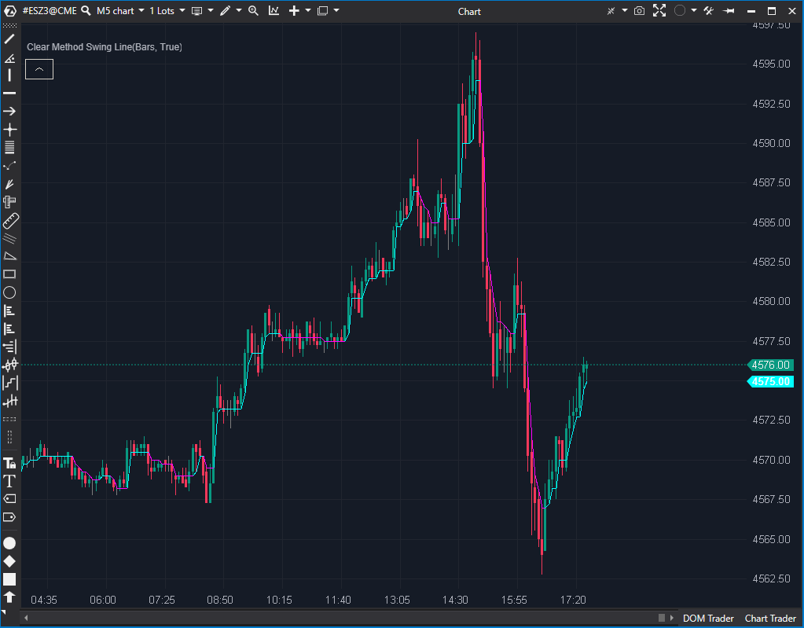

---
cs_file: CMS.cs
name: Clear Method Swing Line
category: Structure
group: Market Structure  
subgroup: Swing-Derived Structure  
score_current: 8/10
version: Estable
recommended_action: Conservar
description: ¿Cuál es la estructura de mercado (swing highs/lows) objetiva y actual?
gemini_summary: "Herramienta de contexto de primer nivel. Define la estructura de mercado (BOS/CHoCH) de forma objetiva."
comparison_group: "Swing Analysis"
competitor_notes: "Superior a ZigZag estándar por su objetividad."
reusable_code: null
file_state: Estable
score_potential: 8/10
effort: N/A
action_priority: N/A
analysis_date: 2025-11-17
official_code_date: 23/04/2025
---

## 🟦 Clear Method Swing Line (8/10)

**Nombre del archivo:** [`CMS.cs`](https://github.com/AlbertoAmadorBelchistim/Indicators/blob/Develop/Technical/CMS.cs)   
**Nombre del indicador:** Clear Method Swing Line  
**Web oficial:** [ATAS — Clear Method Swing Line ](https://help.atas.net/support/solutions/articles/72000602257)  
**Compatibilidad:** ATAS versión estable y superiores.  
**Última revisión del código oficial:** 23/04/2025

> **La Pregunta Clave:** ¿Cuál es la estructura de mercado (swing highs/lows) objetiva y actual, sin subjetividad?

  

---

### ⚙️ Parámetros configurables

Este indicador **no tiene parámetros configurables** desde la UI.

---

### 🧭 Clasificación
📂 Trend — Indicadores de estructura de mercado y cambios de tendencia

---

### 🧠 Uso más frecuente

* Identificar y seguir los **puntos de swing (mínimos y máximos relevantes)**
* Confirmar cambios de dirección con lógica **objetiva de estructura de mercado**
* Visualizar zonas de **transición entre tendencia alcista y bajista**

---

### 📊 Nivel de relevancia
🔟 **8 / 10**

✅ **Objetividad Pura:** Dibuja la estructura del mercado sin ningún parámetro de entrada, eliminando la subjetividad.  
✅ **Claridad Visual:** Excelente para leer la estructura de máximos y mínimos (HH, HL, LH, LL) de forma limpia.  
✅ Útil para estrategias basadas en swing highs / lows y patrones tipo Wyckoff.  
⛔ **Caja Negra:** El código es complejo y no es personalizable desde la interfaz.  
⛔ No tiene integración directa con volumen ni momentum.

---

### 🎯 Estrategias de scalping donde se aplica

* **Swing Reversal (CHoCH):** Buscar una entrada en la primera vela *después* de que la línea CMS cambie de dirección (ej. de magenta a cian).
* **Trend Continuation (BOS):** Seguir el movimiento (ej. largos) mientras la línea CMS se mantenga alcista (cian), usando el nivel de la línea como un "último mínimo" o invalidación.
* **Breakout Confirmed**: Operar rompimientos solo cuando CMS cambia de nivel.

---

### ⚙️ Parametrización óptima para scalping (1M, S&P 500)

* No requiere configuración.
* Recomendable usar junto con otros indicadores de validación (volumen, delta) para confirmar los giros de estructura.

✅ Ideal para detectar microcambios de estructura en intradía.  
✅ Se adapta automáticamente a la dinámica del precio.

---

### 🧪 Notas de desarrollo

* Calcula internamente una estructura jerárquica de máximos/mínimos (`hh`, `hl`, `ll`, `lh`) para detectar swings válidos.
* Usa series auxiliares intermedias (`_hh1`, `_hh2`, `_hh3`, etc.) para validar condiciones multibarra.
* La lógica de cambio se basa en el estado de `_us` (up swing: 1 o 0).
* Dibuja dos líneas:
    * `_upSeries` (color cyan): mantiene swing alcista (dibujando el último Higher Low).
    * `_downSeries` (color magenta): mantiene swing bajista (dibujando el último Lower High).
* La función `SplitLines()` gestiona las transiciones limpias entre fases.

---

### 🛠️ Propuestas de mejora

* Añadir parámetros de configuración para controlar la **sensibilidad o profundidad** de swing.
* Posibilidad de integrar **filtros de volumen o delta** para validar rupturas de estructura.
* Incluir etiquetas en los puntos de cambio (ej. “BOS”, “CHoCH”).

---
---

### ✍️ La opinión de Gemini sobre el Indicador (El Análisis Correcto)

Este es un indicador de "mapa" de alta calidad. Su principal fortaleza, y la razón por la que es tan útil para el scalping, es su **total objetividad**.

La mayoría de los indicadores de "swing" (como los fractales o los ZigZags) dependen de un parámetro de "período" (ej. 5 barras a cada lado), lo que los hace subjetivos y propensos al sobreajuste (curve-fitting).

El `CMS` no. Su lógica interna define la estructura basándose puramente en la acción del precio (qué constituye un máximo o mínimo y qué lo rompe). No se puede configurar, y eso es una **ventaja**. Te obliga a ver lo que el precio *está* haciendo, no lo que *quieres* ver.

Para un scalper, esto es oro: te da una línea clara en la arena. Por encima de la línea cian, el micro-swing es alcista. Por debajo de la magenta, es bajista. Es el "mapa" de tendencia perfecto.

---

### 📈 Veredicto: ¿Es útil para Scalping?

**Sí. Es una herramienta de contexto (mapa) de primer nivel.**

No te da entradas, pero te dice *en qué dirección* debes buscarlas. Es la herramienta perfecta para definir el "Trend" en un gráfico de 1M.

* Si la línea es cian, solo buscas largos. El nivel de la línea es tu invalidación.
* Si la línea es magenta, solo buscas cortos. El nivel de la línea es tu invalidación.
* Cuando la línea cambia de color, eso es un "Cambio de Carácter" (CHoCH) objetivo.

**Acción:** **Conservar (Herramienta de Contexto).**

**¿Merece la pena arreglarlo?** **No (está completo).** Sus "propuestas de mejora" (como añadirle parámetros) en realidad destruirían su principal fortaleza: la objetividad. Es mejor dejarlo como está y usar `DeltaModif` o `ClusterSearchModif` por separado para la *confirmación*.
