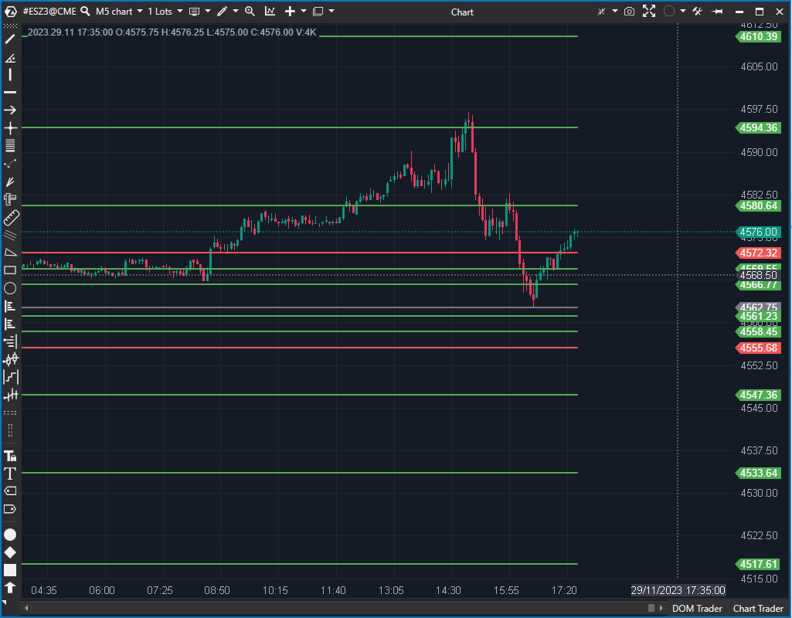

---

# 1. IDENTIFICACIÓN  
cs_file: CamarillaPivots.cs  
name: Camarilla Pivots  
version: ATAS Stable/Latest  

# 2. CLASIFICACIÓN  
group: Market Structure  
subgroup: Session-Derived Reference Levels  
comparison_group: "Session-Derived Reference Levels"  

# 3. VALORACIÓN (Score & Priority)  
score_current: 8/10  
score_potential: 9/10  
file_state: Estable  
effort: Bajo  
action_priority: Baja  
system_priority: P2  

# 4. DECISIÓN  
recommended_action: Conservar (Reserva)  

# 5. ANÁLISIS  
description: ¿Cuáles son los niveles Camarilla que definen zonas de reversión y ruptura intradía para estructurar escenarios tácticos de trading?  
gemini_summary: "Mapa intradía más táctico que los pivots clásicos, útil para diferenciar días de rango frente a días de expansión. Su mayor granularidad aumenta el riesgo de clutter en M1."  
competitor_notes: "Más específico que Pivots en extremos, pero también más ruidoso. Ninguno alcanza nivel CORE; Camarilla queda como reserva P2 para escenarios concretos."  
reusable_code: null  

# 6. METADATOS  
analysis_date: 2025-12-27  
official_code_date: 2025-04-23  

---

## 🧭 Camarilla Pivots (8/10)  

**Nombre del archivo:** [`CamarillaPivots.cs`](https://github.com/AlbertoAmadorBelchistim/Indicators/blob/Develop/Technical/CamarillaPivots.cs)  
**Nombre del indicador:** Camarilla Pivots  
**Web oficial:** [ATAS — Camarilla Pivots](https://help.atas.net/support/solutions/articles/72000602341)  
**Compatibilidad:** ATAS Stable/Latest  
**Última revisión del código oficial:** 2025-04-23  

> **La Pregunta Clave:** ¿Cuáles son los niveles Camarilla que definen zonas de reversión y ruptura intradía para estructurar escenarios tácticos de trading?  

---

### ⚙️ Parámetros configurables  
- **PivotColor**: Color del pivote central.  
- **UpperColor**: Color de niveles superiores (H).  
- **LowerColor**: Color de niveles inferiores (L).  
- **BetweenColor**: Color de niveles intermedios.  
- **HighLowColor**: Color común para niveles extremos.  

---

### 🧭 Clasificación  
**Grupo:** Market Structure  
**Subgrupo:** Session-Derived Reference Levels  
**Comparison Group:** "Session-Derived Reference Levels"  

---

### 🧠 Uso más frecuente  
- Identificación de **zonas de reversión** en días laterales.  
- Definición de **niveles de ruptura** en días de expansión.  
- Planificación de escenarios A/B según comportamiento en H3/L3.  

---

### 📊 Nivel de relevancia  
🔟 **8 / 10**  

✅ Más táctico que pivots clásicos para intradía.  
✅ Útil para clasificar tipo de día (rango vs tendencia).  
⛔ Genera más niveles y exige mayor filtrado visual en M1.  

---

### 🎯 Estrategias de scalping donde se aplica  
- **Fade de extremos** (H4/H5 – L4/L5) con absorción confirmada.  
- **Breakout estructurado** en H3/L3 con Order Flow.  
- **Mean reversion** hacia zona central tras excursión extrema.  

---

### ⚙️ Parametrización óptima para scalping (1M, S&P 500)  

| Parámetro | Valor recomendado | Justificación |  
| --- | --- | --- |  
| Upper/LowerColor | Contraste medio | Evita sobrecargar el gráfico. |  
| BetweenColor | Suave | Niveles intermedios no deben dominar. |  
| Grosor | Fino | Reduce ruido visual en M1. |  

---

### 🧪 Notas de desarrollo  
- Cálculo determinista por sesión; coste computacional bajo.  
- El principal riesgo es el **exceso de niveles** si se usa sin criterio.  

---

### ❗ Incoherencias o aspectos mejorables detectados  
- Falta de preset específico para scalping M1 (RTH).  

---

### 🛠️ Propuestas de mejora  
- Opción “solo H3/H4/L3/L4”.  
- Presets por instrumento y tipo de día.  

---

### 💎 Valor Reutilizable (Código Donante)  
* N/A  

---

### ✍️ La opinión de ChatGPT sobre el Indicador  
Camarilla es una estructura táctica útil, pero exigente. Funciona bien como complemento situacional, no como mapa base permanente del sistema.  

---

### 📈 Veredicto: ¿Es útil para Scalping?  

**Sí**, en **escenarios concretos** y con confirmación de Order Flow.  

**Acción:** **Conservar (Reserva)**  

