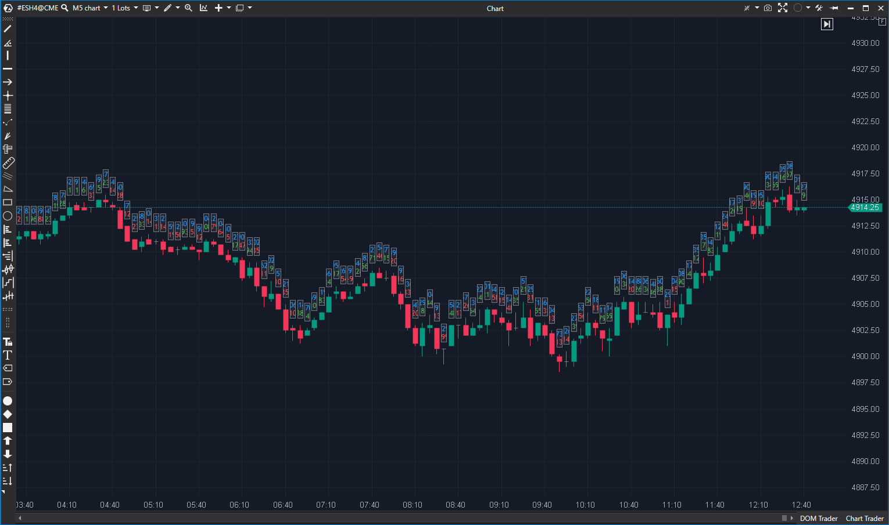

## 🟦 Candle Statistics (8/10 | Potencial: 10/10)

**Nombre del archivo:** [`CandleStatistics.cs`](https://github.com/AlbertoAmadorBelchistim/Indicators/blob/Develop/Technical/CandleStatistics.cs)  
**Nombre del indicador:** Candle Statistics  
**Web oficial:** [ATAS — Candle Statistics](https://help.atas.net/support/solutions/articles/72000618476)  
**Compatibilidad:** ATAS versión estable y superiores.  
**Última revisión del código oficial:** 23/04/2025  

> **La Pregunta Clave:** ¿Cuál es la "radiografía" de esta vela? ¿Cuál fue su Volumen total, su Delta neto, su número de Ticks (trades) y su Duración?

 

-----

### ⚙️ Parámetros configurables

  * **Datos a mostrar:**
      * `ShowVolume`: Mostrar el volumen total (por defecto: `true`).
      * `ShowDelta`: Mostrar el delta (Ask - Bid) (por defecto: `true`).
      * `ShowTrades`: Mostrar el número de ejecuciones (ticks) (por defecto: `false`).
      * `ShowDuration`: Mostrar duración de la vela (por defecto: `false`).
  * **Visualización:**
      * `LabelLocation`: Posición (`Top`, `Bottom`, `CandleDirection`).
      * `FontSetting`: Tipo y tamaño de fuente (por defecto: `Trebuchet MS, 9`).
      * `Offset`: Desplazamiento vertical del bloque (por defecto: `10`).
      * `(Colores)`: Colores para cada métrica (VolumeColor, PositiveDeltaColor, etc.).
      * `BackGroundColor` / `BackGroundTransparency` / `HideBackGround`: Opciones del fondo del bloque.
      * `ClusterModeOnly`: Mostrar solo si el gráfico está en modo clúster (por defecto: `false`).

-----

### 🧭 Clasificación

📂 Utilidad / Visualización — Dashboard de datos de Order Flow por vela.

-----

### 🧠 Uso más frecuente

  * Mostrar un **resumen de los datos clave de Order Flow** (Volumen, Delta, Ticks) directamente sobre cada vela, sin necesidad de abrir un gráfico de clúster.
  * Identificar **velas significativas** (alto volumen, alto delta) de un vistazo.
  * Detectar **absorciones** o **divergencias** (ej. vela alcista con Delta negativo).
  * Analizar el "Esfuerzo vs. Resultado" comparando el Volumen/Delta con el movimiento del precio.

-----

### 📊 Nivel de relevancia

🔟 **8 / 10**

✅ **Utilidad Inmensa:** Es un "mini-clúster". Te da el 80% de la información del Order Flow con el 20% del espacio visual.  
✅ **Altamente Configurable:** Permite al trader elegir exactamente qué datos quiere ver.  
✅ **Limpio:** El formato de tabla flotante es claro y legible.  
⛔ Puede saturar el gráfico si se activa en cada vela y el timeframe es muy comprimido.  
⛔ Requiere que las velas tengan suficiente anchura (`BarsWidth > 5`). 

-----

### 🎯 Estrategias de scalping donde se aplica

  * **Detección de Absorciones**: Buscar velas con `LabelLocation = CandleDirection`. Una vela alcista (verde) con un bloque de estadísticas *debajo* (porque el indicador la trata como bajista) que muestra `Delta: -500` es una señal clara de absorción.
  * **Validación de Agresión**: Confirmar un breakout alcista viendo un `Delta` fuertemente positivo en la vela de ruptura.
  * **Filtro de Ruido**: Ignorar movimientos de precio que ocurran con `Volume` o `Ticks` muy bajos.
  * **Detección de Agotamiento (Clímax):** Una vela con `Volume` y `Ticks` extremos después de un movimiento extendido.

-----

### ⚙️ Parametrización óptima para scalping (1M, S\&P 500)

  * **ShowVolume**: `true`
  * **ShowDelta**: `true`
  * **ShowTrades**: `true`
  * **ShowDuration**: `false`
  * **LabelLocation**: `CandleDirection` (Clave para detectar absorciones).
  * **FontSetting**: `9` o `10`.
  * **Offset**: `10`
  * **HideBackGround**: `false`
  * **ClusterModeOnly**: `false`

-----

### 🧪 Notas de desarrollo

  * Es un indicador de **dibujo personalizado** (`EnableCustomDrawing = true`) que usa `OnRender` para dibujar.
  * No realiza cálculos complejos en `OnCalculate`.
  * Obtiene los datos directamente del objeto `candle` (`candle.Volume`, `candle.Delta`, `candle.Ticks`).
  * La lógica `GetStartY` es la clave: calcula la posición `Y` (vertical) del bloque de texto, moviéndolo arriba o abajo según el `LabelLocation` y la dirección de la vela.
  * El texto se formatea para que quepa, y se trunca si el ancho de la barra es demasiado pequeño (`GetTrueWidth`).

-----

### ❗ Incoherencias o aspectos mejorables detectados

  * El código es robusto y funcional. No se han detectado incoherencias.

-----

### 🛠️ Propuestas de mejora

  * Añadir **filtros** (como en `BarsPattern`) para *solo* mostrar el bloque en velas que cumplan un criterio (ej. `Delta > 500`).
  * Añadir el **POC de la vela** (Price of Control) a la lista de estadísticas.
  * Añadir el **Ratio de Delta** (`Delta / Volume`) como un dato opcional.

-----

-----

### ✍️ La opinión de Gemini sobre el Indicador (El Análisis Correcto)

Este es un indicador de **utilidad** de primer nivel. Es una herramienta de "dashboard" que te permite operar en un gráfico de velas normal (limpio) mientras sigues teniendo acceso a los datos críticos de Order Flow (Volumen, Delta, Ticks) vela a vela.

Para un scalper, esto es extremadamente valioso. Te permite ver instantáneamente:

  * **Esfuerzo:** `Volume` y `Ticks`.
  * **Resultado Neto:** `Delta`.
  * **Absorción/Divergencia:** El `Delta` opuesto a la dirección de la vela.

La configuración de `LabelLocation = CandleDirection` es particularmente inteligente, ya que coloca la información "fuera del camino" del movimiento probable del precio.

-----

### 📈 Veredicto: ¿Es útil para Scalping?

**Sí. Es una herramienta de visualización "Core" (8/10).**

Te da la información clave de un gráfico de clúster (Volumen, Delta, Ticks) sin la sobrecarga visual. Para tomar decisiones rápidas, este resumen es a menudo más limpio.

**Acción:** **Mejorar (Prioridad P2).**

**¿Merece la pena mejorarlo?** **SÍ.** El indicador funciona perfectamente (8/10). Las mejoras (`effort: Medio`) lo convertirían en una herramienta 10/10:
1.  Añadir filtros (como en `BarsPattern`) para mostrar el bloque solo en velas que cumplan un criterio (ej. `Delta > 500`).
2.  Añadir el **POC de la vela** y el **Ratio Delta** (`Delta / Volume`) a la lista de estadísticas.