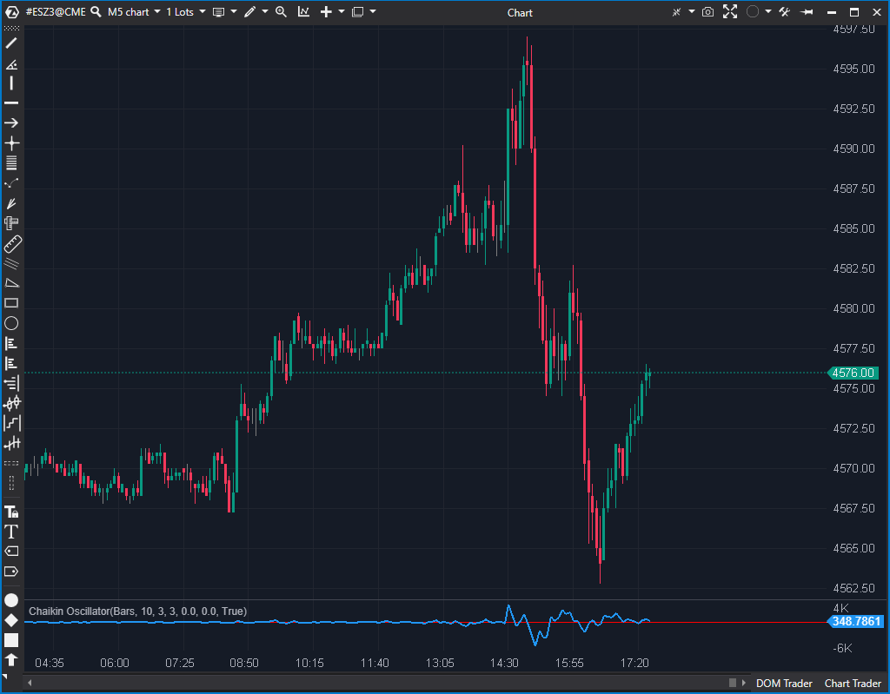

## 🟦 Chaikin Oscillator (3/10)

**Nombre del archivo:** [`ChaikinOscillator.cs`](https://github.com/AlbertoAmadorBelchistim/Indicators/blob/Develop/Technical/ChaikinOscillator.cs)  
**Nombre del indicador:** Chaikin Oscillator  
**Web oficial:** [ATAS — Chaikin Oscillator](https://help.atas.net/support/solutions/articles/72000602273)  
**Compatibilidad:** ATAS versión estable y superiores.  
**Última revisión del código oficial:** 23/04/2025  

> **La Pregunta Clave:** ¿Cuál es el *momentum* del flujo de dinero (Línea AD)? ¿Está el flujo de dinero (acumulación/distribución) acelerando o frenando?

  

-----

### ⚙️ Parámetros configurables

  * **ShortAvg**: Periodo de la EMA rápida (por defecto: `3`)
  * **LongAvg**: Periodo de la EMA lenta (por defecto: `10`)
  * **Divisor**: Factor de escala para el valor final del oscilador (por defecto: `3`)
  * **DrawLines**: Mostrar líneas de sobrecompra/sobreventa (por defecto: `true`).
  * **OverboughtLine / OversoldLine**: Líneas horizontales configurables para visualización.

-----

### 🧭 Clasificación

📂 VolumeClassic / Momentum — Oscilador de momentum de la línea de Acumulación/Distribución (AD).

-----

### 🧠 Uso más frecuente

  * Medir el **momentum del flujo de dinero** (inferido). Es un "MACD de la línea AD".
  * Detectar cambios en la presión compradora o vendedora (cruce de la línea cero).
  * Identificar divergencias entre el precio y el momentum del flujo de dinero.

-----

### 📊 Nivel de relevancia

🔟 **3 / 10**

⛔ **LAG EXTREMO:** Es un "MACD del AD". Es un `EMA(EMA(AD))`. Es un indicador de triple suavizado (AD es acumulativo, luego dos EMAs) y, por tanto, *extremadamente* lento.  
⛔ **BASADO EN UN INDICADOR OBSOLETO:** Se basa en la línea `AD` (que puntuamos 2/10), que "estima" el flujo de dinero en lugar de medir el Delta real.  
⛔ **Abstracto y Redundante:** Es un indicador lento, de un concepto obsoleto, con un valor numérico que no es tangible.  

-----

### 🎯 Estrategias de scalping donde se aplica

  * **Ninguna.**
  * Es conceptualmente demasiado lento para cualquier estrategia de scalping. Las señales de cruce de cero o divergencia llegarán con un retraso masivo.

-----

### ⚙️ Parametrización óptima para scalping (1M, S\&P 500)

  * **No se recomienda su uso para scalping.**

-----

### 🧪 Notas de desarrollo

  * Este indicador **NO** es la línea `AD`. Es un oscilador *basado en* la línea `AD`.
  * **Paso 1:** Calcula la línea `AD` de forma acumulativa (con una lógica de `_exAd` frágil).
  * **Paso 2:** Calcula dos EMAs (`ShortAvg` y `LongAvg`) de esa línea `AD`.
  * **Paso 3:** Calcula el oscilador (como un MACD): `(emaShort - emaLong) / Divisor`.
  * El parámetro `Divisor` (defecto: 3) es no estándar y solo sirve para "aplastar" visualmente el oscilador.

-----

### ❗ Incoherencias o aspectos mejorables detectados

  * **Basado en `AD`:** La debilidad conceptual es que se basa en la línea `AD` (un estimador de flujo obsoleto de 2/10) en lugar del `Delta Acumulado` (el flujo real).
  * **Manejo del Acumulado:** La lógica de acumulación (`_exAd`, `_lastAd`) es frágil.

-----

### 🛠️ Propuestas de mejora

  * **¡Mejora Crítica\!:** Crear una versión moderna (un "Delta Oscillator") que aplique la misma lógica (EMA rápida - EMA lenta) al **Delta Acumulado** en lugar de a la línea `AD`.

-----

-----

### ✍️ La opinión de Gemini sobre el Indicador (El Análisis Correcto)

Este indicador es, conceptualmente, un **MACD de la línea de Acumulación/Distribución (AD)**.

El `AD` (que ya descartamos con un 2/10 por obsoleto y roto) intenta mostrar el *flujo de dinero acumulado*.
Este `Chaikin Oscillator` intenta mostrar el *momentum de ese flujo de dinero* (midiendo cuándo el flujo se acelera o frena).

Es una idea interesante, pero tiene dos capas de problemas:

1.  **Fallo Base (Obsoleto):** Se basa en la línea `AD` (un 2/10), que es una "estimación" de flujo de los años 80. Tenemos herramientas (Delta Acumulado) que miden el flujo real.
2.  **Fallo de Diseño (Lag):** Es un `EMA(3)` menos un `EMA(10)` de una línea `AD` que ya es acumulativa (lenta). Es un indicador con un lag considerable, diseñado para gráficos diarios.

-----

### 📈 Veredicto: ¿Es útil para Scalping?

**No.** Es demasiado lento, y se basa en datos "estimados" (AD) en lugar de datos "reales" (Delta).

Un scalper obtendría una señal de momentum mucho más rápida, limpia y fiable usando `AverageDelta` (6.5/10), `ActiveVolume` (8/10), o incluso un simple `RSI`.

**Acción:** **Descartar.**

**¿Merece la pena arreglarlo?** **No.** El concepto es obsoleto. La "Propuesta de Mejora" (crear un "Delta Oscillator") no es un arreglo, es la creación de un indicador completamente nuevo y superior.