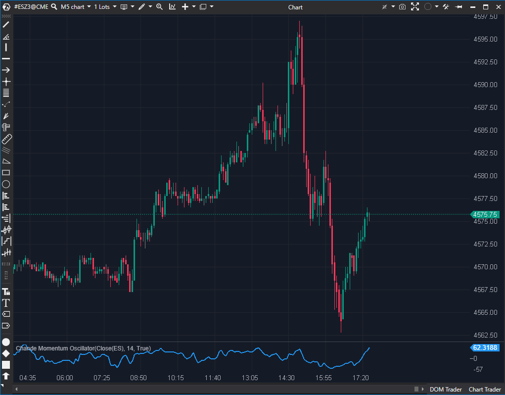

---
cs_file: ChandeMomentum.cs
name: Chande Momentum Oscillator 
category: Momentum
score: 6/10
version: Estable
verdict: Descartar
description: ¿Cuál es la fuerza neta del impulso (Suma de Subidas vs. Suma de Bajadas), expresada como un oscilador centrado en cero?
---

## 🟦 Chande Momentum Oscillator (CMO) (6/10)

**Nombre del archivo:** [`ChandeMomentum.cs`](https://github.com/AlbertoAmadorBelchistim/Indicators/blob/Develop/Technical/ChandeMomentum.cs)  
**Nombre del indicador:** Chande Momentum Oscillator  
**Web oficial:** [ATAS — Chande Momentum Oscillator](https://help.atas.net/support/solutions/articles/72000602279)  
**Compatibilidad:** ATAS versión estable y superiores.  
**Última revisión del código oficial:** 23/04/2025  

> **La Pregunta Clave:** ¿Cuál es la fuerza neta del impulso (Suma de Subidas vs. Suma de Bajadas), expresada como un oscilador centrado en cero?

-----

### ⚙️ Parámetros configurables

  * **Period**: Número de barras consideradas para el cálculo del momentum (por defecto: `14`).

-----

### 🧭 Clasificación

📂 Momentum / Oscillators — Oscilador que mide la fuerza del movimiento.

-----

### 🧠 Uso más frecuente

  * Medir la **fuerza neta del impulso** entre cierres sucesivos.
  * Identificar condiciones de **sobrecompra** (ej. \> +50) y **sobreventa** (ej. \< -50).
  * Detectar **divergencias** entre el precio y el momentum.
  * Usar el **cruce de la línea cero** como señal de cambio de momentum.

-----

### 📊 Nivel de relevancia

🔟 **6 / 10**

✅ Es un oscilador "puro" de momentum, centrado en 0, lo que facilita la lectura del sesgo.  
✅ Más directo que el RSI (usa Suma Simple vs. la EMA/RMA del RSI).  
⛔ **Redundante:** Es conceptualmente muy similar al `RSI` y al `CCI`.  
⛔ **Ruidoso:** Al usar una "Suma Simple" (`CalcSum`) en lugar de una media exponencial (como el RSI), la línea es más "dentada" y reactiva al ruido.  
⛔ "Ciego" (solo precio), no tiene en cuenta el volumen ni el Order Flow.

-----

### 🎯 Estrategias de scalping donde se aplica

  * **Contratendencia (Fading) en Extremos**: Venta si CMO \> +50 (o +70) y muestra divergencia. Compra si CMO \< -50 (o -70) con divergencia.
  * **Confirmación de Momentum (Cruce de Cero)**: Comprar cuando el CMO cruza de negativo a positivo (cruce de la línea cero).
  * **Divergencias**: Buscar divergencias clásicas entre el precio y el oscilador.

-----

### ⚙️ Parametrización óptima para scalping (1M, S\&P 500)

  * **Period**: `10` a `14`

-----

### 🧪 Notas de desarrollo

  * El CMO compara la suma de subidas y bajadas de precio (cierre contra cierre) en un período:
      * `up[i] = max(C[i] - C[i-1], 0)`
      * `down[i] = max(C[i-1] - C[i], 0)`
  * Fórmula: `CMO = 100m * (upSum - downSum) / (upSum + downSum)`
  * El indicador usa `_upValues.CalcSum` y `_downValues.CalcSum` para obtener las sumas del período.
  * Tiene un "warm-up" (`if (bar < _period) return;`) para asegurar que el cálculo solo se realiza con un conjunto de datos completo.
  * Tiene protección contra división por cero (`if (upSum + downSum != 0)`).

-----

### ❗ Incoherencias o aspectos mejorables detectados

  * **Nombre de Serie Confuso:** La serie de datos principal (`_renderSeries`) se llama `"Momentum"`, lo que puede llevar a confusión con el indicador "Momentum" estándar (que es `Precio[0] - Precio[N]`).
  * **Falta de Líneas Guía:** El indicador no incluye `LineSeries` para los niveles clave (como `0`, `+50`, `-50`), que son fundamentales para la interpretación clásica del CMO.

-----

### 🛠️ Propuestas de mejora

  * Renombrar la `_renderSeries` a `"CMO"` para mayor claridad.
  * **Añadir Líneas Guía:** Incluir `LineSeries` configurables para `0`, `+50` y `-50`.
  * Añadir alertas (`AddAlert`) cuando se crucen estos niveles clave.

-----

-----

### ✍️ La opinión de Gemini sobre el Indicador (El Análisis Correcto)

Este indicador es un "primo" del `RSI`. Ambos miden la relación entre las subidas y bajadas recientes del precio.

  * **RSI:** Usa un suavizado exponencial (EMA/RMA) y se mueve entre 0-100 (centrado en 50).
  * **CMO (Este):** Usa un suavizado simple (Suma Simple / SMA) y se mueve entre -100 y +100 (centrado en 0).

Al usar una suma simple, el CMO es generalmente **más ruidoso y "dentado"** que el RSI. Responde más bruscamente a una sola vela grande.

Es un oscilador de momentum clásico, funcional, pero que no aporta ninguna información fundamental que no se pueda obtener (y de forma más suave) con un RSI, o (de forma más extrema) con un CCI.

-----

### 📈 Veredicto: ¿Es útil para Scalping?

**Es usable (6/10), pero redundante.**

Para un scalper, la elección de un oscilador "ciego" (solo de precio) es importante.

  * El `CCI` (7/10) es útil porque es *no acotado* y muestra mejor las tendencias extremas.
  * El `RSI` (que veremos) es útil porque es *suave* (usa EMA).
  * El `CMO` se queda en un punto medio: es *acotado* (como el RSI) pero *ruidoso* (como un SMA).

Dado que ya hemos conservado el `CCI` (7/10) como un oscilador de momentum viable, el `CMO` es redundante.

**Acción:** **Descartar (Redundante).**

**¿Merece la pena arreglarlo?** **No.** Las mejoras (añadir líneas guía) son triviales, pero no arreglan el hecho de que es un indicador conceptualmente redundante frente al RSI o el CCI.