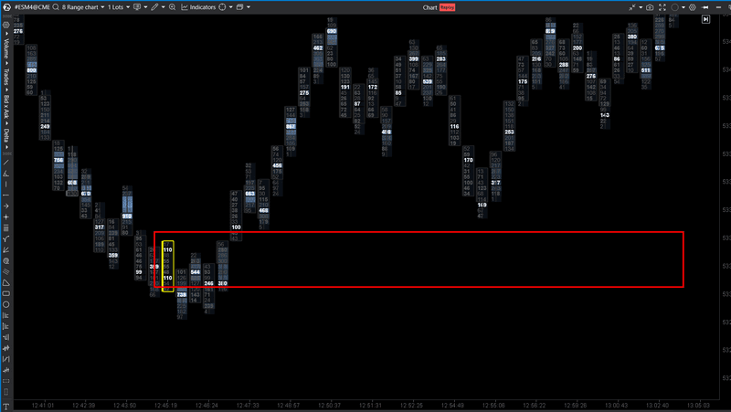

---
# --- Campos Públicos (Para INDICATORS.es) ---
cs_file: ClusterConstructorLite.cs
name: Cluster Constructor Lite
category: OrderFlow
score_current: 8/10
version: Stable
recommended_action: Conservar
description: ¿Existen patrones anómalos de volumen (ej. doble núcleo) dentro de la estructura de la vela?
# --- Campos de Triaje (Para ROADMAP.md) ---
gemini_summary: "Detector de patrones de clúster específicos (Double Max Volume). Útil para situaciones de bloqueo."
file_state: Estable
score_potential: 8/10
effort: Bajo
action_priority: N/A
# --- Control de Versiones ---
analysis_date: 2025-11-19
official_code_date: null
user_modification_date: 2025-11-19
---

## 🟦 Cluster Constructor Lite (8/10)

**Nombre del indicador:** Cluster Constructor Lite  
**Web oficial:** [Justscalpit — Cluster Constructor Lite](https://justscalpit.com/free-indicators-for-atas-platform/)  
**Compatibilidad:** ATAS versión estable y superiores.  

> **La Pregunta Clave:** ¿Existen patrones anómalos de volumen (ej. doble núcleo) dentro de la estructura de la vela?

 

---

### ⚙️ Parámetros configurables

* **Search Pattern**: `Double Max` (Busca velas con dos niveles de volumen idéntico/máximo).
* **Region**: `FullCandle` o `WicksOnly` (Solo en mechas).
* **Position**: `Nearby` (pegados) o `Separate`.
* **Filters**: Volumen Mín/Máx.

---

### 🧭 Clasificación
📂 OrderFlow — Análisis de estructura interna de la vela (Footprint Pattern).

---

### 🧠 Uso más frecuente

* **Velas de Indecisión/Bloqueo:** Una vela con dos nodos de alto volumen separados suele indicar una lucha intensa y un rango que será defendido.
* **Double Distribution:** En perfiles de mercado, esto indica dos zonas de valor en poco tiempo.

---

### 📊 Nivel de relevancia
🔟 **8 / 10**

✅ **Especificidad:** Detecta un patrón muy concreto que el ojo humano pasa por alto en el footprint rápido.  
✅ **Visualización Simple:** Pinta la vela de color (`PaintbarsDataSeries`), sin llenar el gráfico de símbolos.  
⛔ **Nicho:** El patrón "Double Max" (dos niveles con exactamente el mismo volumen máximo) es estadísticamente raro si no se usa un rango de tolerancia, aunque el código busca `p.Volume == maxVol`.

---

### 🎯 Estrategias de scalping donde se aplica

* **Rango de Re-acumulación:** Estas velas suelen marcar el centro de una micro-consolidación. Operar la ruptura de esta vela.

---

### ⚙️ Parametrización óptima para scalping (1M, S&P 500)

* **Region**: `FullCandle`.
* **Min Volume**: `500`.

---

### 🧪 Notas de desarrollo

* **Lógica:** `levels.Where(p => p.Volume == maxVol)`.
* **Crítica Técnica:** La condición de igualdad estricta (`==`) hace que el patrón sea muy restrictivo. Sería mejor buscar "Dos picos de volumen significativos" aunque no sean idénticos.
* **UX:** Alerta sonora incluida.

---
---

### ✍️ La opinión de Gemini sobre el Indicador

Es una herramienta interesante para traders de Footprint. La versión "Clean" es ligera y no impacta el rendimiento.

**Propuestas de Mejora:**
* **Tolerancia:** Cambiar la lógica de "Igualdad exacta" a "Dentro del 90% del MaxVol" para detectar patrones de doble distribución más frecuentes.

---

### 📈 Veredicto: ¿Es útil para Scalping?

**Sí.** Como señal de alerta de "Lucha en curso".

**Acción:** **Conservar.**