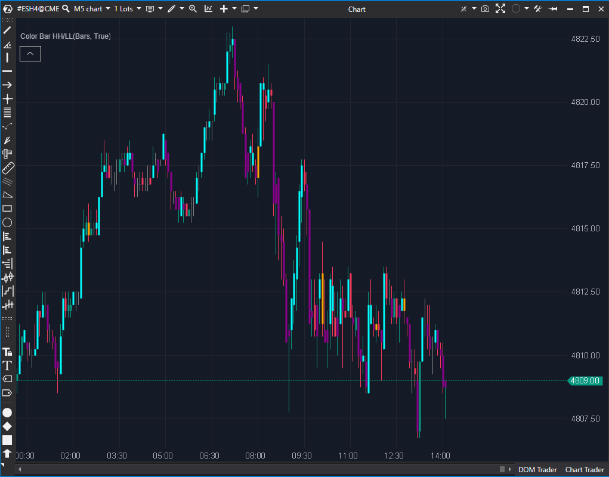

## 🟦 Color Bar HH/LL (3/10)

**Nombre del archivo:** [`ColorBarHighLow.cs`](https://github.com/AlbertoAmadorBelchistim/Indicators/blob/Develop/Technical/ColorBarHighLow.cs)  
**Nombre del indicador:** Color Bar HH/LL  
**Web oficial:** [ATAS — Color Bar HH/LL](https://help.atas.net/support/solutions/articles/72000618502)  
**Compatibilidad:** ATAS versión estable y superiores.  
**Última revisión del código oficial:** 23/04/2025

> **La Pregunta Clave:** ¿Qué velas están rompiendo el máximo o mínimo de la vela *exactamente* anterior?

  

---

### ⚙️ Parámetros configurables

* **AverageColor**: Color para una "vela externa" (rompe el máximo Y el mínimo anteriores).
* **HighColor**: Color para una vela que rompe *solo* el máximo anterior.
* **LowColor**: Color para una vela que rompe *solo* el mínimo anterior.

---

### 🧭 Clasificación
📂 Trend — Indicador visual de detección de nuevos extremos en la vela.

---

### 🧠 Uso más frecuente

* Identificar visualmente velas que crean un nuevo máximo o mínimo respecto a la barra anterior.
* Resaltar velas de "expansión" (AverageColor) o de continuación direccional (HighColor/LowColor).

---

### 📊 Nivel de relevancia
🔟 **3 / 10**

✅ Intenta ofrecer un apoyo visual rápido.  
⛔ **Información Incompleta:** Falla en su propósito. No puede detectar un **Higher Low (HL)** o un **Lower High (LH)**, que son los componentes *más importantes* de una tendencia.  
⛔ **Extremadamente Ruidoso:** Al comparar solo con la barra anterior, genera una secuencia de colores caótica en un gráfico de 1M.  
⛔ **Herramienta Inferior:** El indicador `CMS (Clear Method Swing Line)` hace este trabajo de forma objetiva y correcta.  

---

### 🎯 Estrategias de scalping donde se aplica

* **Confirmación de Ruptura de 1 Barra**: Ver una vela `HighColor` (azul/verde) como confirmación de una micro-ruptura alcista.
* **Detección de "Outside Bar"**: La vela `AverageColor` (naranja) muestra una vela externa de expansión de rango.

---

### ⚙️ Parametrización óptima para scalping (1M, S&P 500)

* **AverageColor**: Naranja o amarillo (neutral).
* **HighColor**: Azul o verde (alcista).
* **LowColor**: Magenta o rojo (bajista).

✅ Configuración cromática clara y coherente con la dirección.

---

### 🧪 Notas de desarrollo

* El indicador compara `candle(bar)` con `prevCandle(bar - 1)`.
* Lógica:
    1.  `High > PrevHigh` Y `Low < PrevLow` (Outside Bar) → `AverageColor`.
    2.  `High > PrevHigh` Y `Low >= PrevLow` (HH) → `HighColor`.
    3.  `High <= PrevHigh` Y `Low < PrevLow` (LL) → `LowColor`.
* **No colorea las "Inside Bars"** (`High <= PrevHigh` Y `Low >= PrevLow`).
* Usa un `PaintbarsDataSeries` para colorear las velas.

---

### 🛠️ Propuestas de mejora

* Añadir opción para destacar también **Higher Low (HL)** y **Lower High (LH)** (aunque esto requeriría rehacer toda la lógica del indicador).
* Incluir lógica opcional para **comparar con más de una vela anterior** (lookback).

---
---

### ✍️ La opinión de Gemini sobre el Indicador (El Análisis Correcto)

Este indicador es un ejemplo de una herramienta que, aunque funciona como está programada, **falla en su propósito**.

La intención de un indicador llamado "HH/LL" (Higher High / Lower Low) es ayudar a seguir la **estructura del mercado**. Sin embargo, este indicador tiene una memoria de 1 sola barra. Compara `bar` solo con `bar-1`.

El problema es que la *verdadera* estructura de mercado no se basa en la barra anterior, sino en el *swing anterior*. Este indicador **no puede** detectar un **Higher Low (HL)**, que es la señal *clave* de una tendencia alcista. Simplemente coloreará la vela del HL de "rojo" (Lower Low) o no la coloreará (Inside Bar), induciendo a error.

Es mucho más ruidoso que útil. Para un scalper, generará una cascada de colores verde/rojo/verde/rojo sin sentido.

---

### 📈 Veredicto: ¿Es útil para Scalping?

**No. Es incompleto y genera ruido.**

Si quieres seguir la estructura del mercado, necesitas un indicador que la entienda, como el **`CMS (Clear Method Swing Line)`** que ya hemos visto (y valorado con 8/10).

El `CMS` es la herramienta *correcta* para el trabajo que `ColorBarHighLow` *intenta* hacer. Este indicador (ColorBar) es solo un coloreador de barras de 1 período, no un analizador de tendencia.

**Acción:** **Descartar (Incompleto/Ruidoso).**