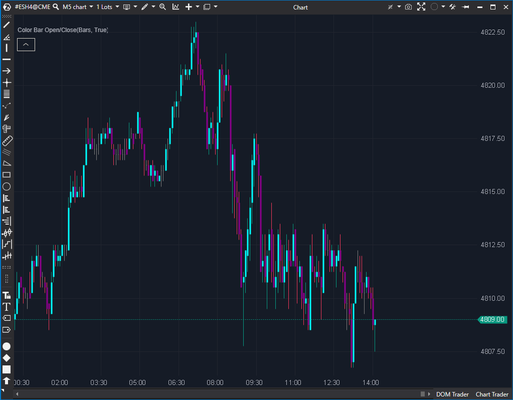

---
# --- Campos Públicos (Para INDICATORS.es) ---
cs_file: ColorBarOpenClose.cs
name: Color Bar Open/Close
category: Trend
score_current: 1/10
version: Estable
recommended_action: 'Descartar'
description: >-
  'Colorea las velas según si el cierre es mayor (alcista) o menor (bajista)' que la apertura.
# --- Campos de Triaje (Para ROADMAP.md) ---
gemini_summary: >-
  Indicador redundante (replica la función base del gráfico) y defectuoso, ya que su lógica de herencia de color para velas Doji es incorrecta.
file_state: Defectuoso
score_potential: 1/10
effort: N/A
action_priority: N/A
# --- Control de Versiones ---
analysis_date: 2025-11-17
official_code_date: 2025-04-23
user_modification_date: null
---

## 🟦 Color Bar Open/Close (1/10)

**Nombre del archivo:** [`ColorBarOpenClose.cs`](https://github.com/AlbertoAmadorBelchistim/Indicators/blob/Develop/Technical/ColorBarOpenClose.cs)  
**Nombre del indicador:** Color Bar Open/Close  
**Web oficial:** [ATAS — Color Bar Open/Close](https://help.atas.net/support/solutions/articles/72000618541)  
**Compatibilidad:** ATAS versión estable y superiores.  
**Última revisión del código oficial:** 23/04/2025

> **La Pregunta Clave:** ¿Es la vela alcista (cierre > apertura) o bajista (cierre < apertura)?

  

---

### ⚙️ Parámetros configurables

* **HighColor**: Color para velas con cierre por encima de la apertura (alcistas).
* **LowColor**: Color para velas con cierre por debajo de la apertura (bajistas).

---

### 🧭 Clasificación
📂 Trend — Indicador visual de dirección de vela (alcista / bajista).

---

### 🧠 Uso más frecuente

* Distinguir rápidamente entre **velas alcistas y bajistas**.

---

### 📊 Nivel de relevancia
🔟 **1 / 10**

⛔ **Completamente Redundante:** Esta es la función *estándar* de cualquier plataforma de gráficos (colorear velas alcistas/bajistas). Este indicador no añade **ninguna información nueva**.  
⛔ **Lógica Defectuosa:** En velas doji (`Close == Open`), el indicador hereda el color de la vela anterior. Esto es fundamentalmente incorrecto y engañoso, ya que una vela de indecisión (doji) se colorea falsamente con un sesgo direccional.  
⛔ No incorpora información contextual (volumen, rango, ubicación relativa).  

---

### 🎯 Estrategias de scalping donde se aplica

* **Ninguna.** La funcionalidad que ofrece es la visualización base de cualquier gráfico de velas. No aporta valor estratégico.

---

### ⚙️ Parametrización óptima para scalping (1M, S&P 500)

* **Ninguna.** Es preferible desactivar este indicador y usar la coloración de velas por defecto de la plataforma.

---

### 🧪 Notas de desarrollo

* El indicador colorea cada vela según si **Close > Open** (HighColor) o **Close < Open** (LowColor).
* En caso de empate (`Close == Open`), **hereda el color de la vela anterior** (`_renderSeries[bar - 1]`).

---

### 🛠️ Propuestas de mejora

* Añadir una opción para **colorear velas doji** con un color específico (ej. gris o amarillo).
* *Nota: La propuesta de mejora principal sería no usar este indicador en absoluto.*

---
---

### ✍️ La opinión de Gemini sobre el Indicador (El Análisis Correcto)

Este indicador es la definición de redundancia. Es una herramienta que existe para hacer algo que ATAS (y cualquier software de gráficos) ya hace como función principal: colorear las velas alcistas de un color y las bajistas de otro.

No aporta absolutamente nada. De hecho, es *peor* que la configuración por defecto, debido a su lógica defectuosa para las velas Doji. Al heredar el color anterior en una vela Doji, te está mintiendo: te muestra una "vela de continuación" (ej. verde) cuando lo que realmente hay es una "vela de indecisión" (un Doji neutral).

---

### 📈 Veredicto: ¿Es útil para Scalping?

**No. Es completamente inútil y redundante.**

Si un indicador no proporciona nueva información o una nueva perspectiva, no debe estar en el gráfico. Este indicador no solo no aporta nada, sino que la única "lógica" que añade es incorrecta.

**Acción:** **Descartar (Redundante / Defectuoso).**