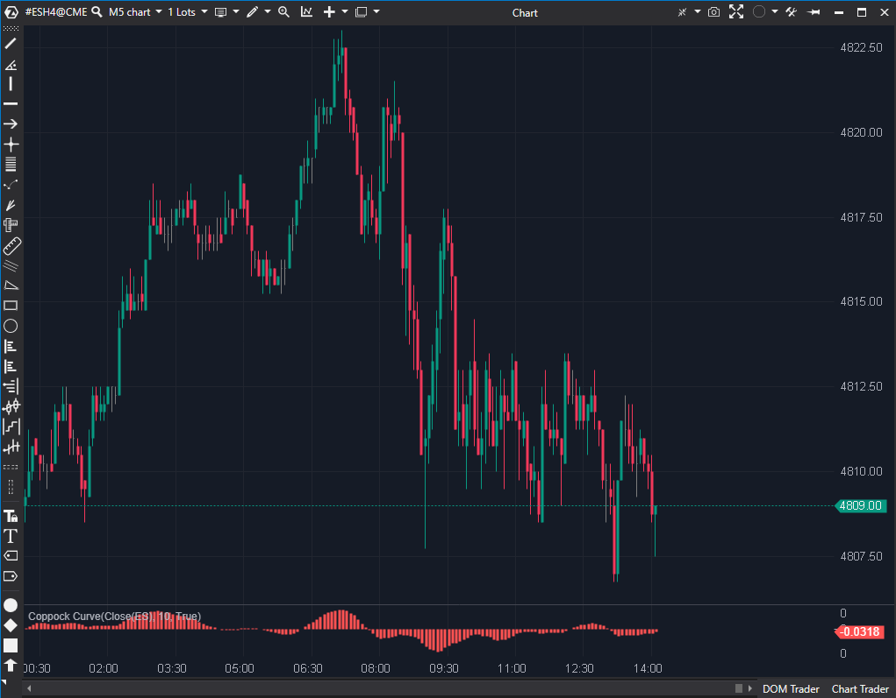

---
# --- Campos Públicos (Para INDICATORS.es) ---
cs_file: CoppockCurve.cs
name: Coppock Curve
category: Momentum
score_current: 3/10
version: Estable
recommended_action: Descartar
description: ¿Cuál es el momentum de largo plazo del mercado? (Diseñado para gráficos
  semanales/mensuales).
# --- Campos de Triaje (Para ROADMAP.md) ---
gemini_summary: "Herramienta de inversión a largo plazo (W/MN) con un lag extremo por diseño (doble ROC + WMA), haciéndola categóricamente inútil para scalping."
file_state: Estable
score_potential: 3/10
effort: N/A
action_priority: N/A
# --- Control de Versiones ---
analysis_date: 2025-11-17
official_code_date: 2025-04-23
user_modification_date: null
---

## 🟦 Coppock Curve (3/10)

**Nombre del archivo:** [`CoppockCurve.cs`](https://github.com/AlbertoAmadorBelchistim/Indicators/blob/Develop/Technical/CoppockCurve.cs)  
**Nombre del indicador:** Coppock Curve  
**Web oficial:** [ATAS — Coppock Curve](https://help.atas.net/support/solutions/articles/72000602602-coppock-curve)  
**Compatibilidad:** ATAS versión estable y superiores.  
**Última revisión del código oficial:** 23/04/2025  

> **La Pregunta Clave:** ¿Cuál es el momentum de largo plazo del mercado? (Diseñado para gráficos semanales/mensuales).

  

---

### ⚙️ Parámetros configurables

* **Period**: Periodo de la media móvil ponderada (WMA) que suaviza la suma de los ROCs (por defecto: 10).

---

### 🧭 Clasificación
📂 Momentum — Oscilador basado en tasas de cambio suavizadas.

---

### 🧠 Uso más frecuente

* Identificar **cambios de ciclo** en tendencias de largo plazo.
* Detectar **zonas de compra óptimas** tras correcciones profundas (en gráficos Semanales/Mensuales).
* Utilizado como **herramienta de timing en mercados amplios** como índices bursátiles.

---

### 📊 Nivel de relevancia
🔟 **3 / 10**

✅ Suaviza la volatilidad y evita señales falsas en marcos temporales amplios.  
✅ Ideal para detección de suelos en marcos temporales amplios.  
⛔ **Extremadamente lento:** Su diseño (doble ROC + WMA) lo hace inútil para scalping.  
⛔ No responde bien a fases laterales prolongadas.

---

### 🎯 Estrategias de scalping donde se aplica

**No recomendado para scalping en 1M.**  
Este indicador está diseñado para marcos **semanales o diarios**, por lo que **no se recomienda en gráficos intradía rápidos** como S&P 500 en 1 minuto.

---

### ⚙️ Parametrización óptima (uso contextual en D1 o W1)

* **Period**: `10`
* **ROC largo**: 14 (fijo en el código)
* **ROC corto**: 11 (fijo en el código)

✅ Esta configuración reproduce el método original de Coppock.

---

### 🧪 Notas de desarrollo

* El indicador **suma dos tasas de cambio** (ROC 11 y ROC 14, en modo porcentaje) y aplica una **media móvil ponderada** (WMA) sobre la suma resultante.
* El valor final se representa en forma de **histograma**.
* La propiedad `Period` controla exclusivamente el suavizado final (WMA), pero **los ROCs tienen valores fijos en el código (11 y 14)**.

---

### 🛠️ Propuestas de mejora

* Permitir que los **valores de los ROCs** (actualmente 11 y 14) sean configurables desde la UI.
* Añadir una **línea cero** como referencia visual en el histograma.

---
---

### ✍️ La opinión de Gemini sobre el Indicador (El Análisis Correcto)

Este es un caso claro de "herramienta correcta para el trabajo incorrecto". La Curva de Coppock es un indicador histórico y respetado, pero fue diseñado por Edwin Coppock con un propósito muy específico: identificar suelos de mercado para **inversores a largo plazo** en gráficos **mensuales**.

Su diseño (un ROC de 14 meses + un ROC de 11 meses, suavizados por una WMA de 10 meses) está pensado para capturar la marea de fondo de la economía, no las olas de 1 minuto.

Es el equivalente a usar un sonar de un submarino para buscar las llaves en una piscina.

---

### 📈 Veredicto: ¿Es útil para Scalping?

**No. Es categóricamente inútil para scalping.**

Es uno de los indicadores con más *lag* (retraso) que se pueden encontrar, por diseño. Su única aplicación es para *swing trading* o *inversión* en gráficos diarios o semanales. Para un scalper, la nota de 3/10 es incluso generosa.

**Acción:** **Descartar (herramienta de largo plazo).**