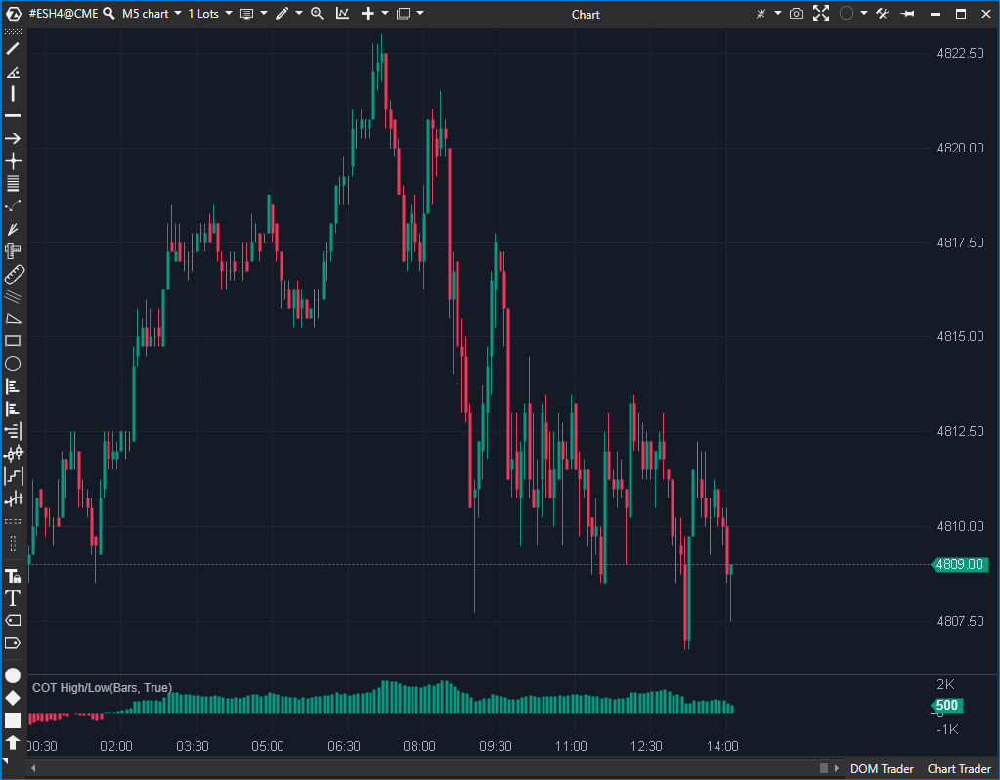

## 🟦 COT High/Low (2/10)

**Nombre del archivo:** [`CotHigh.cs`](https://github.com/AlbertoAmadorBelchistim/Indicators/blob/Develop/Technical/CotHigh.cs)  
**Nombre del indicador:** COT High/Low  
**Web oficial:** [ATAS — COT High/Low](https://help.atas.net/support/solutions/articles/72000602603)  
**Compatibilidad:** ATAS versión estable y superiores.  
**Última revisión del código oficial:** 23/04/2025  

> **La Pregunta Clave:** (Teóricamente) ¿Cuál es el delta acumulado desde el último máximo/mínimo? *(En la práctica, la lógica es errónea).*

---

### ⚙️ Parámetros configurables

* **Mode** (`High` / `Low`): Define si se buscan nuevos máximos o nuevos mínimos.
* **PosColor**: Color para barras con delta acumulado positivo.
* **NegColor**: Color para barras con delta acumulado negativo.

---

### 🧭 Clasificación
📂 VolumeOrderFlow — Indicadores de acumulación de delta en extremos.

---

### 🧠 Uso más frecuente

* (Teórico) Acumular el **delta neto** desde un nuevo **máximo o mínimo local**.
* (Teórico) Evaluar la **intensidad de la agresión** tras una expansión del rango.

---

### 📊 Nivel de relevancia
🔟 **2 / 10**

⛔ **LÓGICA ROTA (MODO LOW):** El `Mode = Low` no funciona. El código no contiene lógica para comprobar este modo, por lo que **nunca reinicia el delta** y se limita a acumularlo desde el inicio del gráfico.  
⛔ **LÓGICA ERRÓNEA (MODO HIGH):** El `Mode = High` (que sí se ejecuta) también es incorrecto. Se reinicia si `candle.High >= _extValue` O si `candle.Low >= _extValue`. Esta segunda condición (comprobar el mínimo de la vela) no tiene sentido para buscar un nuevo máximo.  
✅ La idea conceptual es buena.  

---

### 🎯 Estrategias de scalping donde se aplica

* **Ninguna.** El indicador no funciona como se espera. Sus señales no son fiables debido a los errores fundamentales en su lógica.

---

### ⚙️ Parametrización óptima para scalping (1M, S&P 500)

* **Ninguna.** El indicador está roto.

---

### 🧪 Notas de desarrollo

* Usa un `ValueDataSeries` con visualización en histograma para mostrar la acumulación del delta.
* **FALLO CRÍTICO (Modo Low):** La condición de reinicio solo comprueba `Mode is CotMode.High`. Si se selecciona `Mode = Low`, la condición `if` siempre es falsa, y el indicador entra perpetuamente en el `else`, acumulando delta (`_renderSeries[bar - 1] + candle.Delta`) sin reiniciar jamás.
* **FALLO LÓGICO (Modo High):** La condición de reinicio para `Mode.High` es `(candle.High >= _extValue || candle.Low >= _extValue)`. La comprobación `candle.Low >= _extValue` es incoherente y provoca reinicios erróCneos.

---

### 🛠️ Propuestas de mejora (Reparación)

* **Reescritura de `OnCalculate`:** El indicador debe ser reparado.
    1.  **Implementar `Mode.Low`:** Añadir un `else if (Mode is CotMode.Low)` a la lógica de reinicio.
    2.  La condición de reinicio para `Low` debe ser `candle.Low <= _extValue`.
    3.  `_extValue` debe actualizarse a `candle.Low` en este caso.
    4.  **Corregir `Mode.High`:** La condición de reinicio debe ser *exclusivamente* `candle.High >= _extValue`. Eliminar la comprobación `|| candle.Low >= _extValue` que es errónea.

---
---

### ✍️ La opinión de Gemini sobre el Indicador

Este indicador es un ejemplo de una buena idea con una ejecución desastrosa. El concepto de "acumular delta desde el último swing high/low" es una herramienta de Order Flow muy potente (similar a lo que hacen indicadores como "Delta Profile").

Sin embargo, el código está fundamentalmente roto. Como se detalla en las notas, la mitad del indicador (`Mode = Low`) **directamente no funciona**, y la otra mitad (`Mode = High`) tiene una lógica errónea que lo hace impredecible.

A diferencia de otros indicadores inútiles, este **concepto SÍ es valioso para un scalper**. Saber si los nuevos máximos están siendo "vendidos" (delta acumulado negativo) o si los nuevos mínimos están siendo "comprados" (delta acumulado positivo) es una información de alta calidad.

Dado que el concepto es bueno (potencial: 7/10) y la reparación es trivial (effort: Bajo), este es un candidato claro para `Reparar`.

---

### 📈 Veredicto: ¿Es útil para Scalping?

**En su estado actual (2/10), es categóricamente inútil y peligroso.**

Proporciona información falsa que llevaría a tomar decisiones de trading incorrectas.

**Como concepto (7/10), es muy útil.** Si se repara la lógica de reinicio, se convierte en una herramienta de Order Flow válida para detectar la reacción del mercado en los extremos (absorción o continuación).

**Acción:** **Reparar (ROTO).**

**¿Merece la pena arreglarlo?** **Sí.** Es un esfuerzo de programación bajo (P3) para obtener una herramienta de Order Flow conceptualmente valiosa.