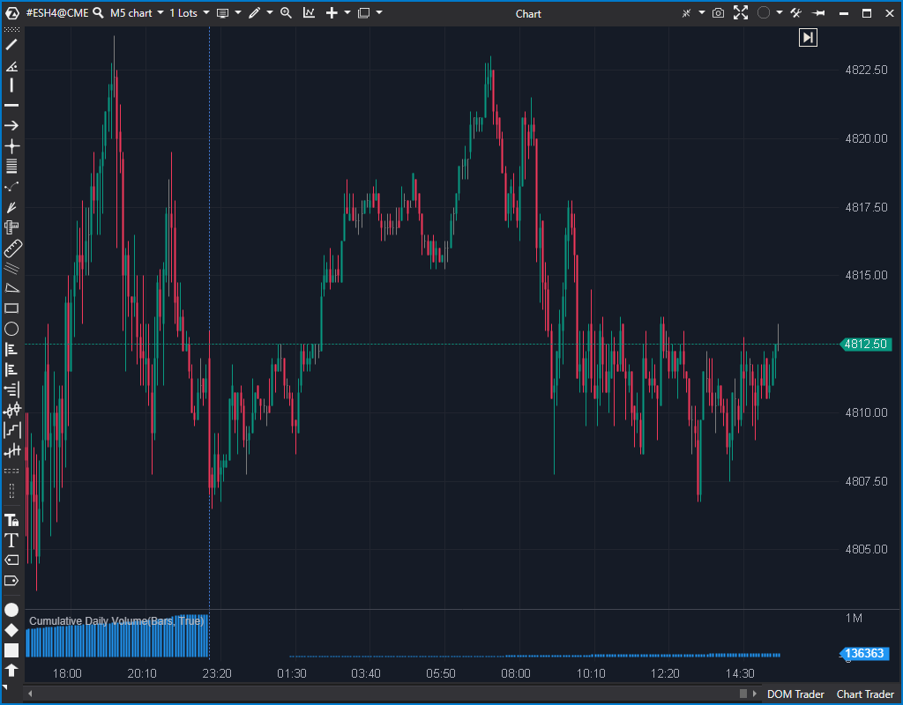

## 🟦 Cumulative Daily Volume (6/10)

**Nombre del archivo:** [`CumulativeDailyVolume.cs`](https://github.com/AlbertoAmadorBelchistim/Indicators/blob/Develop/Technical/CumulativeDailyVolume.cs)  
**Nombre del indicador:** Cumulative Daily Volume  
**Web oficial:** [ATAS — Cumulative Daily Volume](https://help.atas.net/support/solutions/articles/72000618670)  
**Compatibilidad:** ATAS versión estable y superiores.  
**Última revisión del código oficial:** 23/04/2025  

> **La Pregunta Clave:** ¿Cuál es el volumen total acumulado desde el inicio de la sesión?

---

### ⚙️ Parámetros configurables

* **HistogramColor**: Color del histograma de volumen acumulado (por defecto: azul).

---

### 🧭 Clasificación
📂 Volume — Indicadores de volumen tradicional por vela o sesión.

---

### 🧠 Uso más frecuente

* Medir el **volumen total acumulado** desde el inicio de cada sesión.
* Evaluar si la sesión actual está mostrando **volumen inusualmente alto o bajo** en comparación con días anteriores.
* Confirmar o filtrar señales basadas en la presencia de volumen institucional (alta actividad).

---

### 📊 Nivel de relevancia
🔟 **6 / 10**

✅ **Contexto Esencial:** Muy útil para análisis comparativo entre sesiones (ej. "el volumen hoy es alto/bajo").  
✅ Ayuda a detectar días de alta actividad (noticias, eventos).  
⛔ **Información Plana:** No incluye descomposición del volumen (Bid/Ask, Delta), es solo un contador.  
⛔ No tiene umbrales ni herramientas estadísticas (como medias) incorporadas.

---

### 🎯 Estrategias de scalping donde se aplica

* **Filtro de Régimen de Volatilidad**: Decidir si el mercado es "operable" hoy. Evitar operar breakouts en días de volumen acumulado extremadamente bajo.
* **Confirmación de Ruptura**: Validar un breakout si va acompañado de un aumento notable en la pendiente del histograma (mucho volumen entrando).

---

### ⚙️ Parametrización óptima para scalping (1M, S&P 500)

* **HistogramColor**: Un color neutro (azul, gris) que no distraiga.
* Su valor real no está en su configuración, sino en **comparar visualmente** la altura y pendiente de la curva con las de sesiones anteriores.

✅ Aporta contexto sin sobrecargar el gráfico.

---

### 🧪 Notas de desarrollo

* El indicador acumula el `candle.Volume` de cada vela.
* Se reinicia a cero (`_sum = 0`) al inicio de una nueva sesión (`IsNewSession(bar)`).
* La lógica de `_lastBar` y `_sum` es correcta: al inicio de una nueva barra (`bar != _lastBar`), toma el total de la barra anterior (`_data[bar - 1]`) como la base (`_sum`). Luego, en cada tick, actualiza el valor de la barra actual (`_data[bar]`) sumando el volumen de la vela en curso (`_sum + candle.Volume`).
* Aunque el código fuente lo categoriza como `VolumeOrderFlow`, su lógica no usa order flow; es un indicador de `Volume` tradicional.

---

### 🛠️ Propuestas de mejora

* Añadir opción para mostrar líneas de referencia (media de volumen, desviación típica).
* Incluir una función de **comparación contra sesiones anteriores** (por ejemplo, mostrar % acumulado respecto al día anterior a la misma hora).

---
---

### ✍️ La opinión de Gemini sobre el Indicador (El Análisis Correcto)

Este es un indicador de "contexto", no de "señal". Es el "odómetro" de la sesión: te dice *cuánta* gasolina (volumen) ha gastado el mercado hoy.

No te dice *quién* está ganando (Delta), *dónde* se está negociando (Volume Profile) ni *cómo* (ClusterSearch). Su único trabajo es responder: **"¿Hay gente en la fiesta?"**.

Para un scalper, esta información es **esencial**. Operar un setup de breakout en un día de bajo volumen (un lunes festivo, por ejemplo) es una receta para el desastre (un "choppy market"). Este indicador te lo muestra al instante al ver que la curva de volumen está "plana" en comparación con días anteriores.

Es una herramienta simple, pero fundamental.

---

### 📈 Veredicto: ¿Es útil para Scalping?

**Sí, como herramienta de contexto esencial.**

No lo usarás para encontrar una entrada, pero lo usarás para decidir *si* debes buscar entradas. Te ayuda a filtrar los días de baja probabilidad (bajo volumen) de los días de alta probabilidad (alto volumen).

**Acción:** **Conservar (Contexto Esencial).**