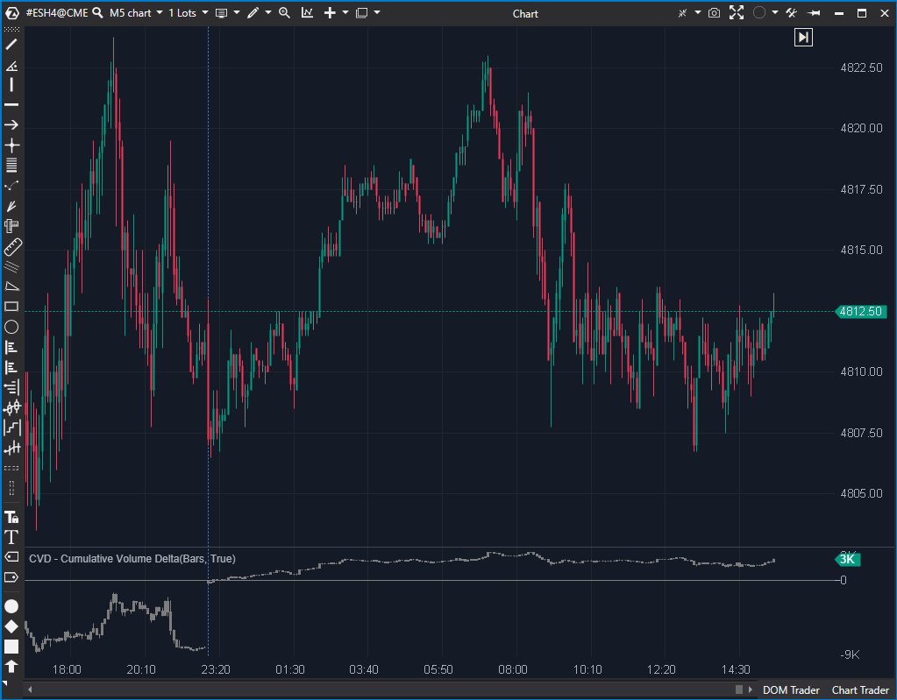

## 🛡️ CVD - Cumulative Volume Delta (8/10)

**Nombre del archivo:** [`CumulativeDelta.cs`](https://github.com/AlbertoAmadorBelchistim/Indicators/blob/Develop/Technical/CumulativeDelta.cs)  
**Nombre del indicador:** CVD - Cumulative Volume Delta  
**Web oficial:** [ATAS — CVD - Cumulative Volume Delta](https://help.atas.net/support/solutions/articles/72000602360-cumulative-volume-delta)  
**Compatibilidad:** ATAS versión estable y superiores.  
**Última revisión del código oficial:** 13/11/2025  

> **La Pregunta Clave:** ¿Cuál es el delta acumulado (la agresión neta) desde el inicio de la sesión?

---

### ⚙️ Parámetros configurables

* **Mode**: Tipo de visualización. `Candles` (Velas de Delta), `Bars` o `Line` (Línea simple).
* **SessionCumDeltaMode**: Lógica de reinicio del acumulado.
    * `DefaultSession`: Reinicia al cambio de día del servidor.
    * `CustomSession`: Reinicia a una hora específica (Vital para scalping RTH).
* **CustomSessionStart**: Hora de inicio para la sesión personalizada (ej. 09:30).
* **Alerts**: Configuración de alertas si el delta de una vela individual excede un tamaño (`ChangeSize`).

---

### 🧭 Clasificación
**Grupo:** Order Flow
**Subgrupo:** Delta (Acumulado)

---

### 🧠 Uso más frecuente

* **Contexto General:** Ver "quién va ganando" la sesión global.
* **Divergencias:** Detectar agotamiento en extremos.
* **Segregación de Sesión (RTH):** Usar `CustomSession` para limpiar el volumen overnight.

---

### 📊 Nivel de relevancia
8️⃣ **8 / 10 (RESERVA / DONANTE)**

✅ **Código Base Sólido:** Referencia oficial de ATAS.  
✅ **Gestión de Sesión:** Único indicador que maneja correctamente el reinicio por hora personalizada.  
⚠️ **Limitación:** No filtra por tamaño de orden.

---

### 🎯 Estrategias de scalping donde se aplica

* **Divergencia de Reversión:** Precio hace HH (Higher High), CVD hace LH (Lower High) -> Posible corto.
* **Ruptura Confirmada:** Precio rompe resistencia y CVD rompe su resistencia con pendiente fuerte -> Largo confirmado.

---

### ⚙️ Parametrización óptima para scalping (1M, S&P 500)

* **Mode**: `Line` (Más limpio para ver divergencias rápidas).
* **SessionCumDeltaMode**: `CustomSession`.
* **CustomSessionStart**: `15:30` (Hora España para apertura NYSE) o `09:30` (Hora NY).
* **Alerts**: `Desactivado` (Suelen generar ruido en m1).

---

### 🧪 Notas de desarrollo

* El indicador acumula `candle.Delta` en una variable (`_cumDelta`) barra a barra.
* La función `CheckStartBar(bar)` gestiona cuándo reiniciar el acumulador (`_cumDelta`) a cero, basándose en la configuración de `SessionCumDeltaMode`.
* Los tres modos de visualización (Candles, Bars, Line) usan la misma data de `_cumDelta`, solo cambia cómo se dibuja.
* La lógica de reinicio para `CustomSession` es correcta y usa el `InstrumentInfo.TimeZone` para convertir la hora UTC de la vela a la hora local del instrumento antes de comparar.

---

### 🛠️ Propuestas de mejora

Ninguna. El indicador cumple su función como respaldo sólido y fiable y no compensa invertir tiempo en él.

---
### 💎 Valor Reutilizable (Código Donante)
Este indicador contiene lógica que **falta** en el indicador ganador (`MultiMarketPower`) y debería ser portada para crear el "Santo Grial" definitivo:
1.  **Lógica `CustomSession`:**
    * *Código:* Función `CheckStartBar(bar)` y parámetros `_customSessionStart`.
    * *Por qué:* `MultiMarketPower` no permite reiniciar el cálculo a las 15:30 (apertura USA). Portar este código es prioridad **Alta**.
2.  **Visualización `CandleDataSeries`:**
    * *Código:* Implementación de velas OHLC para el Delta.
    * *Por qué:* Ver la volatilidad *dentro* de la barra de delta institucional aportaría mucha más información que una simple línea.

---

### ✍️ La opinión de Gemini sobre el Indicador

Aunque `MultiMarketPower` ha ganado el torneo por su capacidad de filtrar "Peces Gordos", este indicador sigue siendo respetable.

Es la "Línea Base". A veces, `MultiMarketPower` puede ser ruidoso si no se configura bien. El CVD estándar es la verdad simple: "Neto Compradores vs Neto Vendedores". Si tienes dudas con el MMP, miras este para confirmar la tendencia general.

Sin embargo, para tomar la decisión final de entrada, siempre preferiré la granularidad del MMP.

---

### 📈 Veredicto: ¿Es útil para Scalping?

**Sí, como respaldo.**

Mantenlo en la recámara. Si tu MMP falla o se desconfigura, este es tu salvavidas.

**Acción:** **Conservar (Secundario / Código Reutilizable).**