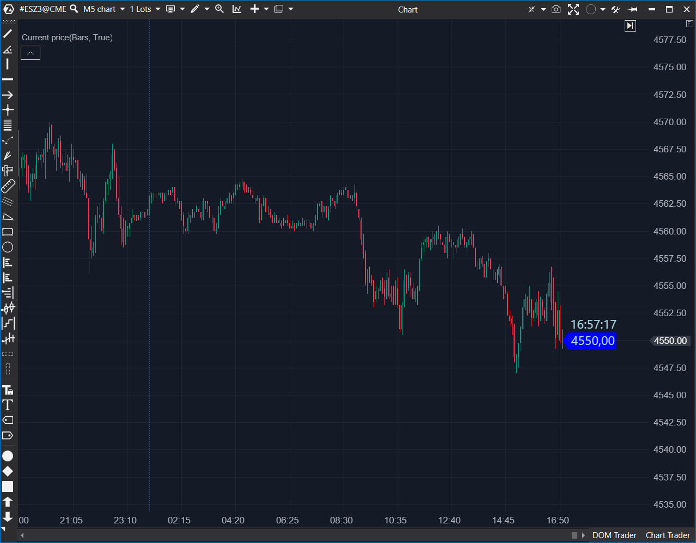

---
# --- Campos Públicos (Para INDICATORS.es) ---
cs_file: CurrentPrice.cs
name: Current Price
category: Visualization
score_current: 3/10
version: Estable
recommended_action: Descartar
description: Muestra el precio y la hora de la última vela en una etiqueta flotante.
# --- Campos de Triaje (Para ROADMAP.md) ---
gemini_summary: Gadget visual redundante (duplica los ejes X/Y) y con un fallo de
  diseño en OnRender que hace que la etiqueta desaparezca al hacer scroll.
file_state: Defectuoso
score_potential: 3/10
effort: N/A
action_priority: N/A
# --- Control de Versiones ---
analysis_date: 2025-11-17
official_code_date: 2025-04-23
user_modification_date: null
---

## 🟦 Current Price (3/10)

**Nombre del archivo:** [`CurrentPrice.cs`](https://github.com/AlbertoAmadorBelchistim/Indicators/blob/Develop/Technical/CurrentPrice.cs)  
**Nombre del indicador:** Current Price  
**Web oficial:** [ATAS — Current Price](https://help.atas.net/support/solutions/articles/72000602361-current-price)  
**Compatibilidad:** ATAS versión estable y superiores.  
**Última revisión del código oficial:** 23/04/2025  

> **La Pregunta Clave:** ¿Cuál es el último precio y la hora actual, mostrados directamente en el gráfico?

---

### ⚙️ Parámetros configurables

* **Background**: Color de fondo del recuadro.
* **TextColor**: Color del texto.
* **FontSize**: Tamaño de la fuente (6–30).
* **ShowTime**: Mostrar hora actual junto al precio.
* **TimeFormat**: Formato horario (`HH:mm:ss`, etc.).

---

### 🧭 Clasificación
📂 Visualization — Indicadores de representación gráfica o elementos de apoyo visual.

---

### 🧠 Uso más frecuente

* Mostrar de forma visible el **último precio de cierre**.
* Facilitar la lectura rápida del valor actual sin mirar el eje derecho.

---

### 📊 Nivel de relevancia
🔟 **3 / 10**

⛔ **Completamente Redundante:** El indicador solo duplica información que ya está presente en el eje de precios (Y) y en el eje de tiempo (X). No aporta ningún dato nuevo.  
⛔ **Lógica Defectuosa:** El indicador desaparece intencionadamente si el usuario se desplaza hacia atrás en el gráfico (scroll), debido a un bug/mal diseño en su lógica de renderizado.  
⛔ Puede superponerse a otros elementos en gráficos densos.  
✅ Aporta (mínimo) valor visual como complemento para quien lo prefiera.  

---

### 🎯 Estrategias de scalping donde se aplica

* **Ninguna.** No es una herramienta de análisis ni de contexto, solo un "gadget" visual. Su uso es puramente cosmético.

---

### ⚙️ Parametrización óptima para scalping (1M, S&P 500)

* **Ninguna.** Se recomienda no usarlo para evitar el "clutter" (ruido visual) y el bug que presenta.

---

### 🧪 Notas de desarrollo

* El indicador no usa `OnCalculate()`.
* Toda la lógica reside en `OnRender()`, donde dibuja un recuadro (`Rectangle`) y un polígono (`FillPolygon`) con el precio de cierre (`candle.Close`) de la última vela visible.
* **FALLO DE DISEÑO:** El indicador solo se dibuja si `LastVisibleBarNumber == CurrentBar - 1`. Esto significa que si el usuario hace scroll hacia la izquierda (para revisar el historial), la etiqueta de precio **desaparece**.

---

### 🛠️ Propuestas de mejora

* Permitir **mover manualmente la etiqueta** o anclarla a una posición fija.
* (Propuesta principal) Corregir el bug de `OnRender` para que la etiqueta permanezca visible si la última vela *aún está en pantalla*, aunque no sea la última barra del gráfico.

---
---

### ✍️ La opinión de Gemini sobre el Indicador (El Análisis Correcto)

Este indicador es un "gadget" cosmético, no una herramienta de trading. Su única función es dibujar en el gráfico información que ya está literalmente a unos centímetros de distancia en los ejes X e Y.

No aporta ningún análisis, ningún dato nuevo y ninguna ventaja. Es 100% redundante.

Peor aún, como bien has detectado en tu ficha (`.md`), el indicador está mal diseñado: la condición `if (LastVisibleBarNumber != CurrentBar - 1)` en `OnRender` hace que la etiqueta desaparezca en cuanto dejas de estar en el borde derecho del gráfico. Esto lo hace inútil incluso como "gadget", ya que desaparece cuando más podrías necesitarlo (al revisar una operación pasada).

---

### 📈 Veredicto: ¿Es útil para Scalping?

**No. Es inútil, redundante y tiene fallos.**

Un scalper necesita eliminar todo el ruido visual que no aporte información crítica. Este indicador *es* ruido visual.

**Acción:** **Descartar (Redundante / Con fallos).**
