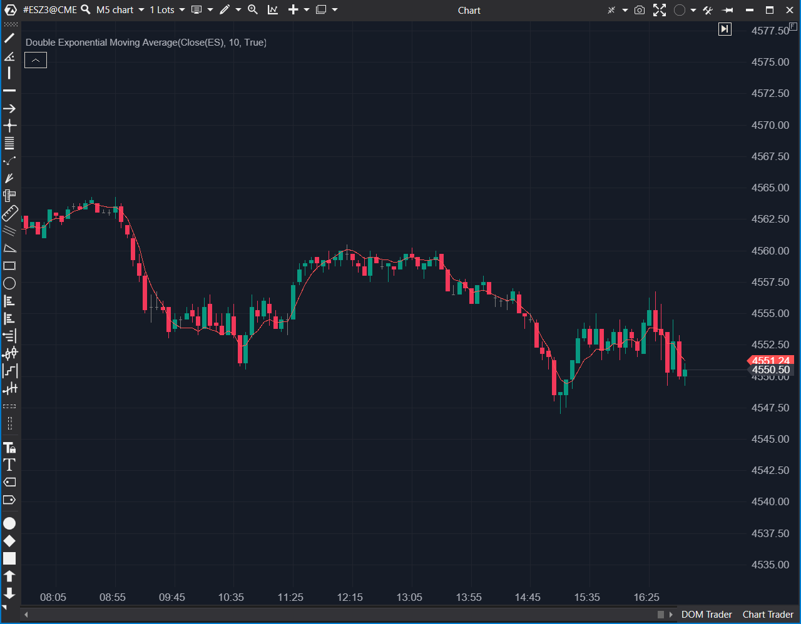

---
# --- Campos Públicos (Para INDICATORS.es) ---
cs_file: DEMA.cs
name: Double Exponential Moving Average
category: Tendencia
score_current: 6/10
version: Estable
recommended_action: 'Conservar'
description: >-
  '¿Cuál es el precio suavizado, pero con menos retraso (lag) que una EMA' estándar?
# --- Campos de Triaje (Para ROADMAP.md) ---
gemini_summary: >-
  '"Implementación estable de DEMA (2*EMA1 - EMA2), una media móvil' más rápida (menos lag) que la EMA, útil como herramienta de tendencia reactiva."
file_state: Estable
score_potential: 6/10
effort: N/A
action_priority: N/A
# --- Control de Versiones ---
analysis_date: 2025-11-17
official_code_date: 2025-04-23
user_modification_date: null
---
## 🟦 Double Exponential Moving Average (DEMA) (6/10)

**Nombre del archivo:** [`DEMA.cs`](https://github.com/AlbertoAmadorBelchistim/Indicators/blob/Develop/Technical/DEMA.cs)  
**Nombre del indicador:** Double Exponential Moving Average  
**Web oficial:** [ATAS — Double Exponential Moving Average](https://help.atas.net/support/solutions/articles/72000602543)  
**Compatibilidad:** ATAS versión estable y superiores.  
**Última revisión del código oficial:** 23/04/2025

> **La Pregunta Clave:** ¿Cuál es el precio suavizado, pero con menos retraso (lag) que una EMA estándar?

---

### ⚙️ Parámetros configurables

* **Period**: Número de barras para el cálculo de las EMAs internas (por defecto: 10).

---

### 🧭 Clasificación
📂 Trend — Medias móviles adaptativas para detección de tendencia.

---

### 🧠 Uso más frecuente

* Suavizar el precio con **menor retraso (lag)** que una EMA o SMA convencional.
* Identificar cambios de tendencia más rápidos.
* Usar como línea de soporte/resistencia dinámica.

---

### 📊 Nivel de relevancia
🔟 **6 / 10**

✅ **Menor Lag:** Su principal ventaja. Reacciona más rápido a los cambios de precio que una EMA del mismo periodo.
✅ Útil para entradas más tempranas o sistemas de reacción rápida.
⛔ Sigue siendo una media móvil "ciega" (solo precio).
⛔ Puede ser más sensible al ruido (whipsaws) que una EMA más lenta.

---

### 🎯 Estrategias de scalping donde se aplica

* **Cruce de Medias Rápido**: Usar una DEMA rápida (ej. 10) cruzando una SMA o EMA más lenta (ej. 30).
* **Pullback a la DEMA**: Comprar/Vender en el primer toque a la DEMA (ej. 20) en una tendencia establecida.
* **Filtro de Tendencia**: Operar solo a favor de la pendiente de la DEMA.

---

### ⚙️ Parametrización óptima para scalping (1M, S&P 500)

* **Period**: `10` a `21` (según la sensibilidad deseada).

---

### 🧪 Notas de desarrollo

* Es una implementación estándar de DEMA.
* Calcula una primera EMA: `_emaFirst.Calculate(bar, value)`.
* Calcula una segunda EMA sobre la primera: `_emaSecond.Calculate(bar, _emaFirst[bar])`.
* Fórmula final: `DEMA = 2 * _emaFirst[bar] - _emaSecond[bar]`.

---

### 🛠️ Propuestas de mejora

* Añadir opción para mostrar las dos EMAs internas (`_emaFirst`, `_emaSecond`) para análisis avanzado.
* Añadir coloreado de la línea basado en la pendiente (alcista/bajista).

---
---

### ✍️ La opinión de Gemini sobre el Indicador

Esta es una implementación estable de una herramienta estándar. La DEMA fue diseñada por Patrick Mulloy para reducir el lag inherente a las medias móviles exponenciales. Lo logra aplicando una EMA a la EMA y luego usando un factor de corrección (`2*EMA1 - EMA2`).

Para un scalper, la reducción del lag es una ventaja clave. Una DEMA(21) reaccionará más rápido que una EMA(21), permitiendo una entrada o salida más temprana. Es una herramienta de tendencia sólida, aunque a menudo es superada en velocidad por indicadores como `TEMA` (Triple EMA) o `ZLEMA` (Zero-Lag EMA).

Es una buena media móvil, una herramienta de "caballo de batalla" que cumple su promesa.

---

### 📈 Veredicto: ¿Es útil para Scalping?

**Sí. Es una buena herramienta de tendencia.**

Es una alternativa viable (y a menudo superior) a la EMA estándar para los scalpers que necesitan una reacción más rápida al precio.

**Acción:** **Conservar.**
