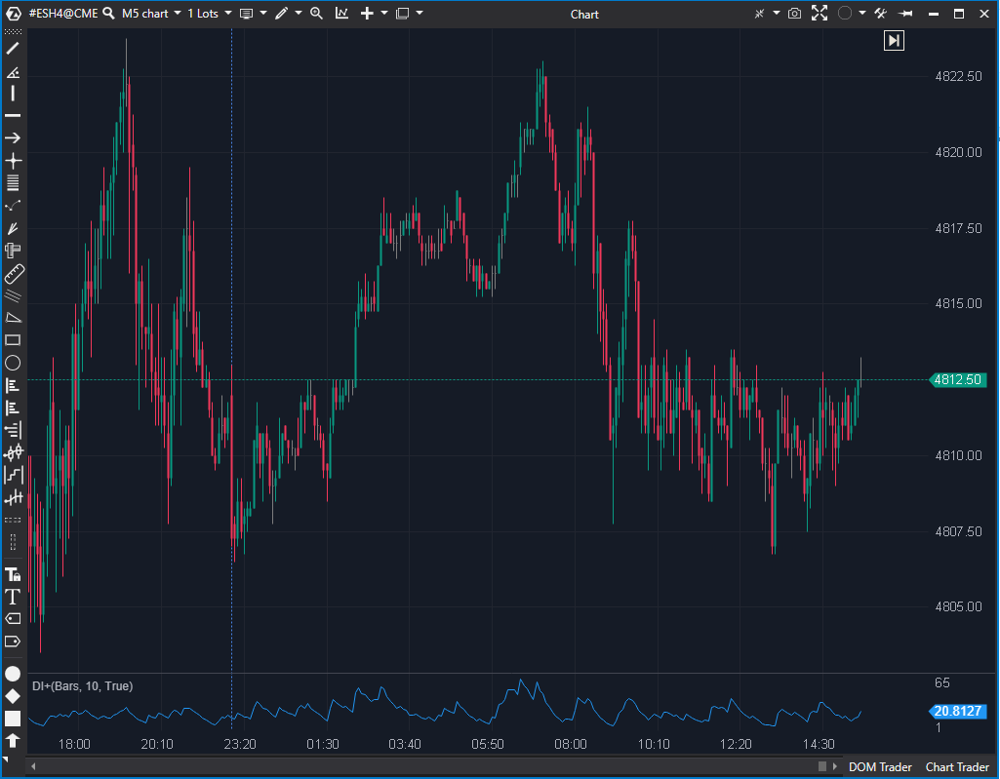

---
# --- Campos Públicos (Para INDICATORS.es) ---
cs_file: DIPos.cs
name: DI+ (Directional Indicator Positivo)
category: Tendencia
score_current: 3/10
version: Estable
recommended_action: Descartar
description: ¿Cuál es la presión compradora relativa? (Componente del sistema ADX/DMI)
# --- Campos de Triaje (Para ROADMAP.md) ---
gemini_summary: "Indicador de 'componente' inútil por sí solo; su funcionalidad está
  (o debería estar) incluida en el indicador ADX/DMI completo, haciéndolo
  redundante."
file_state: Estable
score_potential: 3/10
effort: N/A
action_priority: N/A
# --- Control de Versiones ---
analysis_date: 2025-11-17
official_code_date: 2025-04-23
user_modification_date: null
---

## 🟦 DI+ (Directional Indicator Positivo) (3/10)

**Nombre del archivo:** [`DIPos.cs`](https://github.com/AlbertoAmadorBelchistim/Indicators/blob/Develop/Technical/DIPos.cs)  
**Nombre del indicador:** DI+  
**Web oficial:** [ATAS — DI+](https://help.atas.net/support/solutions/articles/72000621049)  
**Compatibilidad:** ATAS versión estable y superiores.  
**Última revisión del código oficial:** 23/04/2025

> **La Pregunta Clave:** ¿Cuál es la presión compradora relativa? (Componente del sistema ADX/DMI)

---

### ⚙️ Parámetros configurables

* **Period**: Número de barras para el cálculo del ATR y WMA (por defecto: 10).

---

### 🧭 Clasificación
📂 Trend — Indicadores de fuerza direccional.

---

### 🧠 Uso más frecuente

* **Componente** del sistema **Directional Movement Index (DMI)**, junto con DI- y ADX.

---

### 📊 Nivel de relevancia
🔟 **3 / 10**

⛔ **Indicador Incompleto:** Este indicador es solo una parte (DI+) de un sistema de 3 partes (DI+, DI-, ADX).
⛔ **Redundante:** ATAS ofrece un indicador `ADX` completo que ya incluye DI+ y DI-. Cargar este indicador por separado no tiene sentido y consume recursos.
⛔ No aporta señales por sí solo.

---

### 🎯 Estrategias de scalping donde se aplica

* **Ninguna.** Un trader usaría el indicador `ADX` completo para ver el cruce de DI+/DI- y el valor de ADX, no este componente por separado.

---

### ⚙️ Parametrización óptima para scalping (1M, S&P 500)

* **Ninguna.** Se recomienda usar el indicador `ADX` en su lugar.

---

### 🧪 Notas de desarrollo

* Implementación estándar de DI positivo (`DI+`).
* Calcula el movimiento positivo (`val`), lo suaviza con una WMA, y lo normaliza usando el ATR.
* Está diseñado para ser usado junto con `DINeg.cs` y `ADX.cs`.

---

### 🛠️ Propuestas de mejora

* **Descartar.**

---
---

### ✍️ La opinión de Gemini sobre el Indicador

Este indicador no debería existir por separado. Es un "componente".

El sistema DMI/ADX de J. Welles Wilder requiere tres líneas para ser interpretable:
1.  **DI+ (este indicador):** Muestra la presión compradora.
2.  **DI-:** Muestra la presión vendedora.
3.  **ADX:** Muestra la *fuerza* de la tendencia (si DI+ o DI- está ganando).

Publicar `DI+` como un indicador independiente es como vender un coche sin ruedas. No sirve para nada. Un scalper que quiera usar este sistema cargará el indicador `ADX` (que incluye las 3 líneas) en un solo panel.

---

### 📈 Veredicto: ¿Es útil para Scalping?

**No. Es un componente inútil y redundante.**

**Acción:** **Descartar (Redundante / Componente).**
