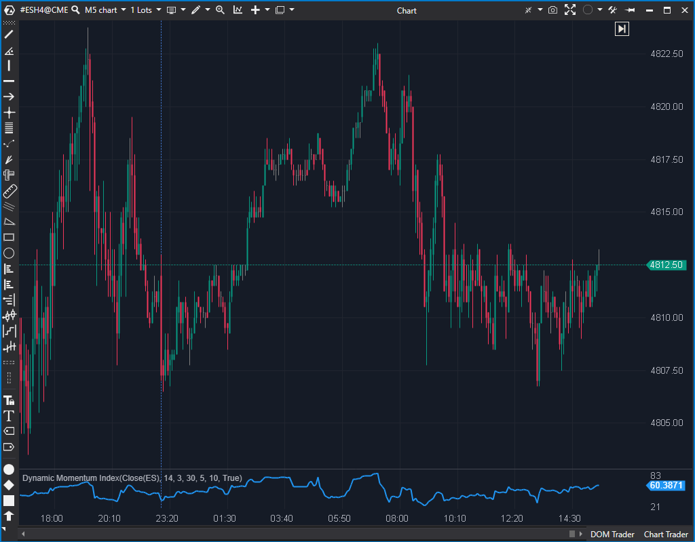

## 🟦 Dynamic Momentum Index (DMI) (5/10)

**Nombre del archivo:** [`DMI.cs`](https://github.com/AlbertoAmadorBelchistim/Indicators/blob/Develop/Technical/DMI.cs)  
**Nombre del indicador:** Dynamic Momentum Index  
**Web oficial:** [ATAS — Dynamic Momentum Index](https://help.atas.net/support/solutions/articles/72000602261)  
**Compatibilidad:** ATAS versión estable y superiores.  
**Última revisión del código oficial:** 23/04/2025

> **La Pregunta Clave:** ¿Cuál es el RSI, pero con un periodo que se ajusta automáticamente a la volatilidad del mercado?



---

### ⚙️ Parámetros configurables

* **RsiPeriod**: Periodo base del RSI dinámico (por defecto: 14).
* **RsiMin / RsiMax**: Límites inferior y superior del periodo dinámico permitido (ej. 3-30).
* **StdPeriod**: Periodo para el cálculo de la desviación estándar (volatilidad).
* **SmaPeriod**: Periodo para la media móvil usada como base de la volatilidad.

---

### 🧭 Clasificación
📂 Momentum — Osciladores adaptativos basados en volatilidad.

---

### 🧠 Uso más frecuente

* Detectar condiciones de **sobrecompra o sobreventa ajustadas a la volatilidad actual**.
* Utilizar un RSI dinámico que se adapta al mercado en vez de ser fijo.
* Evaluar momentos de aceleración o desaceleración del momentum con mayor precisión.

---

### 📊 Nivel de relevancia
🔟 **5 / 10**

✅ **Concepto Excelente:** Un RSI que se acelera (periodo corto) en alta volatilidad y se frena (periodo largo) en baja volatilidad es, en teoría, superior a un RSI fijo.  
⛔ **BUG CRÍTICO:** El indicador tiene un bug lógico en su implementación del RSI que lo hace poco fiable.  
⛔ Requiere más parámetros y calibración que un RSI tradicional.  

---

### 🎯 Estrategias de scalping donde se aplica

* (Teóricas, si se repara) **Divergencia adaptativa**: Buscar divergencias en un oscilador que no se "satura" tan rápido como un RSI fijo.
* (Teóricas, si se repara) **Reversión en extremos**: Vender en sobrecompra / Comprar en sobreventa, con niveles que se adaptan al régimen del mercado.

---

### ⚙️ Parametrización óptima para scalping (1M, S&P 500)

* **No recomendado hasta ser reparado.**

---

### 🧪 Notas de desarrollo

* El indicador calcula la volatilidad (`vi = std / sma`).
* Usa esa volatilidad para calcular un periodo dinámico: `td = RsiPeriod / vi`.
* El periodo `td` se "sujeta" entre `RsiMin` y `RsiMax`.
* **FALLO CRÍTICO:** En la función `RsiDynamic(bar, period)`, hay un bug lógico:
    ```csharp
    if (_negSmma != 0) 
    {
        if (_negSmma == 0) // <-- Este 'if' es imposible, nunca se ejecutará
            return 0;

        var div = _posSmma / _negSmma;
        return div == 1 ? 0 : 100 - 100 / (1 + div);
    }
    return 100; // Esto se ejecuta si _negSmma == 0
    ```
* Este bug hace que la lógica del RSI sea defectuosa en ciertas condiciones.

---

### 🛠️ Propuestas de mejora (Reparación)

* **Crítico (P3):** Reescribir la función `RsiDynamic` para que la lógica del RSI sea correcta. La lógica estándar de RSI es:
    ```csharp
    if (_negSmma == 0)
    {
        return (_posSmma == 0) ? 50 : 100; // Si ambos son 0, neutral (50). Si solo neg es 0, 100.
    }
    var rs = _posSmma / _negSmma;
    return 100 - (100 / (1 + rs));
    ```
* Añadir opción para mostrar el periodo dinámico (`td`) como una línea secundaria.

---
---

### ✍️ La opinión de Gemini sobre el Indicador

El concepto de este indicador es de **9/10**. Un RSI adaptativo es exactamente lo que un scalper necesita, ya que un RSI(14) fijo es inútil, se satura en tendencias fuertes y da señales falsas en rangos. Un RSI que "sabe" cuándo acelerar y cuándo frenar es una idea de nivel profesional.

Lamentablemente, la implementación tiene un bug claro en la lógica de cálculo del RSI (`RsiDynamic`). Este error, aunque sutil, hace que el indicador sea poco fiable.

Dado que el concepto es excelente y la reparación es trivial (`effort: Bajo`), este es un candidato P3 claro para `Reparar`. Una vez reparado, podría ser una herramienta de momentum superior.

---

### 📈 Veredicto: ¿Es útil para Scalping?

**No en su estado actual (Buggy).**

Si se repara, tiene el potencial de ser una herramienta de momentum de 9/10, mucho más útil que el RSI estándar.

**Acción:** **Reparar (Buggy).**

**¿Merece la pena arreglarlo?** **Sí.** Es un esfuerzo de programación `Bajo` (P3) para obtener una herramienta de momentum adaptativa de alto potencial.