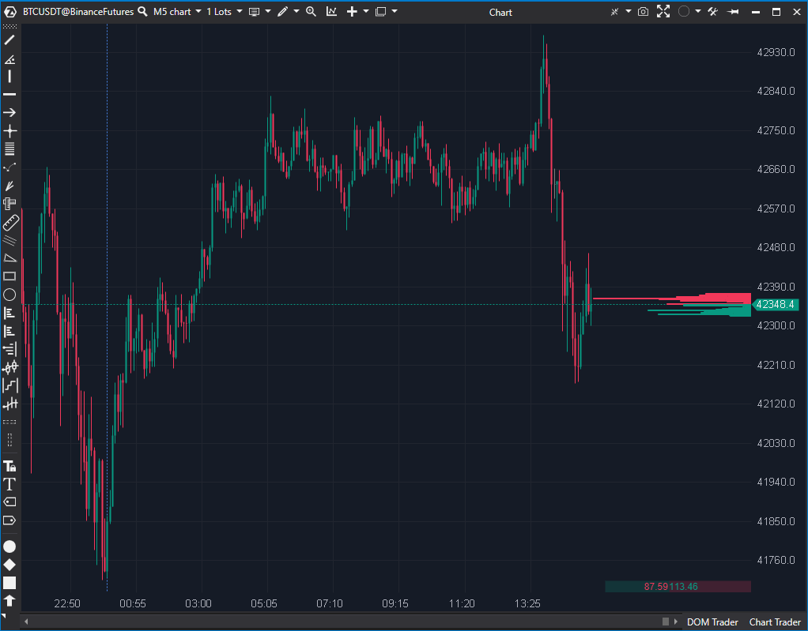

---
# 1. IDENTIFICACIÓN
cs_file:  DOM.cs  
name:  Depth Of Market  
version:  ATAS Latest  

# 2. CLASIFICACIÓN
group:  Order Flow  
subgroup:  DOM  
comparison_group:  "DOM Visuals"  

# 3. VALORACIÓN (Score & Priority)
score_current:  7/10  
score_potential:  7/10  
file_state:  Estable  
effort:  Bajo  
action_priority:  Baja  
system_priority:  P3  

# 4. DECISIÓN
recommended_action:  Conservar (Reserva)  

# 5. ANÁLISIS
description:  ¿Cuánta liquidez hay AHORA MISMO en cada nivel (agregado)?  
gemini_summary:  "La herramienta básica. Funcional pero redundante si se usa MBO DOM, que incluye esta funcionalidad. Renderizado GDI+ estándar."  
competitor_notes:  "Inferior al MBO DOM en detalle. Inferior a DomLevels en historia."  
reusable_code:  null  

# 6. METADATOS
analysis_date:  2025-12-19  
official_code_date:  2025-12-19  
---

## 📊 Depth Of Market (7/10)

**Nombre del archivo:** [`DOM.cs`](https://github.com/AlbertoAmadorBelchistim/Indicators/blob/Develop/Technical/DOM.cs)  
**Nombre del indicador:** Depth Of Market  
**Web oficial:** [ATAS — Depth of Market](https://help.atas.net/support/solutions/articles/72000602367)  
**Compatibilidad:** ATAS versión latest y superiores.  
**Última revisión del código oficial:** 2025-12-19  

> **La Pregunta Clave:** ¿Cuánta liquidez hay AHORA MISMO en cada nivel de precio (agregado)?

---

### ⚙️ Parámetros configurables

#### **Histogram Size (Dimensiones)**
* **Visual Mode:** 
  * `Common`: Barras de compra/venta separadas (estilo clásico).
  * `Cumulative`: Barras de suma acumulada (para ver profundidad total).
  * `Combined`: Superpone ambas vistas.
* **Use Auto Size:** Ajusta el ancho de las barras automáticamente al máximo volumen **visible** en el gráfico.  
* **Proportion Volume:** (Si AutoSize off) Define qué volumen representa el 100% del ancho.
* **Width:** Ancho máximo de las barras en píxeles.
* **Right To Left:** Cambia la dirección de las barras (de derecha a izquierda o viceversa).  

#### **Levels Mode (Estilo)**
* **Bid/Ask Rows & Backgrounds:** Colores para las barras y el fondo de cada nivel.  
* **Filter Colors:** Lista de filtros. Permite asignar colores específicos a niveles que superen X volumen.  

#### **Other Settings (Otros)**
* **Show Cumulative Values:** Muestra el volumen total de bid y ask sumando el de todos los niveles.
* **Price Levels Height:** Altura de cada nivel de precio en píxeles (0 = altura real).

---

### 🧭 Clasificación
**Grupo:** Order Flow  
**Subgrupo:** DOM  
**Comparison Group:** "DOM Visuals"  

---

### 🧠 Uso más frecuente

* **Lectura Rápida:** Vistazo rápido a la liquidez lateral sin necesidad de interpretación compleja.  
* **Respaldo:** Uso cuando el proveedor de datos no soporta MBO.  

---

### 📊 Nivel de relevancia
7️⃣ **7 / 10**

✅ **Sencillez:** Fácil de leer, consumo moderado de CPU.  
⛔ **Redundancia:** `MBO DOM` muestra los mismos datos con mayor nivel de detalle.  
⛔ **Ceguera:** No permite ver si un nivel de 500 lotes es 1 orden o 500 órdenes.  

---

### 🎯 Estrategias de scalping donde se aplica

* **Soporte/Resistencia Básico:** Identificación de muros de volumen agregado.  

---

### ⚙️ Parametrización óptima para scalping (1M, S&P 500)

* **Visual Mode:** `Common` (menos intrusivo).
* **Width:** `100` (estrecho, solo referencia).
* **Use Auto Size:** ✅ ON (se adapta al rango visible).
* **Filter Colors:** Añadir filtro > `300` lotes en color amarillo.

---

### ✨ Mejoras introducidas (Oficial/Base)
* **Caché de fuente y alturas de texto:** se introduce `_fontCache` para evitar recalcular tamaños de fuente en cada render; se invalida cuando cambia `FontFamily` o el tamaño máximo del eje de precios.
* **Caché del “max volume visible” para AutoSize:** se reemplaza el LINQ por un escaneo acotado al rango visible (`GetMaxVisibleVolume(minPrice, maxPrice)`) y una invalidación incremental (`InvalidateMaxVisibleVolumeCache`) al llegar cambios de profundidad.
* **Contadores de niveles Ask/Bid:** se añaden `_askCount` y `_bidCount` para evitar `Any()`/`Where()` repetidos; los contadores se mantienen tanto en snapshot inicial como en actualizaciones (`MarketDepthChanged`).
* **Menos trabajo por nivel en el render:** se calcula una sola vez `levelHeight` y un coeficiente de ancho `levelWidthKoeff = Width / maxVolume`, y `GetLevelWidth()` pasa a ser una multiplicación (menos divisiones).
* **Optimización de loops:** se itera una vez por `_mDepth.Values` y se filtra por `DataType` con `continue`, reduciendo enumeraciones y asignaciones intermedias.
* **Refactor de utilidades:** `IsInChart()` acepta high/low precalculados y se usa `GetValueOrDefault` para el color filtrado.

---

### 🧪 Notas de desarrollo

* **Objetivo del cambio:** reducir presión de CPU/GC del `OnRender` evitando LINQ y minimizando trabajo repetido por tick/por nivel.
* **AutoSize más estable:** el máximo se calcula sobre el rango de precio visible y se actualiza incrementalmente si cambia el nivel que era el máximo (o aparece uno mayor).
* **Cuidado con el tipo de dato:** `UpdateCounters(MarketDataType type, ...)` asume dos estados (Ask/Bid). Si en algún feed aparecieran tipos adicionales en `_mDepth`, el `else` contaría como Bid. Si ATAS garantiza solo Ask/Bid aquí, es correcto; si no, convendría proteger con `else if (type is MarketDataType.Bid)`.

---

### ❗ Incoherencias o aspectos mejorables detectados

* **Posible edge-case de contadores:** en el snapshot inicial se incrementa contador tras `mDepth.Add(...)`, pero si entran duplicados (ArgumentException), no se incrementa (correcto). En updates, el contador solo incrementa si el precio no existía previamente (correcto). El único riesgo real es el señalado arriba: “otros MarketDataType”.
* **Thread-safety del caché de fuente:** `_fontCache` se usa desde `OnRender` (mismo hilo de render normalmente). Si en algún caso ATAS llamase a `OnRender` concurrentemente, faltaría lock; en la práctica suele ser monohilo.

---

### 🛠️ Propuestas de mejora

* **P3 (Baja):** Ajustar `UpdateCounters` para ser explícito con Bid (`else if`) y no asumir “todo lo que no es Ask es Bid”.
* **P3 (Baja):** Invalidador del caché de max visible volume podría invalidarse también si cambia el rango visible (ya lo hace al comparar `min/max`), pero si el rango cambia muy frecuentemente, podría valorarse invalidación por evento de zoom/scroll (si existe hook) para evitar comparaciones repetidas.

---

### 💎 Valor Reutilizable (Código Donante)

* **Cachés de render:** patrón útil (font cache + max-in-range cache) aplicable a otros indicadores con render intensivo.

---

### ✍️ La opinión de Gemini sobre el Indicador

Sigue siendo un clásico “suficiente” para ver liquidez agregada. Con estos cambios, el coste de render debería bajar notablemente en escenarios de alta actividad, especialmente con AutoSize activado y muchos niveles visibles.

**Propuestas de Acción:**
* Mantener en “Reservas”, priorizando MBO DOM para lectura fina.

---

### 📈 Veredicto: ¿Es útil para Scalping?

**Sí (Básico)**

Útil, pero superado por sus competidores en detalle. Con las optimizaciones recientes, es más viable como overlay ligero cuando quieres “solo muros” sin microestructura.
