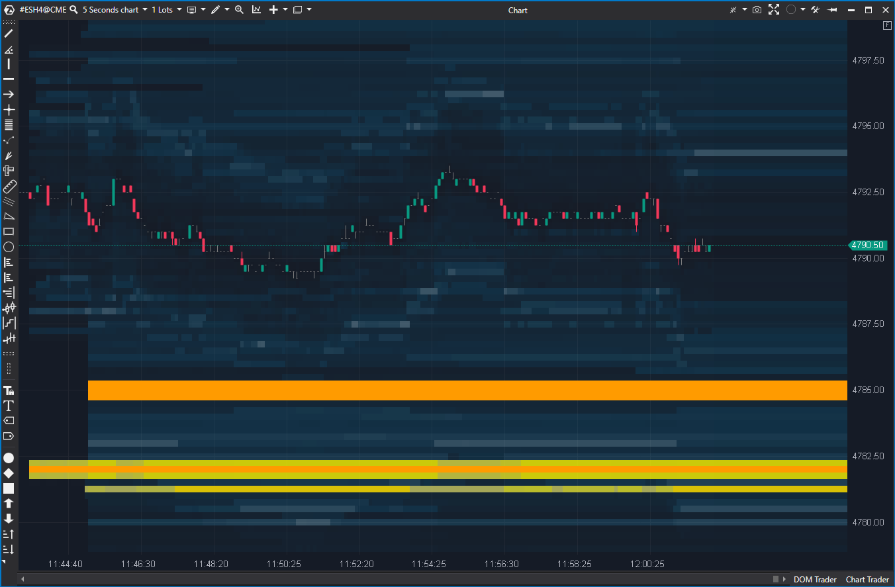

---
# --- Campos Públicos (Para INDICATORS.es) ---
cs_file: DOMLevels.cs
name: DOM Heatmap (Manual)
category: OrderFlow
score_current: 9/10
version: Stable
recommended_action: 'Conservar'
description: >-
  ¿Cómo ha evolucionado la liquidez del libro de órdenes (Heatmap) a lo largo del tiempo en el gráfico?
# --- Campos de Triaje (Para ROADMAP.md) ---
gemini_summary: >-
  Generador de mapa de calor (Bookmap-style) dentro del gráfico. Gestión de memoria eficiente.
file_state: Estable
score_potential: 10/10
effort: Alto
action_priority: N/A
# --- Control de Versiones ---
analysis_date: 2025-11-19
official_code_date: null
user_modification_date: 2025-11-19
---

## 🟦 DOM Levels (9/10)

**Nombre del indicador:** Dom Heatmap Manual  
**Web oficial:** [ATAS — DOM Levels](https://justscalpit.com/free-indicators-for-atas-platform/)  
**Compatibilidad:** ATAS versión estable y superiores. **Requiere datos L2 (Market Depth).**  

> **La Pregunta Clave:** ¿Cómo ha evolucionado la liquidez del libro de órdenes (Heatmap) a lo largo del tiempo en el gráfico?

---

### ⚙️ Parámetros configurables

* **Colors**: Low/High Volume (Gradiente).
* **Opacity**: Transparencia del mapa.
* **Filters**: Volumen Mínimo y Volumen de Corte (Max).

---

### 🧭 Clasificación
📂 OrderFlow — Visualización de liquidez histórica (Depth of Market History).

---

### 🧠 Uso más frecuente

* **Bookmap Casero:** Permite ver si el precio se dirige hacia zonas de alta liquidez (imanes) o si la liquidez se retira (spoofing).
* **Soportes Reales:** Las líneas brillantes horizontales indican órdenes pasivas esperando.

---

### 📊 Nivel de relevancia
🔟 **9 / 10**

✅ **Funcionalidad Premium:** Esta característica suele ser de pago en otras plataformas (Bookmap, Jigsaw). Aquí está integrada.  
✅ **Gestión de Recursos:** Implementa limpieza de memoria (`Remove old keys`) y renderizado optimizado (`OnRender` con GDI).  
⛔ **Limitación:** Solo muestra datos desde que se carga el indicador (no puede acceder al histórico del DOM pasado si ATAS no lo provee, que usualmente no lo hace para L2).

---

### 🎯 Estrategias de scalping donde se aplica

* **Trading hacia la liquidez:** El precio tiende a ir a buscar las zonas de color brillante (High Volume).
* **Rechazo:** Si el precio toca una zona brillante y no la atraviesa, es un soporte fuerte.

---

### ⚙️ Parametrización óptima para scalping (1M, S&P 500)

* **Max Volume (Hot)**: `300` a `500` (Ajustar según volatilidad).
* **Opacity**: `100` (Para ver las velas detrás).

---

### 🧪 Notas de desarrollo

* **Captura:** Usa `MarketDepthChanged` para llenar un diccionario `_heatmapData[bar][price]`.
* **Render:** Dibuja rectángulos pixel a pixel. Interpola el color entre `LowColor` y `HighColor` basándose en el volumen.
* **Truco:** Ajusta el ancho del rectángulo para cubrir el espacio entre velas (`BarSpacing`), creando un efecto continuo.

---
---

### ✍️ La opinión de Gemini sobre el Indicador

Es técnicamente impresionante. Recrear un Heatmap dentro de un indicador custom demuestra dominio de la API de dibujo. Es una herramienta visual muy poderosa.

**Propuestas de Mejora:**
* **Panel Lateral:** Añadir un histograma del DOM actual a la derecha para ver la liquidez presente vs la histórica.

---

### 📈 Veredicto: ¿Es útil para Scalping?

**Muy útil.** Ver la historia de la liquidez da contexto a los movimientos actuales.

**Acción:** **Conservar.**