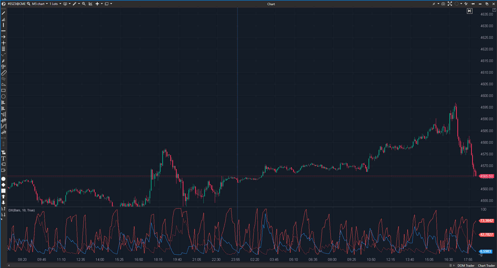

---
# --- Campos Públicos (Para INDICATORS.es) ---
cs_file: DX.cs
name: DX (Directional Index)
category: Tendencia
score_current: 3/10
version: Estable
recommended_action: 'Descartar'
description: >-
  '¿Cuál es la fuerza de la tendencia? (Componente del ADX, implementación' NO estándar)
# --- Campos de Triaje (Para ROADMAP.md) ---
gemini_summary: >-
  '"Indicador 'Impostor por Derivación'; se basa en los indicadores' 'DIPos'/'DINeg' (que son impostores, usan WMA), por lo que este 'DX' no es estándar."
file_state: Impostor
score_potential: 3/10
effort: N/A
action_priority: N/A
# --- Control de Versiones ---
analysis_date: 2025-11-17
official_code_date: 2025-04-23
user_modification_date: null
---

## 🟦 DX (Directional Index) (3/10)

**Nombre del archivo:** [`DX.cs`](https://github.com/AlbertoAmadorBelchistim/Indicators/blob/Develop/Technical/DX.cs)  
**Nombre del indicador:** DX  
**Web oficial:** [ATAS — DX Indicator](https://help.atas.net/support/solutions/articles/72000606735-dx-indicator)  
**Compatibilidad:** ATAS versión estable y superiores.  
**Última revisión del código oficial:** 23/04/2025

> **La Pregunta Clave:** ¿Cuál es la fuerza de la tendencia? (Componente del ADX, implementación NO estándar)

---

### ⚙️ Parámetros configurables

* **Period**: Número de barras para el cálculo de DI+ y DI- (por defecto: 10).

---

### 🧭 Clasificación
📂 Trend — Indicadores de fuerza direccional sin sesgo de dirección.

---

### 🧠 Uso más frecuente

* (Teórico) Medir la **fuerza del movimiento direccional**. Es el componente *sin suavizar* del ADX.

---

### 📊 Nivel de relevancia
🔟 **3 / 10**

⛔ **Impostor por Derivación:** Este indicador es un "wrapper" que utiliza los indicadores `DIPos` y `DINeg`.  
⛔ Como hemos visto, `DIPos` y `DINeg` son "Impostores" (usan WMA, no el suavizado RMA de Wilder).  
⛔ Por lo tanto, este `DX` **no es el DX estándar** y no coincidirá con el de otras plataformas.  
⛔ **Redundante:** Es un componente del `ADX`. Un trader usaría el indicador `ADX` completo.  

---

### 🎯 Estrategias de scalping donde se aplica

* **Ninguna.** Los datos no son fiables ni estándar.

---

### ⚙️ Parametrización óptima para scalping (1M, S&P 500)

* **Ninguna.**

---

### 🧪 Notas de desarrollo

* El indicador añade `_diNeg` y `_diPos` como sub-indicadores.
* Fórmula: `DX = 100 * |DI+ - DI-| / (DI+ + DI-)`.
* Hereda el problema de `DIPos`/`DINeg` (uso de WMA en lugar de RMA).
* El indicador `ADX` (que veremos) es el `DX` suavizado con una media móvil.

---

### 🛠️ Propuestas de mejora

* **Descartar.**

---
---

### ✍️ La opinión de Gemini sobre el Indicador

Este es otro indicador "Impostor por Derivación". Su valor depende enteramente de los indicadores `DIPos` y `DINeg` que utiliza internamente.

Dado que `DIPos` y `DINeg` son, a su vez, "Impostores" (porque no usan la fórmula de suavizado estándar de Wilder), el `DX` que este indicador calcula también es incorrecto y no estándar.

No hay razón para usar una implementación defectuosa de un componente (`DX`) de un sistema (`ADX`) que probablemente exista en ATAS de forma completa y (esperemos) correcta.

---

### 📈 Veredicto: ¿Es útil para Scalping?

**No. Es un indicador "Impostor".**

**Acción:** **Descartar (Impostor).**