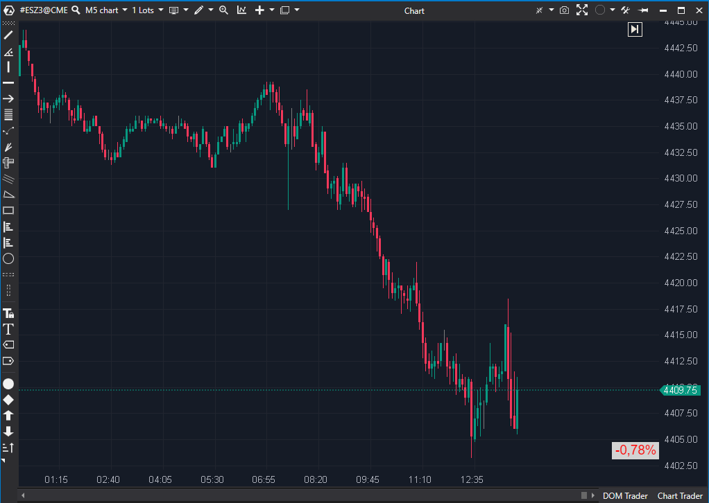

---
cs_file: DailyChange.cs
name: Daily Change
category: Structure
group: Structure
subgroup: Static Levels
score_current: 6/10
version: Estable
recommended_action: Conservar
description: ¿Cuál es la variación neta del precio en el día?
gemini_summary: "Contexto esencial ('¿de qué humor está la fiesta?'). Dato clave para filtrar trades."
comparison_group: "Timeframe Levels"
competitor_notes: "Único en su función."
reusable_code: null
file_state: Estable
score_potential: 6/10
effort: N/A
action_priority: N/A
analysis_date: 2025-11-17
official_code_date: 23/04/2025
---

## 🟦 Daily Change (6/10)

**Nombre del archivo:** [`DailyChange.cs`](https://github.com/AlbertoAmadorBelchistim/Indicators/blob/Develop/Technical/DailyChange.cs)  
**Nombre del indicador:** Daily Change  
**Web oficial:** [ATAS — Daily Change](https://help.atas.net/support/solutions/articles/72000602542)
**Compatibilidad:** ATAS versión estable y superiores.  
**Última revisión del código oficial:** 23/04/2025  

> **La Pregunta Clave:** ¿Cuál es la variación neta del precio en el día (en %, ticks o $)?

---

### ⚙️ Parámetros configurables

* **BuyColor / SellColor**: Color del texto para variación positiva o negativa.
* **BackGroundBuyColor / BackGroundSellColor**: Color de fondo para variaciones positivas o negativas.
* **CalcType**: Precio de referencia (Apertura del día / Cierre del día anterior).
* **ValType**: Tipo de valor mostrado (Porcentaje, Ticks, Diferencia de precio).
* **Alignment**: Posición en pantalla (esquina superior/inferior izquierda/derecha).
* **FontSize**: Tamaño de la fuente.

---

### 🧭 Clasificación
📂 Visualization — Indicadores de representación gráfica o etiquetas de contexto.

---

### 🧠 Uso más frecuente

* Mostrar en pantalla la **variación diaria del precio** en tiempo real.
* Ver de forma rápida si el instrumento sube o baja respecto a la referencia (apertura o cierre previo).

---

### 📊 Nivel de relevancia
🔟 **6 / 10**

✅ **Contexto Esencial:** Proporciona un dato clave (el % de cambio diario) que no está en el gráfico por defecto.
✅ Altamente configurable en color, posición y formato (%, ticks, $).
⛔ No aporta análisis técnico directo, es solo una etiqueta informativa.
⛔ **Dependiente de Datos:** Su precisión depende de que esté cargado el día anterior completo (si se usa `PreviousDayClose`).

---

### 🎯 Estrategias de scalping donde se aplica

* **Confirmación de Sesgo Diario**: Solo tomar entradas a favor de la dirección diaria (ej. solo largos si `DailyChange > +0.50%`).
* **Filtro para Reversión**: Evitar trades contra la variación diaria si esta es muy fuerte (ej. no buscar cortos si el día va `+2.00%`).
* **Contexto de "Valor Justo"**: Buscar operaciones cerca del `+0.00 %`, que actúa como un "pivot" psicológico.

---

### ⚙️ Parametrización óptima para scalping (1M, S&P 500)

* **CalcType**: `PreviousDayClose` (el estándar del mercado).
* **ValType**: `Percent` (el más útil para comparar días).
* **FontSize**: `16`.
* **Alignment**: `BottomRight` (fuera del camino).
* **BackGroundBuyColor / SellColor**: Gris oscuro o negro (para no distraer).

✅ Aporta contexto diario sin ocupar espacio en el gráfico de precios.

---

### 🧪 Notas de desarrollo

* Calcula la diferencia entre el `candle.Close` actual y un `_startPrice`.
* El `_startPrice` se define según `CalcType` (ya sea `GetCandle(Math.Max(0, _lastSession)).Open` o `GetCandle(_lastSession - 1).Close`).
* Usa `OnRender` para dibujar un recuadro con la información en la esquina elegida.

---

### ❗ Incoherencias o aspectos mejorables detectados

* Si `CalcType` es `PreviousDayClose`, pero **no se ha cargado el día anterior completo** (`_lastSession <= 0`), se muestra `"Previous day is not loaded"` permanentemente.

---

### 🛠️ Propuestas de mejora

* Añadir modo “Auto” que cambie de `PreviousDayClose` a `CurrentDayOpen` si falta información del día anterior.
* Integrar líneas guía opcionales (por ejemplo, dibujar la línea del `PreviousDayClose` en el gráfico).

---
---

### ✍️ La opinión de Gemini sobre el Indicador (El Análisis Correcto)

Este es un "gadget" de contexto esencial, al mismo nivel que el `CumulativeDailyVolume`.

* `CumulativeDailyVolume` (6/10) responde: "¿Hay gente en la fiesta?" (Volumen).
* `DailyChange` (6/10) responde: "¿De qué humor está la fiesta?" (Precio).

Para un scalper intradía, saber si el S&P 500 está +1.8% o -0.2% en el día es un dato de contexto **crítico** que define el sesgo (bias) de la operativa. No es un indicador de señal, es un indicador de "cuadro de mandos". Te ayuda a decidir si debes priorizar largos o cortos, o si estás operando cerca de un nivel psicológico clave (el 0.00%).

A diferencia de `CurrentPrice` (que era redundante), este indicador calcula y muestra información nueva y valiosa.

---

### 📈 Veredicto: ¿Es útil para Scalping?

**Sí. Es una herramienta de contexto esencial.**

No te dará entradas, pero te ayudará a filtrar tus setups. Te impide "nadar contra la corriente" (ej. buscar cortos agresivos en un día de tendencia alcista extrema) y te da el sesgo macro del día de un solo vistazo.

**Acción:** **Conservar (Contexto Esencial).**