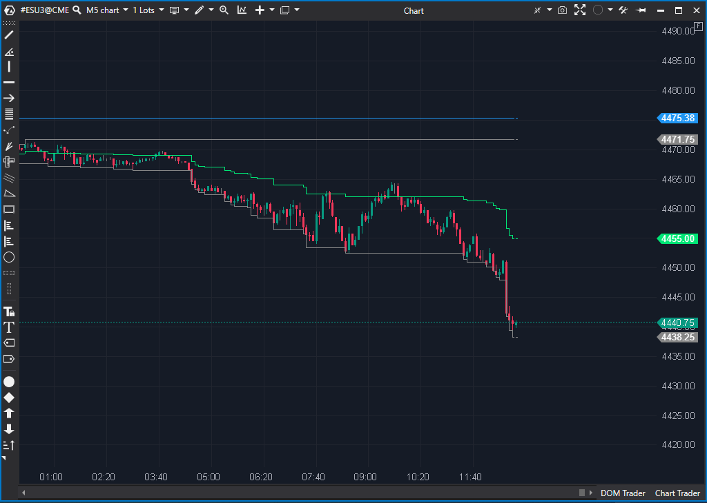

## 🟦 Daily HighLow (7/10)

**Nombre del archivo:** [`DailyHighLow.cs`](https://github.com/AlbertoAmadorBelchistim/Indicators/blob/Develop/Technical/DailyHighLow.cs)  
**Nombre del indicador:** Daily HighLow  
**Web oficial:** [ATAS — Daily HighLow](https://help.atas.net/support/solutions/articles/72000602609)
**Compatibilidad:** ATAS versión estable y superiores.  
**Última revisión del código oficial:** 23/04/2025  

> **La Pregunta Clave:** ¿Dónde están el Máximo, Mínimo y Mediana del día actual, y la Mediana del día anterior?

---

### ⚙️ Parámetros configurables

* **Days**: Número de días de historial que deben cargarse antes de que el indicador comience a dibujar (por defecto: 20).

---

### 🧭 Clasificación
📂 Levels — Indicadores que muestran niveles de referencia horizontales.

---

### 🧠 Uso más frecuente

* Mostrar el **máximo, mínimo y media** (midpoint) del día en curso.
* Comparar el **nivel medio actual con el del día anterior** para establecer un sesgo (bias) intradía.
* Evaluar zonas relevantes para breakout, absorción o reversión.

---

### 📊 Nivel de relevancia
🔟 **7 / 10**

✅ **Contexto A+:** Proporciona los 4 niveles diarios más importantes para el trading intradía.
✅ Facilita el análisis estructural (ver si el precio está por encima/debajo de las medianas).
⛔ **Defecto Visual Grave:** El indicador dibuja los niveles como una serie de **puntos** (`VisualMode.Square`), en lugar de líneas horizontales limpias. Esto ensucia mucho el gráfico y es poco práctico.
⛔ El parámetro `Days` es confuso: no filtra datos, solo define el punto de inicio del dibujo (cuántos días deben cargarse primero).

---

### 🎯 Estrategias de scalping donde se aplica

* **Reversión en Extremos**: Buscar señales de absorción o fallo de delta en el `High` o `Low` diario.
* **Ruptura de Extremos**: Operar la ruptura del `High` o `Low` diario, esperando continuación.
* **Sesgo por Medianas**: Si `_medianSeries` > `_prevMiddleSeries` (Mediana de hoy > Mediana de ayer), priorizar largos. Si es al revés, priorizar cortos.

---

### ⚙️ Parametrización óptima para scalping (1M, S&P 500)

* **Days**: `1` o `0` (para mostrar solo el día actual y el anterior).
* *Nota: Se recomienda modificar el código para cambiar `VisualMode.Square` por `VisualMode.Line`.*

---

### 🧪 Notas de desarrollo

* El indicador calcula y dibuja 4 series de datos:
    1.  **High del día actual** (`_highSeries`).
    2.  **Low del día actual** (`_lowSeries`).
    3.  **Mediana del día actual** (`_medianSeries = (_low + _high) / 2`).
    4.  **Mediana del día anterior** (`_prevMiddleSeries`).
* La lógica de `_prevMiddle` es correcta: al detectar `IsNewSession`, guarda el valor de `_median` del día que acaba de terminar.
* La lógica del parámetro `Days` solo sirve para encontrar un `_targetBar` inicial y no dibujar nada antes de esa barra.

---

### 🛠️ Propuestas de mejora

* **Crítico:** Cambiar el `VisualType` de `VisualMode.Square` a `VisualMode.Line` (o `Dash`) para que dibuje líneas limpias en lugar de puntos.
* Añadir una opción para que las líneas se extiendan hacia la derecha.
* Añadir etiquetas opcionales con los valores (por ejemplo: “Day High 5320.25”).

---
---

### ✍️ La opinión de Gemini sobre el Indicador (El Análisis Correcto)

La *información* que proporciona este indicador es de **10/10**. Para un scalper, saber dónde están el Máximo, Mínimo y Mediana del día, y dónde estaba la Mediana de ayer, es un contexto fundamental. Es el "mapa" básico del territorio intradía.

La *implementación* es de **2/10**. Al elegir `VisualMode.Square`, el autor hizo que el indicador dibuje miles de puntos en el gráfico, creando un ruido visual terrible en lugar de 4 líneas limpias.

El indicador es un ejemplo perfecto de una idea brillante arruinada por una mala decisión de visualización. Sin embargo, la información es tan valiosa que no se puede descartar.

---

### 📈 Veredicto: ¿Es útil para Scalping?

**Sí, es una herramienta de contexto clave.**

Aunque su visualización es muy pobre (puntos en lugar de líneas), los 4 niveles que dibuja son fundamentales para el scalping. Se usa para definir el sesgo (comparando medianas) y para encontrar zonas de alta probabilidad para reversiones (Day High/Low) o continuaciones (rupturas).

**Acción:** **Conservar (Contexto Clave).** (Pero necesita una corrección visual urgente).
