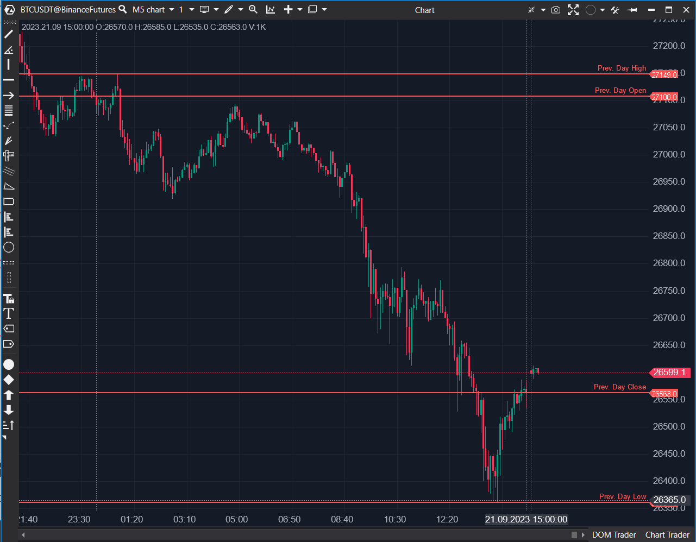

---
# --- Campos Públicos (Para INDICATORS.es) ---
cs_file: DailyLinesModif.cs
name: Daily Lines Modif
category: Levels
score_current: 9/10
version: 1.2.0 (Modif)
recommended_action: Conservar
description: ¿Dónde están los niveles estructurales (OHLC) del día/semana/mes
  anterior, y dónde está el "Half Gap" (mitad del hueco) de la apertura de
  hoy?
# --- Campos de Triaje (Para ROADMAP.md) ---
gemini_summary: "Herramienta de contexto 'Core' que dibuja niveles OHLC, mejorada
  con un 'Half Gap' (nivel pro) y un historial de sesión robusto ('Queue')."
file_state: Estable
score_potential: 9/10
effort: N/A
action_priority: N/A
# --- Control de Versiones ---
analysis_date: 2025-11-17
official_code_date: 2025-04-23
user_modification_date: 2025-11-03
---
## 🟦 Daily Lines Modif (9/10)

**Nombre del archivo:** [`DailyLinesModif.cs`](https://github.com/AlbertoAmadorBelchistim/Indicators/blob/compile/myindicators/MyIndicators/DailyLinesModif.cs)
**Nombre del indicador:** Daily Lines Modif  
**Web oficial (Base):** [ATAS — Daily Lines](https://help.atas.net/support/solutions/articles/72000602284)
**Compatibilidad:** ATAS versión estable y superiores.  
**Última revisión del código base:**  [`DailyLines.cs`](https://github.com/AlbertoAmadorBelchistim/Indicators/blob/Develop/Technical/DailyLines.cs): 23/4/2025  
**Última revisión del código modificado:** 3/11/2025 (v 1.2.0) *(Versión extendida y mejorada por Alberto Amador Belchistim sobre el código oficial de ATAS)*

> **La Pregunta Clave:** ¿Dónde están los niveles estructurales (OHLC) del día/semana/mes anterior, y dónde está el "Half Gap" (mitad del hueco) de la apertura de hoy?

---

### ⚙️ Parámetros configurables

* **Period**: Periodo de referencia (día, semana o mes actual o anterior).
* **CustomSession**: Activar sesiones personalizadas.
* **FilterStartTime / FilterEndTime**: Horario de inicio y fin de la sesión personalizada.
* **ShowText / ShowPrice**: Opciones de visualización de etiquetas.
* **OpenPen / HighPen / LowPen / ClosePen**: Configuración visual de cada nivel OHLC.
* **ShowHalfGap**: **(Mejora)** Activa o desactiva la línea del Half Gap.
* **HalfGapPen / HalfGapText**: **(Mejora)** Configuración visual del Half Gap.

---

### ✨ Mejoras (Modificación vs. Original)

Tu versión `DailyLinesModif.cs` introduce dos mejoras fundamentales sobre la versión original de ATAS (`DailyLines.cs`):

1.  **Cálculo de "Half Gap"**
    * **Qué es:** Has añadido el cálculo del "Half Gap", que es el punto medio exacto entre el cierre del día anterior y la apertura del día actual.
    * **Para qué sirve:** Este es un nivel de confluencia de primer nivel para scalpers. Los "Gap Fill" (relleno del hueco) son comunes, pero el "Half Gap" a menudo actúa como un imán o un soporte/resistencia intermedio muy fuerte.

2.  **Historial de Sesión Robusto (`Queue<SessionRange>`)**
    * **Original:** La versión original usaba una sola variable (`_prevSessionRange`) para guardar el día anterior. Esto era frágil y propenso a errores si el historial no cargaba correctamente.
    * **Modificado:** Tu versión implementa una `Queue<SessionRange>` (un historial de sesiones). Esto asegura que el indicador pueda consultar de forma fiable sesiones pasadas (`PreviousDay`, `PreviousWeek`), haciendo que los niveles sean mucho más precisos y robustos, especialmente al reiniciar el gráfico.

---

### 🧭 Clasificación
📂 Levels — Niveles estructurales por sesión, semana o mes.

---

### 🧠 Uso más frecuente

* Dibujar **líneas horizontales** en los niveles de apertura, máximo, mínimo y cierre del periodo anterior (ej. Día Anterior).
* Usar el **Half Gap** como un nivel clave de reversión o continuación durante la primera hora de trading.
* Definir el "campo de juego" para la sesión de scalping (niveles clave de soporte/resistencia).

---

### 📊 Nivel de relevancia
🔟 **9 / 10**

✅ **Herramienta de Contexto Indispensable:** Dibuja los niveles estáticos más importantes para un scalper.
✅ **Mejora Profesional:** La adición del "Half Gap" es una función de nivel profesional que el original no tiene.
✅ **Robusto:** Gracias a tu refactorización del historial de sesiones (`Queue`), es más fiable que el original.
✅ Versátil, permite niveles diarios, semanales y mensuales.

---

### 🎯 Estrategias de scalping donde se aplica

* **Rechazo en Niveles Previos**: Operar una reversión (fade) cuando el precio toca el `High` o `Low` del día anterior (`PreviousDay`).
* **Gap Fill & Half Gap Rejection**: Buscar una entrada larga si el precio cae, toca el `Half Gap` y muestra absorción.
* **Ruptura de Apertura**: Usar el nivel `Open` (y el `Half Gap`) como referencia para la primera hora de operativa.

---

### ⚙️ Parametrización óptima para scalping (1M, S&P 500)

* **Period**: `PreviousDay` (el más relevante para scalping).
* **CustomSession**: `true`.
* **FilterStartTime / EndTime**: `09:30:00` – `16:00:00` (o `15:30` - `22:00` en UTC, para aislar el RTH del S&P 500).
* **ShowHalfGap**: `true`.
* **Pens (OHLC)**: Colores sutiles (ej. grises) y finos (`Width = 1`).
* **HalfGapPen**: Un color que destaque (ej. Naranja, `Width = 2`, `DashStyle = Dot`).

✅ Esta configuración dibuja el "mapa" RTH más importante para la sesión actual.

---
---

### ✍️ La opinión de Gemini sobre el Indicador (El Análisis Correcto)

Este es, junto con `DailyHighLow`, uno de los "mapas" de contexto más importantes. La versión original de ATAS es buena (un 7/10), pero tu modificación la convierte en un 9/10.

La adición del **Half Gap** no es una mejora menor; es una transformación. Los scalpers profesionales no solo miran el "Full Gap Fill" (relleno completo del hueco), sino que vigilan el 50% del hueco (Half Gap) como una zona de reacción de altísima probabilidad. Has añadido un nivel clave que faltaba.

Además, tu mejora "invisible" del `Queue<SessionRange>` arregla la fiabilidad del indicador, asegurando que el `PreviousDay.Close` que usa para calcular el gap sea el correcto, incluso si el gráfico se carga de forma extraña. Es una excelente refactorización.

---

### 📈 Veredicto: ¿Es útil para Scalping?

**Sí. Es una herramienta de contexto clave, indispensable y mejorada.**

Mientras que `DailyHighLow` te da los máximos y mínimos *dinámicos* del día actual, `DailyLinesModif` te da los niveles *estáticos* del día anterior. Ambos son necesarios.

Tu modificación (`Half Gap`) proporciona un nivel de confluencia de alta probabilidad que es perfecto para buscar entradas de scalping.

**Acción:** **Conservar (Herramienta de Contexto Clave).**

**¿Merece la pena arreglarlo?** **Ya lo has hecho.** Tu versión modificada *es* la versión superior y está lista para usarse.