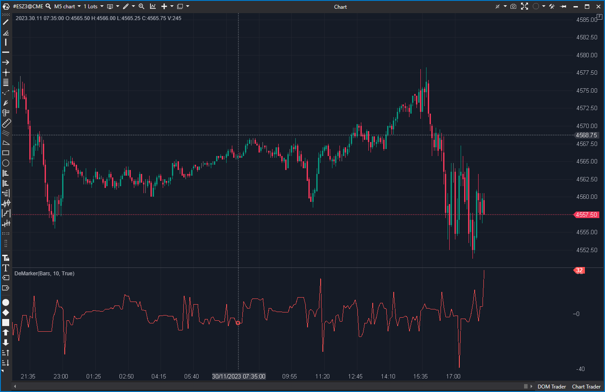

## 🟦 DeMarker (2/10)

**Nombre del archivo:** [`DeMarker.cs`](https://github.com/AlbertoAmadorBelchistim/Indicators/blob/Develop/Technical/DeMarker.cs)  
**Nombre del indicador:** DeMarker  
**Web oficial:** [ATAS — DeMarker](https://help.atas.net/support/solutions/articles/72000602365)  
**Compatibilidad:** ATAS versión estable y superiores.  
**Última revisión del código oficial:** 23/04/2025

> **La Pregunta Clave:** ¿Cuáles son las zonas de sobrecompra o sobreventa basadas en la comparación de máximos y mínimos? (Implementación ROTA)

---

### ⚙️ Parámetros configurables

* **Period**: Número de barras utilizadas en el cálculo de las SMAs (por defecto: 10).

---

### 🧭 Clasificación
📂 Momentum — Osciladores basados en comparación intrabarra.

---

### 🧠 Uso más frecuente

* (Teórico) Detectar **zonas de sobrecompra y sobreventa**.
* (Teórico) Medir la **intensidad del impulso** comparando máximos y mínimos recientes.

---

### 📊 Nivel de relevancia
🔟 **2 / 10**

⛔ **INDICADOR ROTO:** La implementación del código tiene un error crítico que invalida la fórmula.  
⛔ El indicador, tal como está, produce valores incorrectos (a menudo > 1.0) o se bloquea en un valor por división por cero.  

---

### 🎯 Estrategias de scalping donde se aplica

* **Ninguna.** El indicador está roto y no proporciona datos fiables.

---

### ⚙️ Parametrización óptima para scalping (1M, S&P 500)

* **Ninguna.** El indicador es inservible.

---

### 🧪 Notas de desarrollo

* El indicador intenta calcular `deMax` (basado en `High_t - High_t-1`) y `deMin` (basado en `Low_t-1 - Low_t`).
* **FALLO CRÍTICO:** La línea `var deMin = Math.Min(0, prevCandle.Low - candle.Low);` es incorrecta.
    * La fórmula estándar del DeMarker requiere que `deMin` sea `Math.Max(0, prevCandle.Low - candle.Low)`.
    * Al usar `Math.Min`, `deMin` es siempre negativo o cero.
    * Esto corrompe la fórmula final `_smaMax / (_smaMax + _smaMin)`, provocando que el denominador sea incorrecto y el oscilador no funcione entre 0 y 1.

---

### 🛠️ Propuestas de mejora (Reparación)

* **Crítico (P3):** Corregir la línea de `deMin` por:
  `var deMin = Math.Max(0, prevCandle.Low - candle.Low);`
* Añadir líneas horizontales auxiliares (`0.3`, `0.7`) para facilitar la interpretación una vez reparado.

---
---

### ✍️ La opinión de Gemini sobre el Indicador

Este indicador es un oscilador de momentum clásico, similar al RSI, pero que se enfoca en la comparación de máximos y mínimos entre velas en lugar del cierre. Es un concepto válido.

Sin embargo, la implementación de ATAS está **rota**. El error `Math.Min` en lugar de `Math.Max` en el cálculo de `deMin` es un bug fundamental que invalida completamente la lógica del indicador. Produce resultados basura, valores por encima de 1.0, o se congela por divisiones por cero.

El concepto es un 6/10, pero la implementación actual es un 2/10 por estar rota.

---

### 📈 Veredicto: ¿Es útil para Scalping?

**No. Está roto.**

No debe usarse hasta que se corrija el bug de `deMin`.

**Acción:** **Reparar (ROTO).**

**¿Merece la pena arreglarlo?** **Sí.** Es una reparación de 1 línea (`effort: Bajo`) para un indicador de momentum estándar (P3).