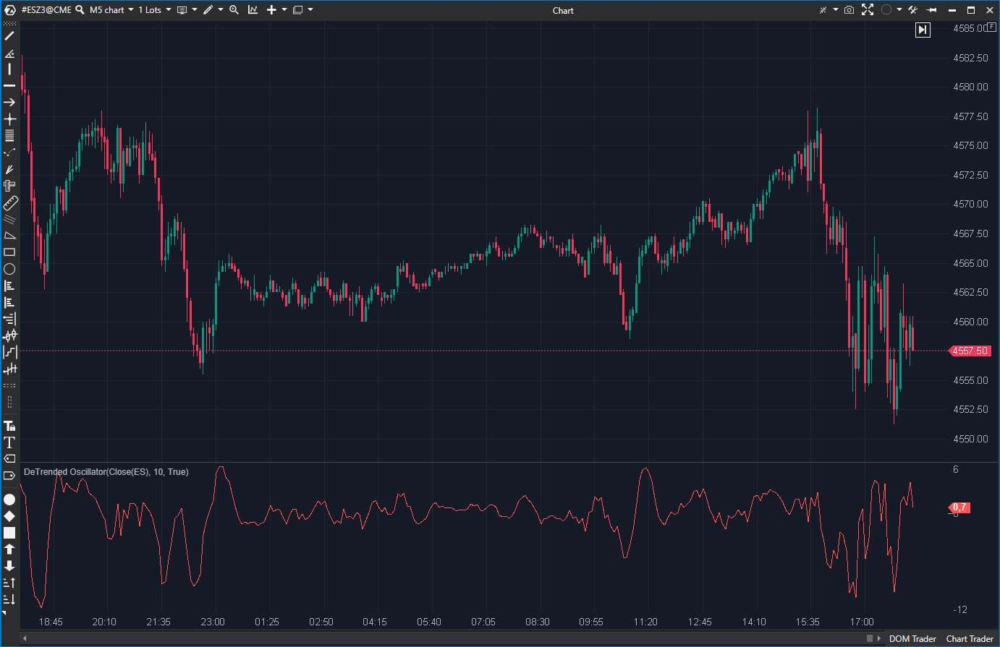

## 🟦 DeTrended Price Oscillator (DPO) (3/10)

**Nombre del archivo:** [`DeTrended.cs`](https://github.com/AlbertoAmadorBelchistim/Indicators/blob/Develop/Technical/DeTrended.cs)  
**Nombre del indicador:** DeTrended Price Oscillator  
**Web oficial:** [ATAS — DeTrended Price Oscillator](https://help.atas.net/support/solutions/articles/72000602370)  
**Compatibilidad:** ATAS versión estable y superiores.  
**Última revisión del código oficial:** 23/04/2025

> **La Pregunta Clave:** ¿Cuáles son los ciclos de corto plazo eliminando la tendencia general? (Implementación no estándar)

---

### ⚙️ Parámetros configurables

* **Period**: Número de barras para calcular la SMA (por defecto: 10).

---

### 🧭 Clasificación
📂 Momentum — Osciladores centrados que eliminan la tendencia.

---

### 🧠 Uso más frecuente

* (Teórico) Identificar ciclos de corto plazo eliminando la tendencia general.

---

### 📊 Nivel de relevancia
🔟 **3 / 10**

⛔ **Impostor / Roto:** El indicador no implementa la fórmula estándar del DPO.  
⛔ **Lógica Confusa:** La fórmula de desfase (`_lookBack = (_period / 2) / 2 + 1`) y el periodo de la SMA (`_period / 2`) no son estándar y crean un oscilador difícil de interpretar y que no coincide con el DPO de otras plataformas.  
⛔ **Redundante:** El indicador `DeTrendedDi` (DiNapoli) implementa la versión simple y correcta (`Precio - SMA`) que la mayoría de traders busca.  

---

### 🎯 Estrategias de scalping donde se aplica

* **Ninguna.** La lógica no es fiable.

---

### ⚙️ Parametrización óptima para scalping (1M, S&P 500)

* **Ninguna.** Se recomienda usar `DeTrendedDi` en su lugar.

---

### 🧪 Notas de desarrollo

* El indicador calcula una SMA con un periodo de `_sma.Period = _period / 2`.
* Calcula un desfase (`_lookBack`) de `_sma.Period / 2 + 1` (es decir, `(_period / 4) + 1`).
* El valor final es `DPO = value - _sma[bar - _lookBack]`.
* Esta no es la fórmula estándar del DPO (`Precio - SMA(Period/2 + 1)`).

---

### 🛠️ Propuestas de mejora

* **Descartar.**

---
---

### ✍️ La opinión de Gemini sobre el Indicador

Este indicador es un "Impostor". Intenta ser el *Detrended Price Oscillator (DPO)*, pero su implementación es errónea y no estándar. La fórmula de cálculo del desfase y del periodo de la SMA no coincide con la definición canónica del DPO, lo que lo convierte en un oscilador "casero" con un nombre confuso.

El indicador `DeTrendedDi` (DiNapoli), que es simplemente `Precio - SMA(Periodo)`, es una herramienta mucho más simple, estándar y útil para lograr el mismo objetivo de "eliminar la tendencia".

---

### 📈 Veredicto: ¿Es útil para Scalping?

**No. Es un indicador confuso e incorrecto.**

No hay razón para usar esta implementación no estándar cuando existen alternativas correctas como `DeTrendedDi`.

**Acción:** **Descartar (Impostor).**