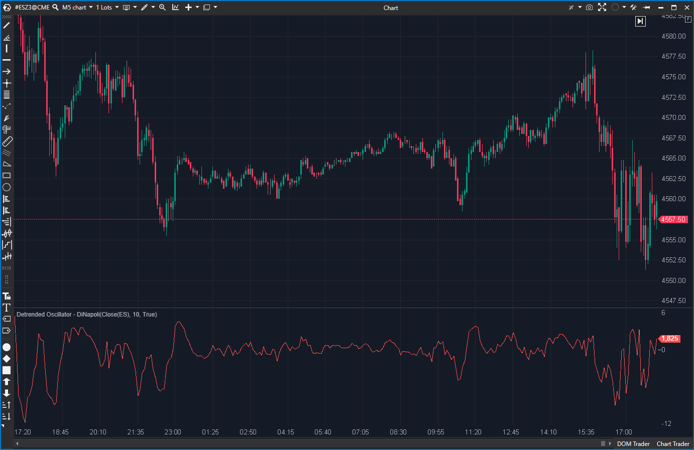

## 🟦 Detrended Oscillator - DiNapoli (6/10)

**Nombre del archivo:** [`DeTrendedDi.cs`](https://github.com/AlbertoAmadorBelchistim/Indicators/blob/Develop/Technical/DeTrendedDi.cs)  
**Nombre del indicador:** Detrended Oscillator - DiNapoli  
**Web oficial:** [ATAS — Detrended Oscillator - DiNapoli](https://help.atas.net/support/solutions/articles/72000602369)  
**Compatibilidad:** ATAS versión estable y superiores.  
**Última revisión del código oficial:** 23/04/2025

> **La Pregunta Clave:** ¿Cuál es el ciclo del precio, eliminando la tendencia de una SMA?

---

### ⚙️ Parámetros configurables

* **Period**: Número de barras usadas para la media móvil simple (por defecto: 10).

---

### 🧭 Clasificación
📂 Momentum — Osciladores que eliminan la tendencia para analizar ciclos.

---

### 🧠 Uso más frecuente

* Identificar **máximos y mínimos de ciclos de corto plazo** sin el "ruido" de la tendencia principal.
* Detectar **reversiones** cuando el oscilador cruza la línea cero.
* Medir la **sobreextensión** del precio respecto a su media.

---

### 📊 Nivel de relevancia
🔟 **6 / 10**

✅ **Simple y Efectivo:** Es la forma más pura de un oscilador.
✅ Útil como base para sistemas cíclicos y de reversión a la media.
⛔ No tiene líneas de sobrecompra/sobreventa (no está normalizado).
⛔ Es redundante si ya se usa DPO o MACD (el MACD es una resta de dos EMAs).

---

### 🎯 Estrategias de scalping donde se aplica

* **Reversión a la media**: Vender cuando el oscilador está en un extremo positivo y cruza hacia abajo; Comprar cuando está en un extremo negativo y cruza hacia arriba.
* **Filtro de Momento**: Entrar largo solo si el oscilador está por encima de cero.

---

### ⚙️ Parametrización óptima para scalping (1M, S&P 500)

* **Period**: `10` a `20`.
* Es fundamental añadir manualmente una línea cero (`LineSeries`) al indicador para tener la referencia.

---

### 🧪 Notas de desarrollo

* Cálculo muy simple: `Oscilador = PrecioActual - SMA(PrecioActual, Periodo)`.
* Usa una única `SMA` y resta su valor al precio de cierre de la barra actual.
* Es la implementación estándar y correcta de un oscilador de precio "detrended".

---

### 🛠️ Propuestas de mejora

* Añadir una **línea cero** (`LineSeries`) por defecto, ya que es esencial para su interpretación.
* Permitir elegir el tipo de precio (ej. Typical, Weighted) además del Cierre.
* Permitir elegir el tipo de MA (SMA, EMA, etc.).

---
---

### ✍️ La opinión de Gemini sobre el Indicador

Esta es la implementación *correcta* y simple de un oscilador de precio. A diferencia del indicador `DeTrended` (que es un impostor con una fórmula confusa), este hace exactamente lo que se espera: `Precio - Media`.

Muestra la distancia (el "delta") entre el precio actual y su media reciente. Cuando esta distancia es grande, el precio está sobreextendido y es probable que revierta a la media. Cuando cruza el cero, indica un cambio en el momentum de corto plazo.

Es una herramienta simple, funcional y que todo scalper de reversión a la media puede apreciar.

---

### 📈 Veredicto: ¿Es útil para Scalping?

**Sí. Es una herramienta de momentum/ciclo válida.**

Es un oscilador simple y eficaz para identificar la sobreextensión del precio. Su principal debilidad es que carece de una línea cero por defecto, lo que dificulta su lectura (aunque se puede añadir manualmente).

**Acción:** **Conservar.**