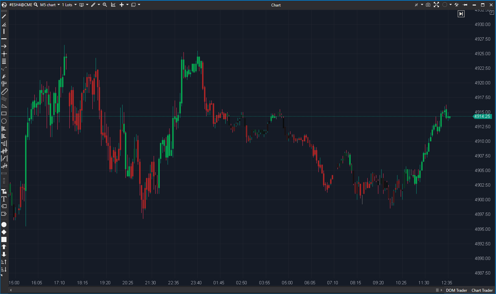

## 🟦 Delta Colored Candles (5/10)

**Nombre del archivo:** [`DeltaColoredCandles.cs`](https://github.com/AlbertoAmadorBelchistim/Indicators/blob/Develop/Technical/DeltaColoredCandles.cs)  
**Nombre del indicador:** Delta Colored Candles  
**Web oficial:** [ATAS — Delta Colored Candles](https://help.atas.net/support/solutions/articles/72000618743)  
**Compatibilidad:** ATAS versión estable y superiores.  
**Última revisión del código oficial:** 23/04/2025  

> **La Pregunta Clave:** ¿Cuál es la intensidad del *momentum* del delta (delta acumulado en N barras) en relación con un máximo fijo?

---

### ⚙️ Parámetros configurables

* **Period**: Número de barras para acumular el delta (por defecto: 14).
* **MaxDelta**: Delta máximo esperado para escalar el color (por defecto: 600).
* **ColorScheme**: Esquema de color del heatmap (`RedToDarkToGreen`, `GreenToRed`, etc.).

---

### 🧭 Clasificación
📂 VolumeOrderFlow — Velas coloreadas según delta acumulado.

---

### 🧠 Uso más frecuente

* Visualizar la **intensidad de la agresión neta** en forma de color, suavizada en un período.
* Detectar acumulaciones o momentos de delta extremo de forma visual.
* Confirmar rupturas o rechazos con validación cromática.

---

### 📊 Nivel de relevancia
🔟 **4 / 10**

✅ **Buena Idea:** El concepto de medir el *momentum* del delta (acumulando N barras) es muy útil, ya que es el "término medio" entre el Delta (1 barra) y el CVD (toda la sesión).
⛔ **Fallo de Implementación:** El indicador es **impractical** para scalping. Requiere que el usuario defina un `MaxDelta` **fijo**. Esto hace que el indicador sea inútil, ya que un `MaxDelta` de 5000 puede ser correcto para la apertura (9:30), pero totalmente incorrecto para el almuerzo (12:00), saturando los colores o no mostrando ninguno.
⛔ Requiere calibración manual *constante*.

---

### 🎯 Estrategias de scalping donde se aplica

* (Teóricamente) **Ruptura con confirmación de agresión acumulada** (vela en verde fuerte).
* (Teóricamente) **Filtro de entrada**: solo operar si el color confirma la dirección.

*En la práctica, estas estrategias no son fiables debido al fallo de calibración.*

---

### ⚙️ Parametrización óptima para scalping (1M, S&P 500)

* **Ninguna.** No se recomienda su uso, ya que el parámetro `MaxDelta` tendría que ser reajustado manualmente cada pocos minutos/horas a medida que cambia la volatilidad del mercado.

---

### 🧪 Notas de desarrollo

* El indicador calcula la suma del delta en una ventana de `Period` barras: `_delta.CalcSum(_period, bar)`.
* Escala el resultado con respecto a un `MaxDelta` fijo: `sumDelta * 100 / MaxDelta`.
* Ajusta el valor visual (rate) como: `rate = 50 + (percent / 2)`.
* El color resultante se obtiene mediante `HeatmapExtensions.GetColor()`.

---

### 🛠️ Propuestas de mejora (Reparación/Mejora)

* **Crítico (P3):** Reemplazar el `MaxDelta` fijo por un cálculo **dinámico**. La solución ideal es usar una media móvil (ej. SMA) del `sumDelta` y una desviación estándar (StDev) del `sumDelta`, y colorear basado en cuántas desviaciones estándar se aleja de la media (similar a un Z-Score).
* Alternativamente, usar un `sumDelta.MAX(PeriodoLookback, bar)` para encontrar el máximo dinámico en un lookback.
* Limitar `rate` a un máximo de 100 y mínimo de 0 antes de pasarlo a la función de color para evitar *wraparounds* de color.

---
---

### ✍️ La opinión de Gemini sobre el Indicador

Este indicador tiene una **idea de 9/10** arruinada por una **implementación de 2/10**.

La idea de crear un "CVD de período corto" (un oscilador de momentum del delta) es excelente. Sería la pieza "meso" que falta entre el `DeltaModif` (micro) y el `CVD` (macro).

Sin embargo, el fallo en la implementación es fatal. Al basar toda la escala de colores en un `MaxDelta` manual y fijo, el indicador es inútil en un mercado real que cambia de régimen de volatilidad (apertura vs. almuerzo). Es el equivalente a un velocímetro de coche que requiere que *tú* le digas cuál es la velocidad máxima (y si te equivocas, o se queda clavado en 100 o no se mueve de 0).

---

### 📈 Veredicto: ¿Es útil para Scalping?

**No. No en su estado actual.**

Un scalper necesita herramientas que se adapten a la volatilidad del momento. Una herramienta que requiere calibración manual constante no es una herramienta, es un obstáculo.

**Acción:** **Mejorar.**

**¿Merece la pena arreglarlo?** **Sí.** El concepto es excelente y muy valioso. La reparación (cambiar `MaxDelta` fijo por uno dinámico) es un esfuerzo `Medio` (P3), pero convertiría un indicador inútil de 4/10 en una herramienta potente de 9/10.