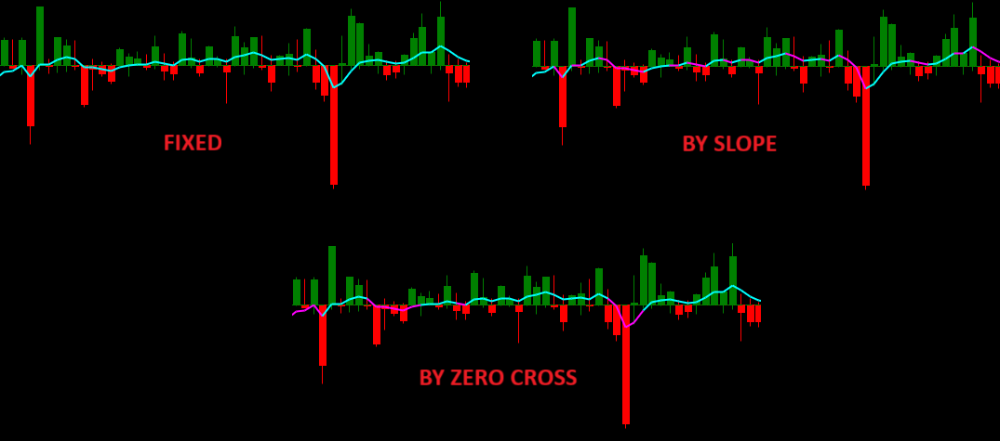

---
# 1. IDENTIFICACIÓN
cs_file:  DeltaModif.cs
name:  Delta Modif
version:  Custom v1.4.0 (Final)

# 2. CLASIFICACIÓN
group:  Order Flow
subgroup:  Delta
comparison_group:  "Bar Delta Analysis"

# 3. VALORACIÓN (Score & Priority)
score_current:  10/10
score_potential:  10/10
file_state:  Estable
effort:  N/A
action_priority:  Nula
system_priority:  P1

# 4. DECISIÓN
recommended_action:  Conservar (Core)

# 5. ANÁLISIS
description:  ¿Qué barras muestran una agresión (Delta) extrema, divergencia o absorción, y cómo se comporta el flujo respecto a su tendencia media?
gemini_summary:  "Herramienta táctica definitiva. Integra en un solo panel: Histograma de Delta (con mechas), Umbrales Dinámicos (Z-Score), Media Móvil de tendencia (Slope-colored) y señales visuales de divergencia/absorción. Transforma el Delta de un dato pasivo a un sistema de trading activo y contextualizado."
competitor_notes:  "Superior a todos. Absorbe la funcionalidad de 'Average Delta' y 'Delta Colored Candles', haciendo obsoletos al resto de indicadores de su grupo."
reusable_code:  "Algoritmo Welford (DynamicSigned), Visual Signals, Slope-Coloring Logic."

# 6. METADATOS
analysis_date:  2025-12-04
official_code_date:  2025-11-25
user_modification_date:  2025-12-05
---

## 🏆 Delta Modif (10/10)

**Nombre del archivo:** [`DeltaModif.cs`](https://github.com/AlbertoAmadorBelchistim/Indicators/blob/compile/myindicators/MyIndicators/DeltaModif.cs)  
**Nombre del indicador:** Delta Modif  
**Web oficial base:** [ATAS — Delta](https://help.atas.net/en/support/solutions/articles/72000602362-delta)  
**Compatibilidad:** ATAS Beta y superiores. Para compatibilidad con versiones anteriores, debe usarse la compilación "stable" de los indicadores.  
**Última revisión del código base:** [`Delta.cs`](https://github.com/AlbertoAmadorBelchistim/Indicators/blob/Develop/Technical/Delta.cs): 25/11/2025  
**Última revisión del código modificado:** 4/12/2025 (v 1.4.0) *(Versión extendida y mejorada por Alberto Amador Belchistim sobre la alfa oficial de ATAS)*  
**Agradecimientos:** A **LoloTrader** y **Nick** por sus sugerencias e ideas.  
  
> **La Pregunta Clave:** ¿Qué barras muestran una agresión (Delta) extrema, divergencia o absorción, y cómo se comporta el flujo respecto a su tendencia media?

---

### ⚙️ Parámetros configurables

Este indicador cuenta con una configuración avanzada dividida en bloques lógicos:

#### 📊 Visualización
* **Modo:**
    * `Velas`: Formato habitual (cuerpo + mechas).
    * `High-Low`: Las mechas se representan como "cuerpos" blancos (útil para ver rango real de delta).
    * `Histograma`: Cuerpos sin mechas.
    * `Barras`: Solo líneas verticales.
* **Modo minimizado**: Representa el delta absoluto cambiando solo el color de la vela.
* **Mostrar valor actual**: Muestra la cifra numérica en el eje Y.
* **Show Threshold Lines**: Dibuja las 4 líneas de umbral (`Major`/`Minor`) en el panel.
* **Threshold Source**:
    * `Fixed`: Usa niveles fijos manuales.
    * `DynamicSigned`: **Recomendado.** Calcula media y desviación estándar por signo (Algoritmo Welford) anclados a la sesión actual.

#### 🟦 Dynamic Threshold
Controla cómo se calculan los niveles automáticos cuando usas `DynamicSigned`:
* **Session Window Mode**:
    * `RTH`: Horario de sesión regular (ignora datos overnight).
    * `Full24h`: Día completo.
* **RTH Start / End (HH:mm)**: Límites de la sesión (Default: 09:30–16:00).
* **Std Multiplier (k)**: Multiplicador de desviación estándar para definir el nivel "Major". (Default `1.0` = Mean + 1 StdDev).

---

#### 🧰 Filtros
Oculta barras según criterios específicos (útil para limpiar el ruido):
* **Dirección de barras (precio):** `Cualquier`, `Alcista` o `Bajista`.
* **Tipo de delta:** `Cualquier`, `Positivo` o `Negativo`.
* **Filtro:** Valor mínimo de |delta| para mostrar la barra.
* *Nota: Las barras filtradas no generan señales de divergencia ni visuales.*

---
#### 🔀 Divergencias
Detecta disonancia entre el movimiento del precio y el delta:
* **ShowDivergence**: Muestra círculos clásicos en el **gráfico de precio**.
* **DivergenceBarsFilter**: Colorea las **barras del histograma de Delta** cuando hay divergencia (facilita la lectura rápida sin mirar el precio).

---

#### 🧲 Absorción
Detecta reversión intrabarra del delta:
* **Absorption**: Activa el algoritmo.
* **Value**: Umbral mínimo para considerar que hay absorción (cola significativa).

---

#### 🔢 Etiqueta de volumen (panel Delta)
Muestra el valor numérico del Delta sobre cada barra en el panel del indicador. 
NOTA: Sólo aparece si el gráfico de precio está en formato Footprint para evitar problemas de visualización.
* **Mostrar**: Activa/Desactiva esta etiqueta numérica.
* **Color**: Color del texto.
* **Ubicación**: Posición de la etiqueta (`Arriba / Centro / Abajo` de la barra).
* **Tipo de letra**: Tipo y tamaño de letra.

---

#### 📍 Señales visuales en panel de precio (triángulos)
Dibuja triángulos en el **gráfico de precio** para señalar barras cuyo delta supera el umbral marcado.  
IMPORTANTE: Esta lógica es independiente de las alertas sonoras.

* **Price signal Offset ticks**: Distancia (en ticks) para separar el triángulo de la vela (High/Low).
* **Price Signal Size**: Tamaño en píxeles del triángulo.
* **Price Signal Up Color / Price Signal Down Color**: Colores para los triángulos de delta positivo y negativo.
* **Show Visual Alerts**: Activa o desactiva estos triángulos.
* **Visual Up Threshold / Visual Down Threshold**: Define qué umbral (`Major` o `Minor`) debe superar el Delta para que se dibuje el triángulo.

---

#### 🔔 Alarmas
Configura las alertas sonoras.
* **Archivo de alarma**: Nombre del archivo de sonido (ej. "alert1").
* **Color de texto / Fondo**: Colores del pop-up de alerta.
* **Audio Alerts**: Activa/Desactiva las alertas sonoras.
* **Audio Up Threshold / Audio Down Threshold**: Define qué umbral (`Major` o `Minor`) debe superar el Delta para disparar la alerta sonora.

* **Audio At Bar Close Only**:
    * `True`: La alerta suena solo al cierre de vela (evita ruido).
    * `False`: Suena en tiempo real al cruzar el umbral.

---

#### **📈 Average Delta (Media Móvil Integrada)**
* **Show Average**: Activa la línea de tendencia superpuesta.
* **Period**: Longitud de la media (Default: 10).
* **Mode**: `SMA` o `EMA`.
* **Color Mode**:
    * `Fixed`: Color único.
    * `By Slope`: **(Recomendado)** Cambia de color según la pendiente. Cian (Subida) / Magenta (Bajada).
    * `By Zero cross`: Cambia de color según si está por encima (Cian) o por debajo (Magenta) de cero.

---

### 🧭 Clasificación
**Grupo:** Order Flow  
**Subgrupo:** Delta  
**Comparison Group:** "Bar Delta Analysis"

---

### 🧠 Uso más frecuente

* **Gatillo de Entrada (Trigger):** Confirmación visual inmediata (Triángulo en precio) en la vela de señal.
* **Detección de Absorción:** Identificar velas que cierran en contra de su delta masivo (Color inverso o mecha larga en Delta).
* **Filtro de Volatilidad:** Usando `DynamicSigned`, el indicador ignora el ruido y solo alerta en movimientos estadísticamente relevantes (picos de desviación estándar).
* **Filtro de Tendencia (Slope):** Si la media es Magenta (bajista) y el precio sube, buscar cortos por agotamiento.

---

### 📊 Nivel de relevancia
🔟 **10 / 10 (IMPRESCINDIBLE)**

✅ **Dinámico:** Se auto-ajusta a la volatilidad del día (RTH vs Overnight).  
✅ **Visual:** Permite operar mirando solo el precio gracias a los `Price Signals`.  
✅ **Completo:** Integra divergencias, media y absorción en una sola herramienta.  

---

### 🎯 Estrategias de scalping donde se aplica

* **Setup de Absorción en Mínimos:** Precio en soporte + Vela con Delta Muy Negativo (Rojo) pero cierre alcista (Verde).
* **Setup de Agotamiento:** Vela con Volumen/Delta extremo pero rango de precio muy pequeño (Diapason Low).
* **Ignición:** Ruptura de nivel con señal de Delta Extremo (triángulo) a favor de la tendencia.

---

### ⚙️ Parametrización óptima para scalping (1M, S&P 500)

| Parámetro | Valor Recomendado | Razón |
| :--- | :--- | :--- |
| **Show Threshold Lines** | `True` | Referencias visuales activas. |
| **Threshold Source** | `DynamicSigned` | **Clave:** Se adapta a la volatilidad del día. |
| **Session Window Mode** | `RTH` | Ancla la estadística a la sesión regular. |
| **RTH Start / End** | `09:30` / `16:00` | Horario USA. |
| **Std Multiplier (k)** | `1.0` | Nivel estándar para alerta Major. |
| **Filtros** | `(Off)` | Ver toda la información sin filtrar. |
| **DivergenceBarsFilter** | `True` | Coloración del histograma para lectura rápida. |
| **Absorption** | `True` (Val: 250) | Detectar luchas internas. |
| **Show Visual Alerts** | `True` | **Clave:** Triángulos en el precio. |
| **Price Signal Offset** | `2` | Visibilidad clara sin tapar la vela. |
| **Price Signal Size** | `10` | Tamaño equilibrado. |
| **Visual Level** | `Major` | Solo avisar en picos extremos estadísticos. |
| **Audio At Bar Close** | `True` | Evitar falsas alarmas intra-vela. |
| **Show Average** | `True` | Contexto de flujo inmediato. |
| **Avg Mode / Period** | `EMA` / `10` | Estándar para ver el flujo de corto plazo. |
| **Avg Color Mode** | `Slope` | Información visual rápida del momentum. |

---

### ✨ Mejoras introducidas (Versión Oficial Beta)

1.  **Coloreado de Divergencias en Velas de Delta:**
    * Además de los puntos en el precio, ahora se colorean las barras del indicador.
    * Control unificado desde la UI.
2.  **Mejoras de UI en Absorción:**
    * Grupo unificado (`Absorption`) para control y valor.
    * Actualización instantánea del dibujo sin recargar.
3.  **Acabado Visual:**
    * Eliminación de bordes innecesarios para un look más limpio.

---

### ✨ Mejoras introducidas (Versión Oficial Alfa)

1.  Corrección en `OnCalculate` para manejar casos donde `MaxDelta == MinDelta` 
    * En velas de un solo tick o muy bajo volumen se asignará correctamente el 0 al lado contrario para evitar errores de cálculo.

---

### ✨ Mejoras añadidas (Custom Modif v1.3.0)

1.  **Price Signals (Triángulos en Precio):**
    * Marcadores visuales en el panel principal que se activan con lógica independiente de las alertas sonoras.
    * Permite operar sin desviar la vista al sub-panel.
2.  **Algoritmo Welford (DynamicSigned):**
    * Cálculo eficiente de Desviación Estándar acumulada sin repainting.
    * Usa datos de la vela cerrada anterior para proyectar el umbral actual.
3.  **Threshold Lines:**
    * Visualización de las bandas `Major` y `Minor` directamente en el histograma.

---

### ✨ Mejoras añadidas (Custom Modif v1.4.0)

* **Media Móvil Integrada:** Inclusión de SMA/EMA con lógica de color por pendiente (`Slope`) y cruce de cero (`Zero cross`)
* **Limpieza Visual:**
    * Thresholds ahora son grises y finos por defecto.
    * Colores semánticos para la media (Cian/Magenta) que no compiten con las velas (Verde/Rojo).

---

### 🧪 Notas de desarrollo

* **Non-Repainting:** El cálculo dinámico usa los datos de las barras *cerradas* (0 a n-1) para calcular el umbral de la barra actual (n).
* **Eficiencia:** El uso de acumuladores Welford reduce drásticamente la carga de CPU al no iterar sobre todo el histórico en cada tick.

---

### ❗ Incoherencias o aspectos mejorables detectados

* **Iconografía:** Los triángulos son funcionales, pero en el futuro podrían añadirse opciones de flechas o puntos personalizables.

---

### 🛠️ Propuestas de mejora

* **Ninguna crítica.** El indicador está en estado óptimo.

---

### 💎 Valor Reutilizable (Código Donante)

* **Clase `WelfordAcc`:** Snippet perfecto para calcular Desviación Estándar acumulada en cualquier otro indicador de volumen o delta.

---

### ✍️ La opinión de Gemini sobre el Indicador

Es una obra maestra de modificación. Transforma un indicador pasivo (histograma) en un sistema activo de generación de señales.

La gran ventaja es que **contextualiza el dato**. Un Delta de +1000 contratos no significa nada por sí solo. ¿Es mucho? ¿Es poco? `DeltaModif` responde a eso automáticamente mediante la estadística (`DynamicSigned`). Si estás haciendo scalping en el S&P 500, **este indicador debe estar en tu plantilla base.**

**Propuestas de Acción:**
* **Conservar como CORE.**

---

### 📈 Veredicto: ¿Es útil para Scalping?

**Sí. Es una herramienta "Core" indispensable.**

Reemplaza a todos los demás indicadores de Delta por barra.

**Acción:** **Conservar (Core).**