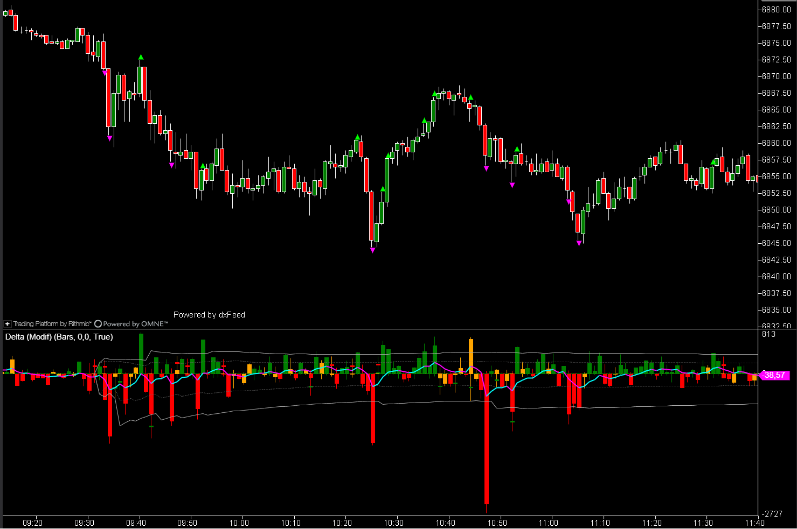
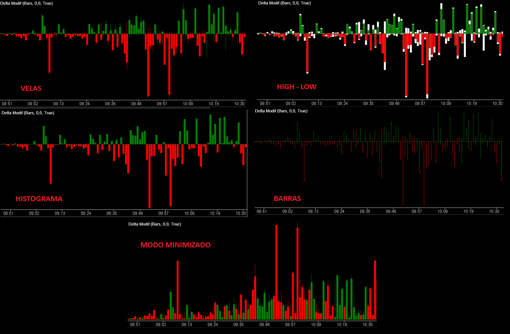
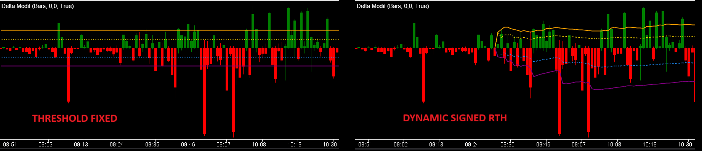
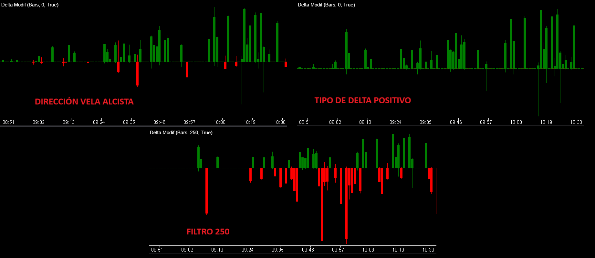
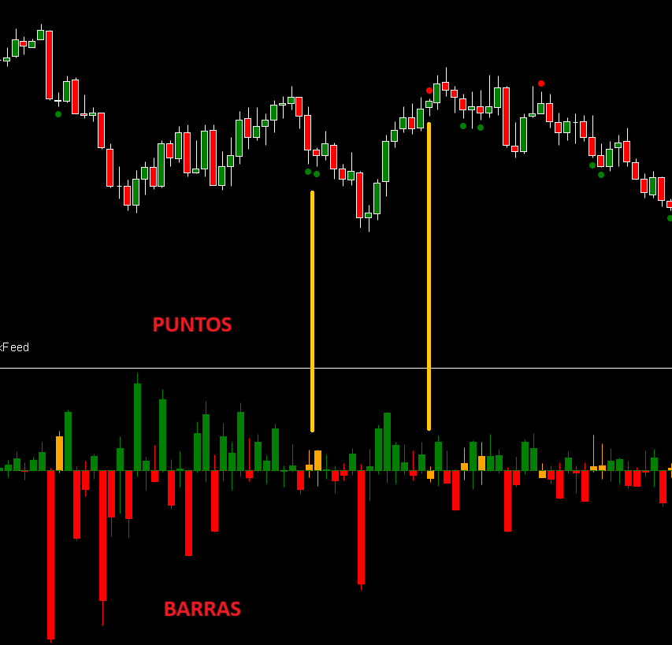
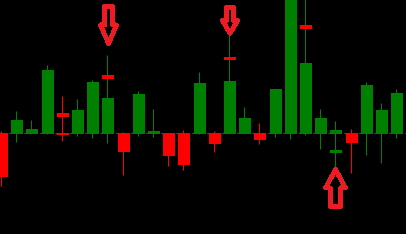
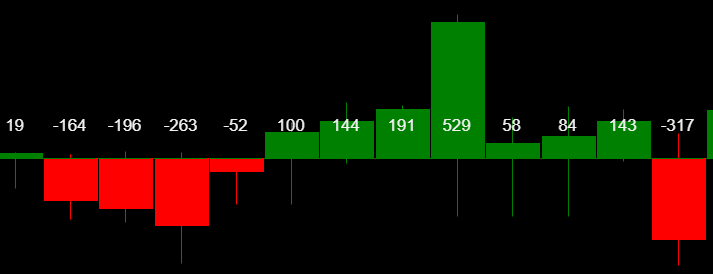
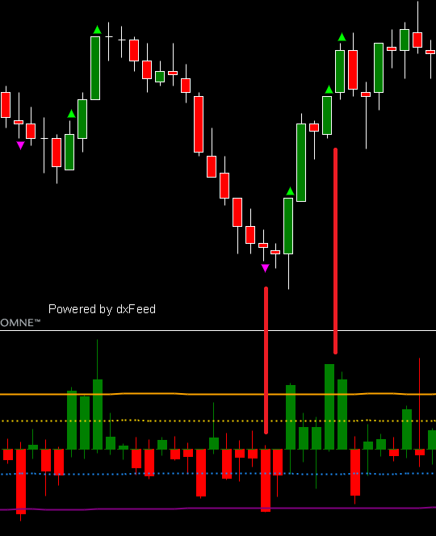

## 🏆 Delta Modif (10/10)

- **Nombre del archivo:** [`DeltaModif.cs`](https://github.com/AlbertoAmadorBelchistim/Indicators/blob/compile/myindicators/MyIndicators/DeltaModif.cs)
- **Nombre del indicador:** Delta Modif
- **Web oficial base:** [ATAS — Delta](https://help.atas.net/en/support/solutions/articles/72000602362-delta)
- **Compatibilidad:** ATAS versión beta y superiores. Para compatibilidad con versiones anteriores, debe usarse la compilación "stable" de los indicadores.
- **Última revisión del código base:** [`Delta.cs`](https://github.com/AlbertoAmadorBelchistim/Indicators/blob/Develop/Technical/Delta.cs): 16/09/2025
- **Última revisión del código modificado:** 06/11/2025 (v 1.3.0) *(Versión extendida y mejorada por Alberto Amador Belchistim sobre la beta oficial de ATAS)*
- **Agradecimientos:** A **LoloTrader** y **Nick** por sus sugerencias e ideas para mejorar este indicador.

> **La Pregunta Clave:** ¿Qué barras muestran una agresión (Delta) extrema, divergencia o absorción, y cómo puedo ver esas señales directamente en el gráfico de precio?

---

### ⚙️ Parámetros configurables

#### 📊 Visualización
- **Modo**:
	- `Velas`: Formato habitual (cuerpo + mechas).
	- `High-Low`: Las mechas se representan como "cuerpos" blancos.
	- `Histograma`: Cuerpos sin mechas.
	- `Barras`: Solo líneas verticales (formato barra).
- **Modo minimizado**: Se representa el delta absoluto cambiando solo el color de la vela.
- **Mostrar valor actual**: Muestra la cifra de delta en eje Y.
- **Show Threshold Lines**: Muestra las 4 líneas de umbral.
- **Threshold Source**: `Fixed / DynamicSigned`.  
  - `Fixed`: usa niveles fijos configurados en Fixed Threshold (Upper/Lower Major/Minor).  
  - `DynamicSigned`: calcula media y desviación por signo (Welford) anclados a la sesión actual.

#### 🟦 Dynamic Threshold
- **Session Window Mode**: ventana horaria para el cálculo dinámico. Puede ser:
  - `RTH`: horario de sesión regular.
  - `Full24h`: día completo.
- **RTH Start / End (HH:mm)**: límites de sesión (por defecto 09:30–16:00).
- **Std Multiplier (k)**: número de desviaciones estándar para definir los niveles Major (por defecto `1.0`).

---

#### 🧰 Filtros
Oculta barras según criterios de dirección de la vela del precio, tipo de delta y valor del delta:
- **Dirección de barras (precio):** `Cualquier / Alcista / Bajista`  
- **Tipo de delta:** `Cualquier / Positivo / Negativo`  
- **Filtro**: cuantía mínima de |delta| por barra.

NOTA: Estos filtros afectan a la visualización de divergencias, absorciones y señales visuales en el precio, ya que a efectos prácticos es como si **no existieran** las barras que no cumplen los criterios.

---
#### 🔀 Divergencias
Detecta cuándo el precio y el delta van en direcciones opuestas.
* **ShowDivergence**: Muestra los puntos de divergencia clásicos (círculos) en el **gráfico de precio**.
* **DivergenceBarsFilter**: Permite colorear las **velas/barras del propio indicador Delta** que muestran divergencia. Puedes activar/desactivar y elegir el color.

---

#### 🧲 Absorción:
Busca barras donde el delta muestra una reversión significativa desde su máximo/mínimo hasta el cierre.
* **Absorption**: Activa y define el umbral para detectar absorción. Dibuja un pequeño punto en el panel del Delta cuando detecta una "cola" significativa en la vela del Delta.

---

#### 🔢 Etiqueta de volumen (panel Delta)
Muestra el valor numérico del Delta sobre cada barra en el panel del indicador. 
NOTA: Sólo aparece si el gráfico de precio está en formato Footprint para evitar problemas de visualización.
* **Mostrar**: Activa/Desactiva esta etiqueta numérica.
* **Color**: Color del texto.
* **Ubicación**: Posición de la etiqueta (`Arriba / Centro / Abajo` de la barra).
* **Tipo de letra**: Tipo y tamaño de letra.

---

#### 📍 Señales visuales en panel de precio (triángulos)
Dibuja triángulos en el **gráfico de precio** para señalar barras cuyo delta supera el umbral marcado.  
IMPORTANTE: Esta lógica es independiente de las alertas sonoras.

* **Price signal Offset ticks**: Distancia (en ticks) para separar el triángulo de la vela (High/Low).
* **Price Signal Size**: Tamaño en píxeles del triángulo.
* **Price Signal Up Color / Price Signal Down Color**: Colores para los triángulos de delta positivo y negativo.
* **Show Visual Alerts**: Activa o desactiva estos triángulos.
* **Visual Up Threshold / Visual Down Threshold**: Define qué umbral (`Major` o `Minor`) debe superar el Delta para que se dibuje el triángulo.

---

#### 🔔 Alarmas
Configura las alertas sonoras.
* **Archivo de alarma**: Nombre del archivo de sonido (ej. "alert1").
* **Color de texto / Fondo**: Colores del pop-up de alerta.
* **Audio Alerts**: Activa/Desactiva las alertas sonoras.
* **Audio Up Threshold / Audio Down Threshold**: Define qué umbral (`Major` o `Minor`) debe superar el Delta para disparar la alerta sonora.
* **Audio At Bar Close Only**:
	* `Activado (true)`: La alerta solo sonará cuando la vela **cierre** por encima/debajo del umbral (evita falsas alarmas intra-vela).
	* `Desactivado (false)`: Sonará en tiempo real en cuanto el delta cruce el umbral.

---

### ✨ Mejoras introducidas en la versión oficial beta (ATAS)

1.  **Coloreado de Divergencias en Velas de Delta**
    * Además de los puntos clásicos en el precio, ahora se pueden colorear las propias velas/barras del indicador Delta cuando hay divergencia.
    * El color se controla desde la UI y se adapta a cualquier modo visual (Velas, Histograma, etc.).

2.  **Mejoras de UI en Absorción**
    * Se ha creado un grupo (`Absorption`) que unifica el control (activar/desactivar) y el valor del umbral.
    * Cualquier cambio en el umbral de absorción actualiza el dibujo al instante, sin recargar el indicador.

3.  **Acabado Visual**
    * Se ha eliminado el borde (border) de las velas del Delta para un aspecto más limpio y moderno.

---

### ✨ Mejoras añadidas por Alberto Amador Belchistim

#### 1) Price Signals (Señales en el Gráfico de Precio)
* **Qué es**: Marcadores visuales (triángulos) que aparecen en el **panel de precio** (arriba/abajo de las velas) cuando el Delta de esa barra supera un umbral extremo.
* **Para qué sirve**: Te permite identificar picos de agresión (inicios de impulso o clímax) de forma inmediata, sin tener que mirar el panel inferior. Ideal para scalping rápido.
* **Lógica**: Los triángulos se disparan usando los umbrales definidos en `VisualUpLevel` y `VisualDownLevel` (puedes elegir "Major" o "Minor"). Estos, a su vez, usan la fuente de datos que hayas elegido (`Fixed` o `DynamicSigned`). Esta lógica es **independiente** de las alertas sonoras.

#### 2) Threshold Lines (Líneas Guía de Umbral)
* **Qué es**: Cuatro líneas horizontales (`UpMajor`, `UpMinor`, `DnMinor`, `DnMajor`) en el panel del Delta.
* **Para qué sirve**: Son la referencia visual de tus umbrales. Te permiten ver de un vistazo si el Delta actual es "normal", "fuerte" (minor) o "extremo" (major), y actúan como la referencia visual para los "Price Signals".
* **Lógica**: Se dibujan automáticamente según los valores de `Fixed` o `DynamicSigned`.

#### 3) Ajustes de UI y Cálculo
* **Reorganización de UI**: Los parámetros están agrupados de forma más lógica.
* **Cálculo No-Repainting**: El modo `DynamicSigned` calcula sus valores usando la barra anterior (cerrada), asegurando que las señales no desaparecen ni cambian en tiempo real ("non-repainting").

---

### 🧭 Clasificación
**Grupo:** Order Flow
**Subgrupo:** Delta (Por Barra)

---

### 🧠 Uso más frecuente

* **Gatillo de Entrada:** Confirmación visual inmediata en la vela de señal.
* **Detección de Absorción:** Ver velas que cierran en contra de su delta masivo (Color inverso).
* **Divergencias:** Señales visuales automáticas sin tener que mirar el panel inferior.
* **Umbrales Dinámicos:** Detectar picos de agresión relativos a la volatilidad actual (RTH vs Overnight) sin reconfigurar parámetros.

---

### 📊 Nivel de relevancia
🔟 **10 / 10 (IMPRESCINDIBLE)**

✅ **Complementario:** No ocupa espacio extra (se superpone al precio).
✅ **Rápido:** Permite tomar decisiones sin desviar la vista de la acción del precio.
✅ **Específico:** Resuelve el problema de "parálisis por análisis" del CVD al dar señales discretas.
✅ **Dinámico:** Su modo `DynamicSigned` ajusta los niveles de alerta automáticamente según la volatilidad.

---

### 🎯 Estrategias de scalping donde se aplica

* **Setup de Absorción en Mínimos:** El precio llega a soporte, aparece una vela con Delta Muy Negativo (Rojo) pero cierra alcista (Verde) o Doji. -> Compra.
* **Setup de Agotamiento:** Vela con Volumen/Delta extremo pero rango muy pequeño (Diapason Low).
* **Ignición:** Ruptura de nivel con señal de Delta Extremo (triángulo) a favor de la tendencia.

---

### ⚙️ Parametrización óptima para scalping (1M, S&P 500)

| **Parámetro** | **Valor recomendado** | **Comentario** |
| :--- | :--- | :--- |
| **Show Threshold Lines** | `True` | Referencias visuales activas. |
| **Threshold Source** | `DynamicSigned` | **La función clave.** Se adapta al día. |
| **Session Window Mode** | `RTH` | Ancla el cálculo de la media y la desviación a la sesión RTH. |
| **RTH Start / End** | `09:30` / `16:00` | Horario de sesión americana. |
| **Std Multiplier (k)** | `1.0` | Nivel estándar (Mean + 1 StDev) para el umbral "Major". |
| **Filtros (Grupo)** | `(Off)` | Generalmente no filtro el delta, prefiero ver toda la información. |
| **DivergenceBarsFilter** | `True` | Activar coloración de divergencias en barras del Delta. |
| **Absorption.Enabled** | `True` | Activar detección de absorción. |
| **Absorption.Value** | `250` | (Depende del activo) Umbral para colas significativas. |
| **Show Visual Alerts** | `True` | **Activar triángulos en precio (clave).** |
| **Price Signal Offset Ticks**| `2` | Visibilidad sin tapar precio. |
| **Price Signal Size** | `10` | Tamaño equilibrado. |
| **Visual Up Threshold** | `Major` | Activar triángulos solo en picos extremos (Mean + k\*Std). |
| **Visual Down Threshold**| `Major` | Activar triángulos solo en picos extremos. |
| **Audio At Bar Close Only**| `True` | Evitar alertas falsas intra-barra. |

✅ Esta configuración se centra en usar las funciones avanzadas (Dynamic Thresholds + Price Signals) para mostrar solo picos de agresión *extremos y adaptativos* directamente en el gráfico de precio.

---

### 🧪 Notas de desarrollo

  * La modificación principal fue añadir las `ValueDataSeries` para `_priceSignalUp`, `_priceSignalDown` y las cuatro líneas de umbral (`_upMajor`, `_upMinor`, etc.).
  * Se implementó la lógica de Welford (acumulador) para el cálculo de media/std en `DynamicSigned` sin *look-ahead* (usa datos de la barra anterior cerrada).
  * Se reorganizó la UI (grupos *Visual signals in price panel*, *Fixed Threshold*, *Dynamic Threshold*) para que la configuración sea más intuitiva.
  * Se aseguró que los `Price Signals` respeten la fuente de umbral (`Fixed` o `Dynamic`) seleccionada.
	
---

### 🛠️ Propuestas de mejora

* **Iconografía:** Cambiar los triángulos por flechas o puntos más estilizados (QoL).
* **Alertas Sonoras:** Añadir alertas configurables separadas para divergencia y absorción.

---

### 💎 Valor Reutilizable

* **Cálculo de Umbrales Dinámicos (`DynamicSigned`):** Esta lógica de auto-ajuste es superior a cualquier filtro fijo y debería ser el estándar para cualquier indicador de volumen/delta futuro.
* **Lógica de Divergencia:** El algoritmo que detecta `Precio UP + Delta DOWN` es limpio y exportable.

---

### ✍️ La opinión de Gemini sobre el Indicador

Esta modificación transforma un indicador pasivo en un arma activa.

Las dos modificaciones clave son de nivel profesional:
1.  **Umbrales Dinámicos (`DynamicSigned`):** Esta es la forma *correcta* de medir "extremo". Un delta de 500 puede ser insignificante en la apertura y un clímax a mediodía. Al anclarlo a la media y desviación estándar de la sesión (RTH), creas un filtro que se auto-ajusta a la volatilidad del día.
2.  **Señales en Precio (`Price Signals`):** Esta es la mejora que *transforma* el indicador para un scalper. Al dibujar un triángulo en el gráfico de precio cuando se supera el umbral dinámico, has convertido el Delta de un *dato* a una *señal*.

Mientras que `ClusterSearchModif` te da la agresión *micro* (dentro del clúster), `DeltaModif` te da la agresión *meso* (el resultado de la batalla en esa barra).

### 📈 Veredicto: ¿Es útil para Scalping?

**Sí. Es una herramienta "Core" (central) e indispensable.**

La versión estándar de Delta es solo un visualizador. Tu versión modificada es un **generador de señales de agresión**. Para un scalper, la velocidad es clave, y ver la señal en el precio sin mover los ojos es una ventaja crítica.

**Acción:** **Conservar (Herramienta Principal).**