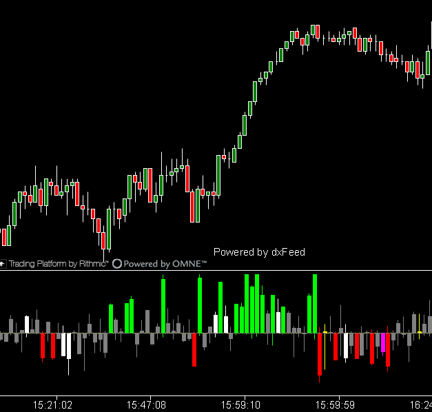

---
# 1. IDENTIFICACIÓN
cs_file: DeltaPatterns.cs
name: Delta Patterns
version: Custom v2.0 (Optimized Logic)

# 2. CLASIFICACIÓN
group: Order Flow
subgroup: Delta
comparison_group: "Bar Delta Analysis"

# 3. VALORACIÓN (Score & Priority)
score_current: 9/10
score_potential: 9.5/10
file_state: Estable
effort: Medio
action_priority: Baja
system_priority: P2

# 4. DECISIÓN
recommended_action: Conservar (Reserva)

# 5. ANÁLISIS
description: ¿Qué patrones de micro-estructura ocurren dentro de una ventana de volumen constante?
gemini_summary: "Escáner de micro-estructura avanzado. A diferencia de los indicadores de Delta normales que dependen del tiempo, este usa una 'Ventana Rodante' (Rolling Window) de ticks para detectar patrones puros de oferta/demanda independientemente de la velocidad del mercado."
competitor_notes: "Complemento táctico del 'DeltaModif'. Mientras DeltaModif da el contexto macro de la vela, DeltaPatterns actúa como un 'Footprint Scanner' automático para dar señales de entrada."
reusable_code: "El motor de 'Rolling Window' (Queue<TickData>) es una pieza de ingeniería institucional reutilizable para cualquier cálculo tick-based."

# 6. METADATOS
analysis_date: 2025-12-09
official_code_date: Unknown
user_modification_date: 2025-12-09
---

## 🎯 Delta Patterns (9/10)

**Nombre del archivo:** [`DeltaPatterns.cs`](Link_Repo)  
**Nombre del indicador:** Delta Patterns  
**Web oficial:** N/A (Custom Indicator)  
**Compatibilidad:** ATAS Beta y superiores. Para compatibilidad con versiones anteriores, debe usarse la compilación "stable" de los indicadores.  
**Última revisión del código oficial:** N/A  
**Última revisión del código modificado:** 2025-12-09  
**Agradecimientos:** A **Joan** de Scalping Agresivo por la idea y **Carlos HK** por sus sugerencias e ideas.  

> **La Pregunta Clave:** ¿Qué patrones de micro-estructura ocurren dentro de una ventana de volumen constante?

---

### ⚙️ Parámetros configurables

Este indicador funciona definiendo un "Target Volume" y buscando patrones dentro de ese flujo:

#### 🧠 Motor de Cálculo
* **Target Volume:** Tamaño de la ventana de análisis (Rolling Window) en contratos.  
* **Show Signals on Chart:** Dibuja iconos en el gráfico de precio.  
* **Signal Size:** Tamaño de los iconos.  

#### 🔎 Patrones (Orden de Prioridad)
* **1. Divergence:** Delta fuerte en dirección opuesta al precio (Absorción).  
* **2. Reversal:** Delta tocó un extremo fuerte pero cerró invertido (Trampa).  
* **3. Dominance:** Control total. Delta fuerte y **sin mecha en contra** (0% tolerancia). Señal de ruptura.  
* **4. Aggressive:** Iniciativa estándar. Delta neto supera el % configurado.  
* **5. Neutral:** Mucho volumen interno (Lucha) pero delta neto cercano a 0 (Empate).  

#### 🎨 Visualización
* **Color Mode:** * `Original`: Colores técnicos variados basados en la idea original de Scalping Agresivo..  
    * `Semantic`: **(Recomendado)** Agrupa señales en Alcistas (Verdes/Azules) y Bajistas (Rojos/Naranjas).  

---

### 🧭 Clasificación
**Grupo:** Order Flow  
**Subgrupo:** Delta  
**Comparison Group:** "Bar Delta Analysis"  

---

### 🧠 Uso más frecuente

* **Confirmación de Ruptura (Dominance):** Señal de "Control Total" justo al romper un nivel clave.  
* **Caza de Giros (Reversal/Divergence):** Detección de agotamiento o absorción en extremos de mercado.  
* **Escáner de Micro-Estructura:** Ver la "salud" interna del movimiento sin depender de la temporalidad del gráfico.  

---

### 📊 Nivel de relevancia
🔟 **9 / 10**

✅ **Independencia Temporal:** Al usar "Target Volume", funciona igual de bien en mercados rápidos que lentos.  
✅ **Motor Eficiente:** Implementa una `Queue` (Cola) FIFO en memoria para procesar tick a tick sin recalcular todo el array.  
✅ **Claridad:** Traduce la complejidad del Order Flow en iconos simples (Puntos, Cuadrados, Diamantes).  
⛔ **Configuración:** Requiere ajustar el `TargetVolume` según la liquidez del instrumento (ES vs NQ).  

---

### 🎯 Estrategias de scalping donde se aplica

* **Setup de Continuación:** Pullback + Señal "Dominance" a favor de tendencia.  
* **Setup de Trampa:** Rompimiento de soporte + Señal "Reversal Buy" (Diamante/Cuadrado).  

---

### ⚙️ Parametrización óptima para scalping (S&P 500)

**Estrategia: Sincronía de Volumen**

| Parámetro | Valor | Justificación |
| :--- | :--- | :--- |
| **Chart Timeframe** | `Volumen 2500` | Normaliza la velocidad del mercado. |
| **Target Volume** | `2500` | Sincroniza el indicador con la vela visual. |
| **Color Mode** | `Semantic` | Lectura rápida (Rojo/Verde). |
| **Dominance %** | `12%` | Señal de ruptura limpia. |
| **Wick Tolerance** | `0.1%` | Exigir control absoluto para la Dominancia. |
| **Aggressive %** | `15%` | Confirmación de fuerza estándar. |

---

### ✨ Mejoras introducidas (Custom v2.0)

* **Optimización Lógica:** Reordenamiento de la jerarquía de señales (`Divergence` > `Reversal` > `Dominance` > `Aggressive`).  
* **Dominance Pura:** Redefinición del patrón "Dominance" para detectar iniciativa unilateral (sin mecha en contra) en lugar de absorción.  
* **Simplificación:** Eliminación de parámetros redundantes (`AggressiveClosePercent`) para facilitar la configuración.  
* **Escalado Hack:** Uso de series transparentes para forzar el escalado simétrico del panel.  

---

### 🧪 Notas de desarrollo

* **Arquitectura Rolling Window:** El código mantiene una cola `_tickQueue` que se llena y vacía dinámicamente, simulando una vela de volumen deslizante sobre cualquier tipo de gráfico.  
* **Rendimiento:** El uso de `Queue<T>` es óptimo para O(1) en inserción/borrado, manteniendo el indicador ligero incluso con ventanas grandes.  

---

### ❗ Incoherencias o aspectos mejorables detectados

* **Falta de Audio:** El indicador es puramente visual. En scalping rápido, las alertas sonoras son necesarias.  

---

### 🛠️ Propuestas de mejora

* **P2:** Implementar sistema de Alertas de Audio (`AddAlert`) configurable por tipo de patrón.  

---

### 💎 Valor Reutilizable (Código Donante)

* **Motor de Rolling Window (`ProcessTick` y `_tickQueue`):** Este bloque es fundamental para crear cualquier indicador que necesite analizar una ventana de "N contratos" independientemente de las velas del gráfico.  

---

### ✍️ La opinión de Gemini sobre el Indicador

Es una joya técnica. Mientras `DeltaModif` (Core) te da la visión estratégica de la vela cerrada, `DeltaPatterns` (Reserva) te da la visión táctica de lo que está ocurriendo *ahora mismo* en el flujo de órdenes. Su capacidad de ignorar el tiempo y centrarse solo en el volumen lo hace superior en momentos de alta volatilidad o noticias.

**Propuestas de Acción:**
* **Conservar como Reserva Activa** (Complemento de Francotirador).

---

### 📈 Veredicto: ¿Es útil para Scalping?

**Sí.**

Esencial para traders que operan con gráficos de Volumen o Ticks.

**Acción:** **Conservar (Reserva)**