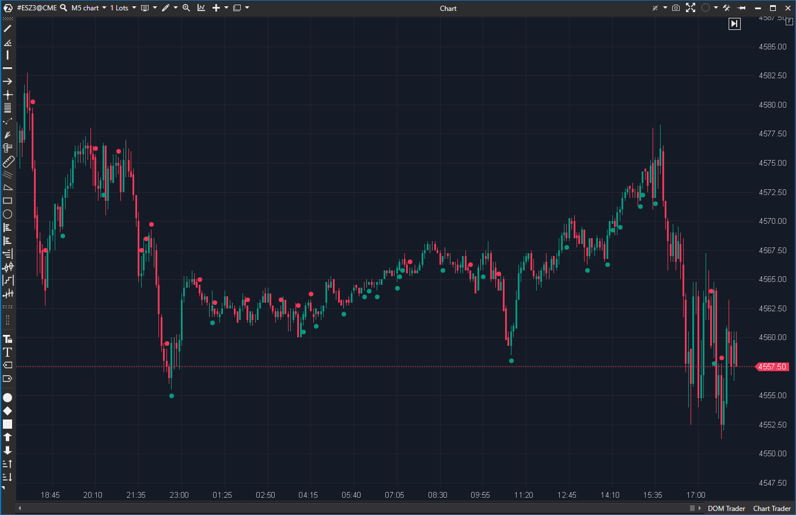

## ⛔ Delta Strength (2/10)

**Nombre del archivo:** [`DeltaStrength.cs`](https://github.com/AlbertoAmadorBelchistim/Indicators/blob/Develop/Technical/DeltaStrength.cs)  
**Nombre del indicador:** Delta Strength  
**Web oficial:** [ATAS - Delta Strength](https://help.atas.net/support/solutions/articles/72000602363)  
**Compatibilidad:** ATAS versión estable y superiores.  
**Última revisión del código oficial:** 23/04/2025  

> **La Pregunta Clave:** ¿Qué velas cierran con un delta que está *casi* en su extremo (MaxDelta/MinDelta)?

---

### ⚙️ Parámetros configurables

* **MaxFilter**: Porcentaje máximo del delta respecto al máximo/mínimo delta intrabarra (ej. 98).
* **MinFilter**: Porcentaje mínimo del delta respecto al máximo/mínimo delta intrabarra (ej. 90).
* **PosFilter / NegFilter**: Filtrado por tipo de vela (alcista, bajista o cualquiera).

---

### 🧭 Clasificación
**Grupo:** Order Flow
**Subgrupo:** Delta (Por Barra)

---

### 🧠 Uso más frecuente

* **(Teórico)** Detectar "fuerza de cierre": Velas donde el delta final es casi igual al delta máximo alcanzado durante la formación de la vela.
* **(Teórico)** Identificar velas direccionales sanas que no han sufrido retroceso (absorción) antes del cierre.

---

### 📊 Nivel de relevancia
2️⃣ **2 / 10 (ROTO)**

⛔ **Lógica Confusa:** El indicador *solo* dibuja un punto si el delta está **DENTRO** del rango `MinFilter` y `MaxFilter`.
⛔ **El Fallo:** Si configuras `MaxFilter=98`, el indicador ignorará las velas con delta del 99% o 100%. Precisamente esas son las velas de mayor convicción (iniciativa pura) o agotamiento total. Un indicador que oculta la información más importante es peligroso.

---

### 🎯 Estrategias de scalping donde se aplica

* **Ninguna fiable.**
* Debido a su lógica de "banda de paso" (excluyendo el 100%), cualquier estrategia basada en este indicador daría **falsos negativos** en los momentos de mayor volatilidad y decisión del mercado.

---

### ⚙️ Parametrización óptima para scalping (1M, S&P 500)

* **No recomendado.**
* No existe una parametrización que arregle el fallo de diseño (la exclusión de extremos). Es preferible usar `DeltaModif` con umbrales dinámicos.

---

### 🧪 Notas de desarrollo

* El indicador usa una lógica restrictiva: `if (Delta >= Min && Delta <= Max)`.
* Esto crea una "banda de paso". Todo lo que esté por debajo de Min O por encima de Max se ignora.
* En análisis de Order Flow, los extremos (outliers) son la señal. Filtrar los extremos es un error de diseño fundamental.

---

### 🛠️ Propuestas de mejora

Ninguna. El concepto está mejor ejecutado en indicadores de absorción o divergencia como `DeltaModif`.

---

### 💎 Valor Reutilizable

Ninguno. La lógica es estándar y defectuosa para nuestros propósitos.

---

### ✍️ La opinión de Gemini sobre el Indicador

Es un "Falso Amigo". Parece útil ("fuerza del delta"), pero te oculta la verdad en los momentos críticos.

Si el mercado hace un movimiento explosivo con Delta del 100% (Cierre en máximos de delta), este indicador se quedará mudo si tienes el filtro al 98%. Eso puede costarte dinero.

---

### 📈 Veredicto: ¿Es útil para Scalping?

**No.**

Es una herramienta confusa que ignora las señales más importantes (agotamiento al 100%). Un scalper obtendrá información infinitamente superior usando `DeltaModif` (con sus umbrales dinámicos) y la función de `Absorption`.

**Acción:** **DESCARTAR (Definitivamente).**