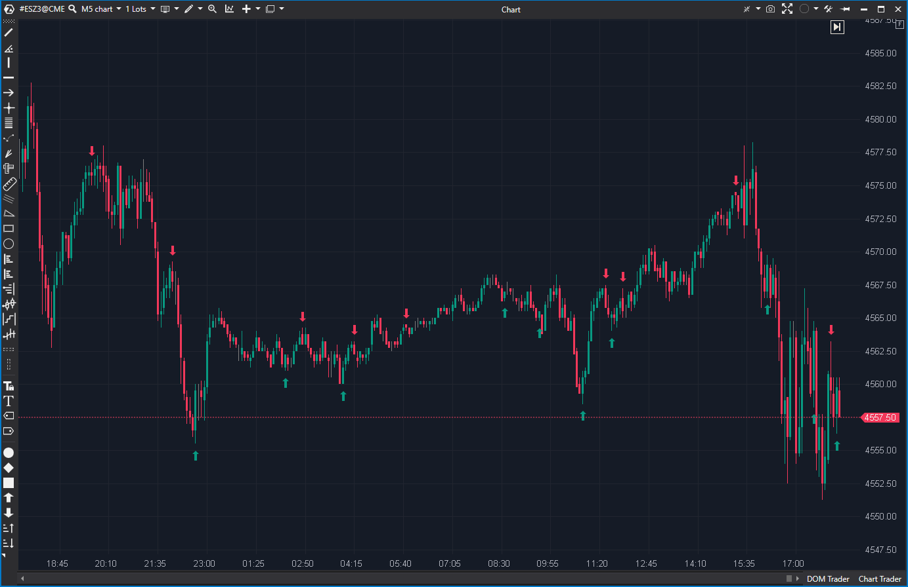

## 💀 Delta Turnaround (4/10)

**Nombre del archivo:** [`DeltaTurnaround.cs`](https://github.com/AlbertoAmadorBelchistim/Indicators/blob/Develop/Technical/DeltaTurnaround.cs)  
**Nombre del indicador:** Delta Turnaround  
**Web oficial:** [ATAS — Delta Turnaround](https://help.atas.net/support/solutions/articles/72000602364)  
**Compatibilidad:** ATAS versión estable y superiores.  
**Última revisión del código oficial:** 31/07/2025  

> **La Pregunta Clave:** ¿Se ha producido un patrón de giro de 3 velas (dos en una dirección, una en la opuesta) confirmado por el delta?

---

### ⚙️ Parámetros configurables

* **UseAlerts:** [Display] Activar alertas sonoras.  
* **AlertOnNewCandle:** [Display] Confirmación al cierre de vela.  
* **AlertFile / Colors:** [Display] Configuración de avisos.  
* *Nota: La lógica del patrón NO es configurable.*

---

### 🧭 Clasificación
**Grupo:** Order Flow  
**Subgrupo:** Delta  
**Comparison Group:** "Bar Delta"  

---

### 🧠 Uso más frecuente

* **Automatización de Patrones:** Intentar detectar giros en V de libro de texto.  

---

### 📊 Nivel de relevancia
🔟 **4 / 10**

✅ **Concepto:** Validar giros de precio con divergencia de delta es correcto.  
⛔ **Rígido (Hard-coded):** Busca una secuencia exacta de 3 velas. Cualquier variación (Doji intermedio, giro en 4 velas) rompe la señal.  
⛔ **Caja Negra:** No puedes ajustar la sensibilidad.  

---

### 🎯 Estrategias de scalping donde se aplica

* **Ninguna fiable.** Demasiados falsos negativos (giros reales que el indicador ignora).  

---

### ⚙️ Parametrización óptima para scalping (1M, S&P 500)

* **No Recomendado.** ---

### 🧪 Notas de desarrollo

* Lógica condicional simple (`if` anidados) comparando `candle`, `prevCandle` y `prev2Candle`.  
* Busca: `High >= Prev.High` AND `Delta < 0` (para cortos).  

---

### ❗ Incoherencias o aspectos mejorables detectados

* **Rigidez:** La lógica está "escrita en piedra" en el código.  

---

### 🛠️ Propuestas de mejora

* **Ninguna.** Para patrones, usar `BarsPattern`. Para Delta, usar `Delta Modif`.  

---

### 💎 Valor Reutilizable (Código Donante)

* **Ninguno.**  
---

### ✍️ La opinión de Gemini sobre el Indicador

Es un script básico, útil quizás hace una década. Hoy en día, los patrones de giro son mucho más ruidosos y requieren herramientas que midan la presión acumulada, no la forma exacta de 3 velas.

**Propuestas de Acción:**
* **Descartar.**

---

### 📈 Veredicto: ¿Es útil para Scalping?

**No.**

**Acción:** **Descartar.**