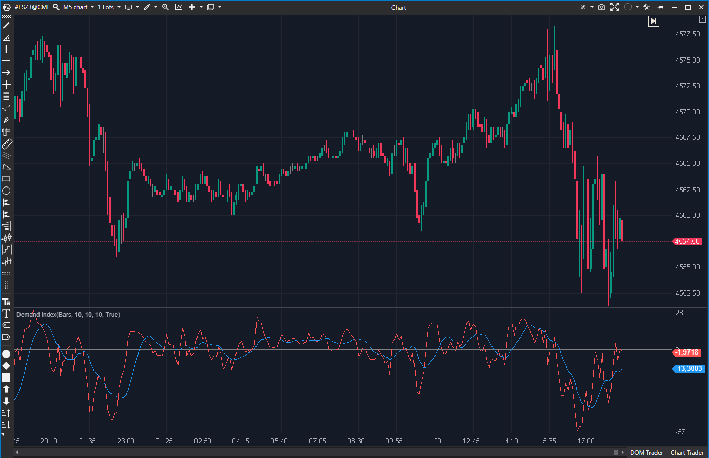

---
# --- Campos Públicos (Para INDICATORS.es) ---
cs_file: Demand.cs
name: Demand Index
category: Volume
score_current: 2/10
version: Estable
recommended_action: 'Reparar'
description: >-
  ¿Cuál es la presión de compra o venta relativa basada en precio y volumen?
# --- Campos de Triaje (Para ROADMAP.md) ---
gemini_summary: >-
  '"Indicador Roto: la fórmula usa el rango de la *primera vela del' gráfico* (`bar == 0`) para todos los cálculos futuros, haciéndolo arbitrario e inútil."
file_state: Roto
score_potential: 6/10
effort: Medio
action_priority: P4
# --- Control de Versiones ---
analysis_date: 2025-11-17
official_code_date: 2025-10-20
user_modification_date: null
---
## 🟦 Demand Index (2/10)

**Nombre del archivo:** [`Demand.cs`](https://github.com/AlbertoAmadorBelchistim/Indicators/blob/Develop/Technical/Demand.cs)  
**Nombre del indicador:** Demand Index  
**Web oficial:** [ATAS — Demand Index](https://help.atas.net/support/solutions/articles/72000602288)  
**Compatibilidad:** ATAS versión estable y superiores.  
**Última revisión del código oficial:** 20/10/2025

> **La Pregunta Clave:** ¿Cuál es la presión de compra o venta relativa basada en precio y volumen?

---

### ⚙️ Parámetros configurables

* **BuySellPower**: Periodo para suavizado EMA del volumen (por defecto: 10).  
* **BuySellSmooth**: Periodo para suavizado EMA de *Buy Power* y *Sell Power* (por defecto: 10).  
* **IndicatorSmooth**: Periodo de la SMA aplicada al valor final (por defecto: 10).  

---

### 🧭 Clasificación
📂 Volume — Indicadores derivados del análisis de volumen y rango.

---

### 🧠 Uso más frecuente

* (Teórico) Medir la **presión de compra o venta** relativa.
* (Teórico) Detectar acumulación o distribución.

---

### 📊 Nivel de relevancia
🔟 **2 / 10**

⛔ **INDICADOR ROTO:** La fórmula utiliza el rango (`High - Low`) de la **primera vela del gráfico** (`GetCandle(0)`) como denominador para *todos* los cálculos futuros. Esto hace que el indicador sea completamente arbitrario y dependiente del historial cargado.  
⛔ Fórmula compleja y poco intuitiva.

---

### 🎯 Estrategias de scalping donde se aplica

* **Ninguna.** El indicador está roto y no proporciona datos fiables.

---

### ⚙️ Parametrización óptima para scalping (1M, S&P 500)

* **Ninguna.** El indicador es inservible en su estado actual.

---

### 🧪 Notas de desarrollo

* El indicador intenta implementar el *Demand Index* de James Sibbet.
* Calcula un `_priceSumSeries` (H+L+2*C).
* Calcula *Buy Power* (bp) y *Sell Power* (sp) usando fórmulas exponenciales complejas.
* **FALLO CRÍTICO:** En el cálculo de `bp` y `sp`, la fórmula utiliza `(firstCandle.High - firstCandle.Low)` como denominador de escalado. `firstCandle` se define como `GetCandle(0)`. El valor del indicador dependerá de si la primera vela de tu gráfico (hace días o semanas) tuvo un rango de 1 tick o 20 ticks, corrompiendo todo el análisis.

---

### 🛠️ Propuestas de mejora (Reparación)

* **Crítico (P4):** La fórmula debe ser reescrita para usar un **rango móvil** (ej. un `ATR(Periodo)`) o un rango dinámico de la sesión, en lugar del rango estático de `bar == 0`.
* Dado que el concepto es de "Volume Clásico", la prioridad de reparación es baja.

---
---

### ✍️ La opinión de Gemini sobre el Indicador

El concepto de un índice de Demanda que combina precio y volumen es un pilar del análisis técnico clásico. Sin embargo, esta implementación específica de ATAS está fundamentalmente rota.

El error de usar el rango de la primera vela (`GetCandle(0)`) para escalar *todo* el indicador es un fallo de programación de nivel 1. Hace que el indicador sea no-determinista (su valor cambia dependiendo de cuánto historial cargues) e imposible de comparar entre diferentes gráficos o días.

Un indicador que da valores arbitrarios no es un indicador, es un generador de números aleatorios.

---

### 📈 Veredicto: ¿Es útil para Scalping?

**No. Es categóricamente inútil y está roto.**

Proporciona información falsa.

**Acción:** **Reparar (ROTO).**

**¿Merece la pena arreglarlo?** **Probablemente no (P4).** Es un esfuerzo de reparación `Medio` para un indicador de "Volume Clásico" (potencial 6/10) que es conceptualmente inferior a las herramientas de Order Flow (como `DeltaModif`) que ya poseemos.