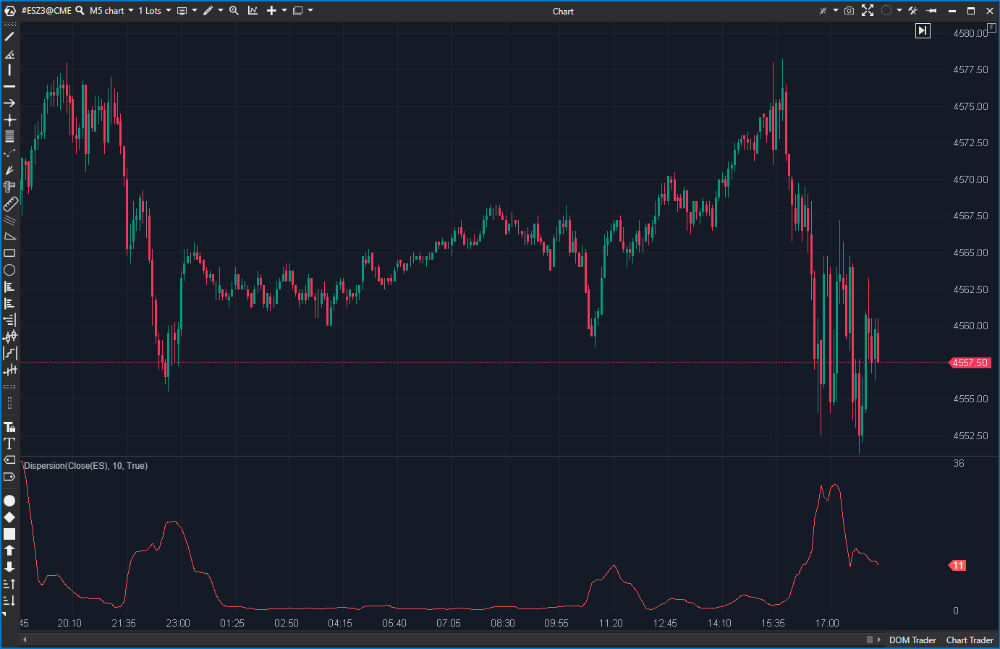

---
# --- Campos Públicos (Para INDICATORS.es) ---
cs_file: Dispersion.cs
name: Dispersion
category: Volatility
score_current: 1/10
version: Estable
recommended_action: 'Descartar'
description: >-
  '¿Está el precio 'pegado' a su media (comprimido) o 'explotando' lejos' de ella (volátil)?
# --- Campos de Triaje (Para ROADMAP.md) ---
gemini_summary: >-
  '"Indicador Roto e Inferior: mide la Varianza ('ticks^2') en lugar' de StDev, la calcula mal, y es 100% inferior a usar ATR o Bollinger Bands."
file_state: Roto
score_potential: 1/10
effort: N/A
action_priority: N/A
# --- Control de Versiones ---
analysis_date: 2025-11-17
official_code_date: 2025-04-23
user_modification_date: null
---

## 🟦 Dispersion (1/10)

**Nombre del archivo:** [`Dispersion.cs`](https://github.com/AlbertoAmadorBelchistim/Indicators/blob/Develop/Technical/Dispersion.cs)  
**Nombre del indicador:** Dispersion  
**Web oficial:** [ATAS — Dispersion](https://help.atas.net/support/solutions/articles/72000602626)  
**Compatibilidad:** ATAS versión estable y superiores.  
**Última revisión del código oficial:** 23/04/2025

> **La Pregunta Clave:** ¿Está el precio 'pegado' a su media (comprimido) o 'explotando' lejos de ella (volátil)?

---

### ⚙️ Parámetros configurables

* **Period**: Número de barras para calcular la desviación respecto a la SMA (por defecto: 10).

---

### 🧭 Clasificación
📂 Volatility — Indicadores de variabilidad del precio.

---

### 🧠 Uso más frecuente

* (Teórico) Medir la dispersión o variabilidad del precio en torno a su media.

---

### 📊 Nivel de relevancia
🔟 **1 / 10**

⛔ **Métrica Incorrecta:** El indicador calcula la **Varianza** (o una aproximación errónea de ella), no la Desviación Estándar. Muestra valores en "unidades al cuadrado" (ej. $ticks^2$), lo cual es no-intuitivo y engañoso.
⛔ **Bug de Cálculo:** La implementación es errónea. Suma `Period - 1` barras pero divide entre `Period`.
⛔ **Inferior y Redundante:** Es 100% inferior a las herramientas estándar de volatilidad. `ATR` mide el rango (en ticks) y `Bollinger Bands` mide la desviación estándar (en precio). Ambas son más útiles e intuitivas.

---

### 🎯 Estrategias de scalping donde se aplica

* **Ninguna.** El indicador es engañoso e inferior a `ATR`.

---

### ⚙️ Parametrización óptima para scalping (1M, S&P 500)

* **Ninguna.**

---

### 🧪 Notas de desarrollo

* El indicador calcula la suma de los cuadrados de la diferencia entre el precio y su SMA.
* `_diffSeries[bar] = (value - _sma.Calculate(bar, value))^2`.
* `_renderSeries[bar] = _diffSeries.CalcSum(_sma.Period - 1, bar) / _sma.Period`.
* Esto es un intento de calcular la Varianza, pero está mal implementado (suma `N-1` y divide por `N`) y, lo que es más importante, no aplica la raíz cuadrada (`Math.Sqrt`) para obtener la Desviación Estándar.

---

### 🛠️ Propuestas de mejora

* **Descartar.** O reescribir por completo para que sea el indicador `StandardDeviation` (que ya existe).

---
---

### ✍️ La opinión de Gemini sobre el Indicador

Este indicador es un intento fallido de crear un medidor de volatilidad y es fundamentalmente defectuoso.

1.  **El Pecado Original (Métrica):** Calcula la **Varianza**, no la Desviación Estándar. Nadie mide la volatilidad en "ticks al cuadrado". Si la volatilidad (distancia a la media) pasa de 2 a 4 ticks (el doble), este indicador pasa de 4 a 16 (el cuádruple), engañando visualmente al trader.
2.  **El Bug de Cálculo:** Como se ha señalado, la fórmula de la varianza está mal implementada.

Es un indicador lento (SMA + Suma) que calcula una métrica inútil (Varianza) de forma incorrecta (bug N-1/N). Es inferior en todos los sentidos a `ATR` o `Bollinger Bands`.

---

### 📈 Veredicto: ¿Es útil para Scalping?

**Categóricamente, no.** Es una herramienta rota, engañosa e inferior.

**Acción:** **Descartar (Roto / Inferior).**
<!--stackedit_data:
eyJoaXN0b3J5IjpbLTE4MTc0ODUyMzFdfQ==
-->