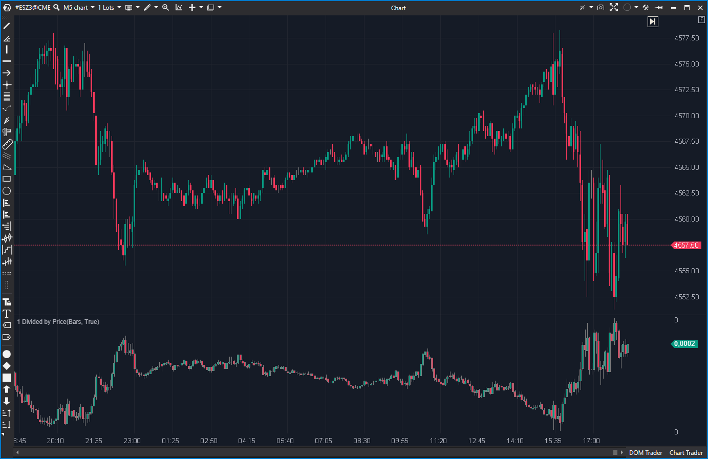

## 🟦 1 Divided by Price (1/10)

**Nombre del archivo:** [`DividedByPrice.cs`](https://github.com/AlbertoAmadorBelchistim/Indicators/blob/Develop/Technical/DividedByPrice.cs)  
**Nombre del indicador:** 1 Divided by Price  
**Web oficial:** [ATAS — 1 Divided by Price](https://help.atas.net/support/solutions/articles/72000602309)  
**Compatibilidad:** ATAS versión estable y superiores.  
**Última revisión del código oficial:** 23/04/2025

> **La Pregunta Clave:** ¿Cuál es el gráfico de precios invertido (1 / Precio)?

---

### ⚙️ Parámetros configurables

* Este indicador no tiene parámetros configurables.

---

### 🧭 Clasificación
📂 Price — Indicadores que transforman el precio en nuevas unidades.

---

### 🧠 Uso más frecuente

* Visualizar el **inverso del precio** (`1 / P`).
* (Teórico) Análisis de pares de divisas inversos o estudios de simetría.

---

### 📊 Nivel de relevancia
🔟 **1 / 10**

⛔ **Gimmick Matemático:** No es una herramienta de análisis técnico ni de trading.
⛔ **Inútil para Scalping:** No proporciona información accionable. El gráfico resultante es a menudo ininteligible y no guarda relación con el volumen o el momentum.
⛔ No tiene aplicación práctica para la mayoría de los traders.

---

### 🎯 Estrategias de scalping donde se aplica

* **Ninguna.**

---

### ⚙️ Parametrización óptima para scalping (1M, S&P 500)

* **Ninguna.**

---

### 🧪 Notas de desarrollo

* El indicador calcula `1 / Open`, `1 / Close`, `1 / High`, `1 / Low`.
* Inteligentemente, asigna el `1 / candle.Low` al `High` de la nueva vela y `1 / candle.High` al `Low` de la nueva vela, para que la forma de la vela se preserve visualmente.
* Es una transformación matemática, no un indicador de análisis.

---

### 🛠️ Propuestas de mejora

* **Descartar.**

---
---

### ✍️ La opinión de Gemini sobre el Indicador

Este es un "gimmick" matemático, no una herramienta de trading. Su única función es dibujar el gráfico de `1 / Precio`.

Como scalper del S&P 500, si el precio está en 5000, este indicador dibujará un gráfico en 0.0002. Esta transformación no ofrece ninguna ventaja, ninguna señal, ni ningún contexto. Es ruido.

No hay ningún escenario en el que un scalper de futuros necesite esta herramienta.

---

### 📈 Veredicto: ¿Es útil para Scalping?

**No. Es categóricamente inútil.**

**Acción:** **Descartar (Gimmick).**