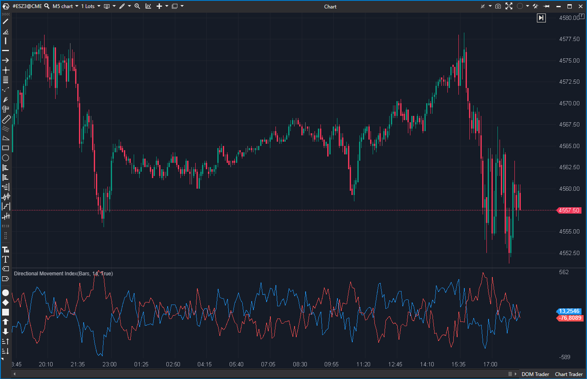

---
# --- Campos Públicos (Para INDICATORS.es) ---
cs_file: DmIndex.cs
name: Directional Movement Index
category: Tendencia
score_current: 3/10
version: Estable
recommended_action: Descartar
description: ¿Cuál es la fuerza direccional (DI+ vs DI-)? (Implementación NO estándar)
# --- Campos de Triaje (Para ROADMAP.md) ---
gemini_summary: "Indicador 'Impostor'; no usa el suavizado de Wilder, sino una 'CalcSum'
  y una fórmula de suavizado personalizada. No es el DMI estándar."
file_state: Impostor
score_potential: 3/10
effort: N/A
action_priority: N/A
# --- Control de Versiones ---
analysis_date: 2025-11-17
official_code_date: 2025-04-23
user_modification_date: null
---

## 🟦 Directional Movement Index (DMI) (3/10)

**Nombre del archivo:** [`DmIndex.cs`](https://github.com/AlbertoAmadorBelchistim/Indicators/blob/Develop/Technical/DmIndex.cs)  
**Nombre del indicador:** Directional Movement Index  
**Web oficial:** [ATAS — Directional Movement Index](https://help.atas.net/support/solutions/articles/72000602285)  
**Compatibilidad:** ATAS versión estable y superiores.  
**Última revisión del código oficial:** 23/04/2025

> **La Pregunta Clave:** ¿Cuál es la fuerza direccional (DI+ vs DI-)? (Implementación NO estándar)

 

---

### ⚙️ Parámetros configurables

* **Period**: Número de barras (por defecto: 14).

---

### 🧭 Clasificación
📂 Trend — Indicadores de dirección y fuerza de movimiento.

---

### 🧠 Uso más frecuente

* (Teórico) Detectar qué fuerza direccional domina (DI+ vs DI-).

---

### 📊 Nivel de relevancia
🔟 **3 / 10**

⛔ **Impostor:** Este indicador **no es el DMI estándar** de J. Welles Wilder.  
⛔ **Lógica Incorrecta:** La fórmula clásica de DMI usa un suavizado exponencial/modificado (RMA/SMMA) sobre el *True Range* y los movimientos direccionales. Este indicador usa `CalcSum` (una suma simple) y luego un suavizado personalizado (`Sum - Sum/Period + CurrentValue`).  
⛔ **Redundante:** Es una de las (al menos) tres implementaciones diferentes y confusas del sistema DMI en ATAS (junto con `DIPos`, `DINeg` y `ADX`).  

---

### 🎯 Estrategias de scalping donde se aplica

* **Ninguna.** Los valores no son estándar y no son fiables para replicar estrategias de DMI.

---

### ⚙️ Parametrización óptima para scalping (1M, S&P 500)

* **Ninguna.**

---

### 🧪 Notas de desarrollo

* El código calcula `dmUp` y `dmDown`.
* Luego aplica una suma simple: `dmUpSum = _dmUp.CalcSum(_period, bar)`.
* Luego aplica un suavizado personalizado no estándar: `smoothedUp = dmUpSum - dmUpSum / _period + _dmUp[bar]`.
* Normaliza con el ATR (`_atr[bar]`).
* Los nombres `_dmDown` y `_dmUp` están **invertidos en el código**, causando confusión.

---

### 🛠️ Propuestas de mejora

* **Descartar.**

---
---

### ✍️ La opinión de Gemini sobre el Indicador

Este indicador es un "Impostor". Se llama "Directional Movement Index", pero no implementa la fórmula estándar de Wilder. El método de suavizado es incorrecto (usa `CalcSum` y una fórmula propia).

Esto significa que cualquier estrategia de DMI probada (como "comprar cuando DI+ cruza DI- y ADX > 20") no funcionará con este indicador, ya que sus valores no coincidirán con los de ninguna otra plataforma de trading.

Es una herramienta confusa y técnicamente incorrecta.

---

### 📈 Veredicto: ¿Es útil para Scalping?

**No. Es un indicador "Impostor" que da valores no estándar.**

**Acción:** **Descartar (Impostor).**
