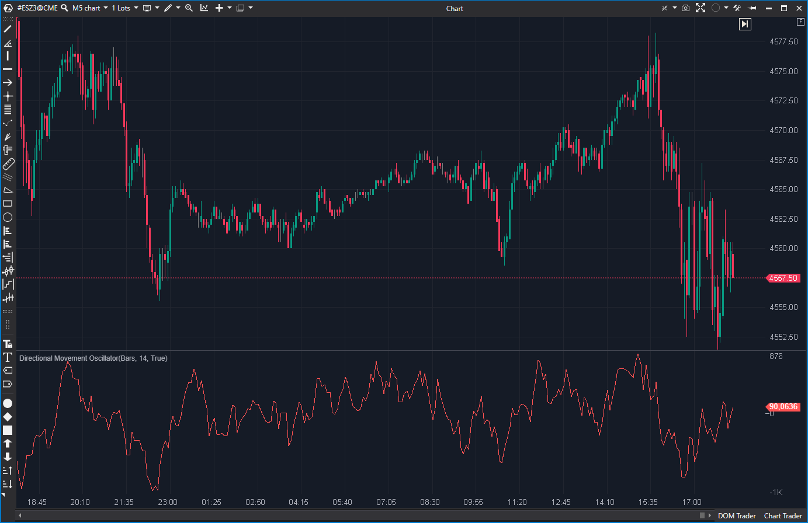

---
# --- Campos Públicos (Para INDICATORS.es) ---
cs_file: DmOscillator.cs
name: Directional Movement Oscillator
category: Tendencia
score_current: 3/10
version: Estable
recommended_action: 'Descartar'
description: >-
  ¿Cuál es la diferencia neta (DI+ menos DI-)? (Basado en un DMI no estándar)
# --- Campos de Triaje (Para ROADMAP.md) ---
gemini_summary: >-
  '"Indicador 'Impostor por Derivación'; se basa en el indicador 'DmIndex'' (que es un impostor no estándar), por lo que este oscilador no es fiable."
file_state: Impostor
score_potential: 3/10
effort: N/A
action_priority: N/A
# --- Control de Versiones ---
analysis_date: 2025-11-17
official_code_date: 2025-04-23
user_modification_date: null
---

## 🟦 Directional Movement Oscillator (3/10)

**Nombre del archivo:** [`DmOscillator.cs`](https://github.com/AlbertoAmadorBelchistim/Indicators/blob/Develop/Technical/DmOscillator.cs)  
**Nombre del indicador:** Directional Movement Oscillator  
**Web oficial:** [ATAS — Directional Movement Oscillator](https://help.atas.net/support/solutions/articles/72000602371)  
**Compatibilidad:** ATAS versión estable y superiores.  
**Última revisión del código oficial:** 23/04/2025

> **La Pregunta Clave:** ¿Cuál es la diferencia neta (DI+ menos DI-)? (Basado en un DMI no estándar)

---

### ⚙️ Parámetros configurables

* **Period**: Número de barras usadas por el `DmIndex` interno (por defecto: 14).

---

### 🧭 Clasificación
📂 Trend — Osciladores de dirección de movimiento.

---

### 🧠 Uso más frecuente

* (Teórico) Medir la **diferencia neta entre DI+ y DI-**.
* (Teórico) Detectar cruces por el eje cero como cambios de dirección.

---

### 📊 Nivel de relevancia
🔟 **3 / 10**

⛔ **Impostor por Derivación:** Este indicador basa todos sus cálculos en el indicador `DmIndex`.  
⛔ Dado que `DmIndex` es un "Impostor" (usa una fórmula no estándar), este oscilador también es un impostor y no coincide con un DMI Oscillator estándar.

---

### 🎯 Estrategias de scalping donde se aplica

* **Ninguna.** Los valores no son fiables ni estándar.

---

### ⚙️ Parametrización óptima para scalping (1M, S&P 500)

* **Ninguna.**

---

### 🧪 Notas de desarrollo

* El indicador es un simple "wrapper" o "derivado".
* Añade el indicador `DmIndex` como un sub-indicador (`_dm`).
* Su único cálculo es: `_renderSeries[bar] = _dm.DataSeries[0] - _dm.DataSeries[1]`.
* Hereda todos los problemas de `DmIndex`.

---

### 🛠️ Propuestas de mejora

* **Descartar.**

---
---

### ✍️ La opinión de Gemini sobre el Indicador

Este indicador es un "Impostor por Derivación". Está construido sobre una fundación podrida.

Dado que su indicador base, `DmIndex`, está roto (es un impostor que no sigue la fórmula estándar), este oscilador simplemente resta dos líneas de datos incorrectos. El resultado es un oscilador no estándar que no tiene correlación con ninguna estrategia probada de DMI.

---

### 📈 Veredicto: ¿Es útil para Scalping?

**No. Es un indicador "Impostor".**

**Acción:** **Descartar (Impostor).**