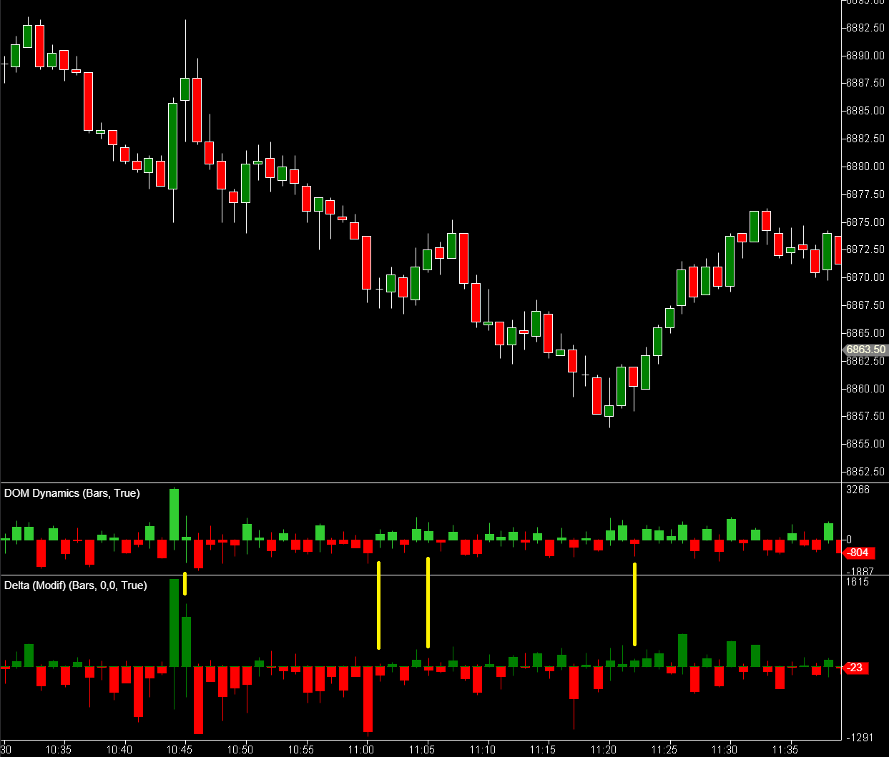

---
# 1. IDENTIFICACIÓN
cs_file:  DomDynamics.cs  
name:  DOM Dynamics  
version:  Custom v3.6 (Net Flow)  

# 2. CLASIFICACIÓN
group:  Order Flow  
subgroup:  DOM  
comparison_group:  "DOM Dynamics"  

# 3. VALORACIÓN (Score & Priority)
score_current:  8/10  
score_potential:  9/10  
file_state:  Estable  
effort:  Bajo  
action_priority:  Baja  
system_priority:  P2  

# 4. DECISIÓN
recommended_action:  Conservar (Core Soporte)  

# 5. ANÁLISIS
description:  ¿Se está añadiendo (Stacking) o retirando (Pulling) liquidez neta del mercado en este instante?  
gemini_summary:  "Detector de manipulación y flujo de liquidez. Calcula el cambio neto de órdenes limitadas tick a tick. Aunque a menudo correlaciona con el Delta, su valor reside en las divergencias (Spoofing): cuando la liquidez hace lo contrario que el precio. Visualización limpia de histograma único."  
competitor_notes:  "Superior al 'Pulling & Stacking' original por claridad visual (1 barra vs 4) y lógica de flujo neto, aunque funcionalmente redundante en tendencias fuertes."  
reusable_code:  "Lógica de Delta de DOM (Snapshot diferencial) y gestión de colores GDI+."  

# 6. METADATOS
analysis_date:  2025-12-02  
official_code_date:  Unknown  
user_modification_date:  2025-12-02  
---

## 🚀 DOM Dynamics (8/10)

**Nombre del archivo:** [`DomDynamics.cs`](https://github.com/AlbertoAmadorBelchistim/Indicators/blob/compile/myindicators/MyIndicators/DomDynamics.cs)  
**Nombre del indicador:** DOM Dynamics  
**Web oficial:** N/A (Desarrollo Propio)  
**Compatibilidad:** ATAS Estable.  
**Última revisión del código modificado:** 2025-12-02  

> **La Pregunta Clave:** ¿Se está añadiendo (Stacking) o retirando (Pulling) liquidez neta del mercado en este instante?

---

### ⚙️ Parámetros configurables

#### **Filters (Filtros de Ruido)**
* **DOM Depth Limit:** (Default: 10) Niveles del libro a monitorizar desde el mejor precio. `10` es suficiente para ver la intención inmediata sin ruido lejano.  
* **Min Change Filter:** (Default: 5) Ignora cambios de liquidez menores a X contratos. Vital para filtrar el "ruido HFT" de algoritmos que solo recolocan órdenes.  

#### **Colors (Estilo)**
* **Bullish Pressure Color:** Color para Stacking de Bids o Pulling de Asks (Facilita subida).  
* **Bearish Pressure Color:** Color para Stacking de Asks o Pulling de Bids (Facilita bajada).  

---

### 🧭 Clasificación
**Grupo:** Order Flow  
**Subgrupo:** DOM  
**Comparison Group:** "DOM Dynamics"  

---

### 🧠 Uso más frecuente

* **Detección de Spoofing (La Señal Única):** Un pico grande de color contrario al movimiento del precio, o un pico grande sin movimiento de precio (Bluff).  
* **Alfombra Roja (Vacuum):** Ver una barra VERDE (Pulling Asks) justo antes de que el precio rompa una resistencia. Confirma que "han quitado el techo".  

---

### 📊 Nivel de relevancia
🔟 **8 / 10**

✅ **Información Exclusiva:** Muestra la "intención" (Limit Orders) en lugar de la "ejecución" (Market Orders).  
✅ **Limpieza:** Reduce 4 variables a 1 vela neta legible.  
⛔ **Redundancia Operativa:** En tendencias fuertes, el DomDynamics se ve casi idéntico al Delta, aportando poco valor extra.  
⛔ **Limitación Técnica:** No distingue matemáticamente entre una orden cancelada y una ejecutada (ambas restan liquidez).  

---

### 🎯 Estrategias de scalping donde se aplica

* **Contra-Tendencia:** Buscar divergencias donde el precio sube pero el DomDynamics es Rojo (Liquidez retirada o soporte muriendo).  
* **Breakout Confirmation:** Confirmar que la ruptura viene acompañada de retirada de órdenes opuestas.  

---

### ⚙️ Parametrización óptima para scalping (1M, S&P 500)

| Parámetro | Valor | Justificación |
| :--- | :--- | :--- |
| **Depth Limit** | `10` | Centrarse en la liquidez que afecta al precio YA. |
| **Min Change Filter** | `10` | Filtrar el ruido de mantenimiento de mercado. |

---

### ✨ Mejoras introducidas (Custom)
* **Lógica Neta:** Unificación de 4 flujos de datos en una sola vela.  
* **Visualización Nativa:** Uso de `ValueDataSeries` para permitir escalado automático.  
* **Corrección de Tipos:** Gestión correcta de conversión de colores WPF/GDI+.  

---

### 🧪 Notas de desarrollo

* **Arquitectura:** Basada en eventos `MarketDepthChanged`. Calcula diferenciales contra snapshots locales (`_bidSnapshot`, `_askSnapshot`).  
* **Rendimiento:** Muy ligero. No acumula histórico pesado, solo dibuja el estado actual.  

---

### ❗ Incoherencias o aspectos mejorables detectados

* **Ambigüedad:** Una barra roja puede ser "Venta Agresiva" (Trade) o "Retirada de Soporte" (Cancel). El indicador no lo sabe. El trader debe inferirlo mirando el Delta o el Precio.  

---

### 🛠️ Propuestas de mejora

* Ninguna que justifique la complejidad. Intentar restar el Delta introduce problemas de sincronización.  

---

### 💎 Valor Reutilizable (Código Donante)

* **Snapshot Diferencial:** La lógica para calcular cambios en el DOM tick a tick es reutilizable para cualquier algoritmo de HFT.  

---

### ✍️ La opinión de Gemini sobre el Indicador

Es un "Detector de Mentiras". **El 80% del tiempo te dirá lo mismo que el Delta** (Ruido/Redundancia), pero en el 20% de los casos donde **diverge**, te da una señal de manipulación que el Delta no ve. Por eso se queda como **Soporte P2**, no como Core P1.

**Propuestas de Acción:**
* Usar solo en setups específicos de manipulación.

---

### 📈 Veredicto: ¿Es útil para Scalping?

**Sí (Específico)**

Útil para confirmar la "calidad" de una ruptura o soporte, no para gatillo de entrada.

**Acción:** **Conservar (Core Soporte)**