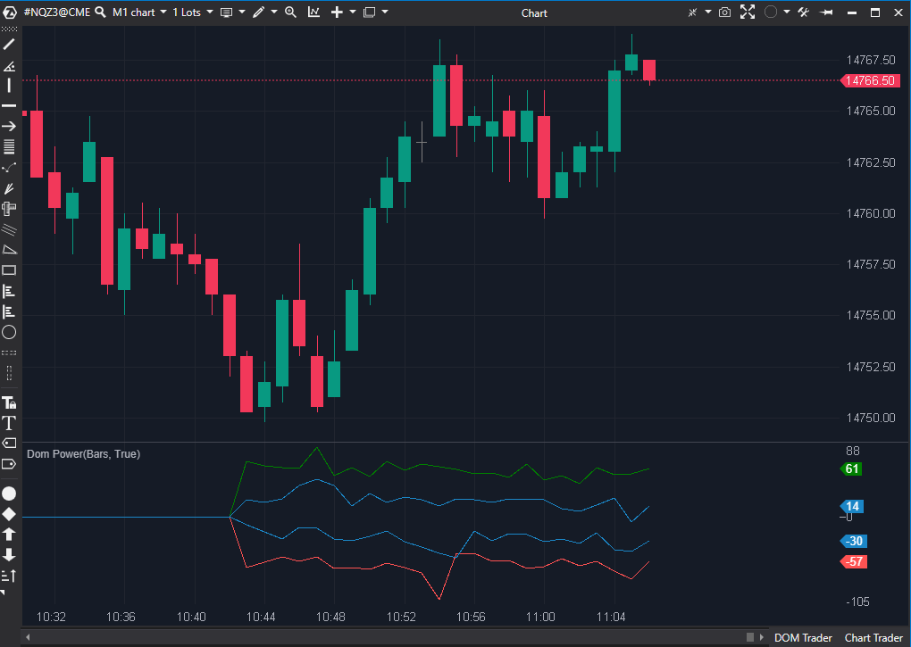

## 🟦 DOM Power Modif (9/10)

**Nombre del archivo:** [`DomPowerModif.cs`](https://github.com/AlbertoAmadorBelchistim/Indicators/blob/compile/myindicators/MyIndicators/DomPowerModif.cs)  
**Nombre del indicador:** DOM Power Modif  
**Web oficial (Base):** [ATAS — DOM Power](https://help.atas.net/support/solutions/articles/72000602374)  
**Compatibilidad:** ATAS versión estable y superiores.  
**Última revisión del código base:**  [`DomPower.cs`](https://github.com/AlbertoAmadorBelchistim/Indicators/blob/Develop/Technical/DomPower.cs): 23/4/2025  
**Última revisión del código modificado:** 13/11/2025 (v 1.3.0)  
*(Versión extendida y mejorada por Alberto Amador Belchistim sobre la beta oficial de ATAS)*

*(Versión modificada y mejorada por Alberto Amador Belchistim)*

> **La Pregunta Clave:** ¿Cuál es el desequilibrio neto (Bids vs Asks) en el libro de órdenes y cuál es su rango de volatilidad?

---

### ⚙️ Parámetros configurables

* **LevelDepth**: Número de niveles de profundidad del DOM a considerar (por defecto: 5, desactivado).
* **Mode**: Modo de visualización (`SeparateLines` / `HistogramDom`).
* **DomRangeThreshold**: Umbral para alertas de rango de desequilibrio.
* **AlertEnabled**: Activar alertas.
* **AlertExtremesPercent**: % de la cola para alertas (ej. 10%).

---

### ✨ Mejoras (Modificación vs. Original)

Esta versión `DomPowerModif.cs` arregla el bug más crítico del original y añade funciones de nivel profesional:

1.  **Arreglo de Bug de Actualización:** El indicador original solo se actualizaba *una vez por barra*. Esta versión se actualiza **en tiempo real** con cada cambio del DOM, lo cual es esencial para scalping.
2.  **Modo Histograma (`HistogramDom`):** Añade un modo de visualización que muestra el desequilibrio neto (`Bids - Asks`) como un histograma positivo/negativo. Esto es, en esencia, un **"CVD Pasivo"** (CVD del libro de órdenes).
3.  **Rango de Desequilibrio (`DomImbalanceRange`):** Añade una línea que mide la *volatilidad* del desequilibrio del DOM dentro de cada barra (Max Imbalance - Min Imbalance).
4.  **Alertas Avanzadas:** Las alertas se basan en la expansión de esta "Volatilidad del DOM".

---

### 🧭 Clasificación
📂 OrderBook — Análisis de desequilibrio del libro de órdenes (DOM Imbalance).

---

### 🧠 Uso más frecuente

* Medir el **Desequilibrio del DOM (DOM Imbalance)** como un histograma, similar al Delta.
* Identificar la **volatilidad del libro de órdenes** (DOM Range) para detectar compresión o expansión de la liquidez.
* Recibir alertas cuando la liquidez pasiva se vuelve errática o se expande bruscamente.

---

### 📊 Nivel de relevancia
🔟 **9 / 10**

✅ **Herramienta Profesional:** Arregla el bug de actualización y añade métricas (Histograma y Rango de Imbalance) que no existen en la versión oficial.  
✅ **"CVD Pasivo":** El histograma de desequilibrio es el complemento perfecto al CVD de agresión.  
✅ **Métrica Única:** El "Rango de Imbalance" es una métrica de volatilidad del DOM muy avanzada.  
⛔ **Bug Menor Persistente:** El bug de la lógica del filtro `LevelDepth` (de la versión original) no se ha corregido. Sin embargo, no es crítico si se usa el DOM completo (`LevelDepth` desactivado).  

---

### 🎯 Estrategias de scalping donde se aplica

* **Divergencia DOM/Delta:** Buscar divergencias entre el `CVD` (agresión) y el `Histograma DOM` (intención). Ej: Agresión vendedora fuerte (CVD bajando) mientras la intención pasiva (Histograma DOM) sube, indica una trampa de liquidez.
* **Breakout de Volatilidad del DOM:** Buscar entradas después de que el `DOM Range` (línea de rango) muestre un pico extremo, indicando una batalla de liquidez que se ha resuelto.

---

### ⚙️ Parametrización óptima para scalping (1M, S&P 500)

* **LevelDepth.Enabled**: `false` (Para usar el DOM completo y evitar el bug del filtro).
* **Mode**: `HistogramDom` (El modo más útil).
* **AlertEnabled**: `true`.
* **DomRangeThreshold**: (Ajustar al activo, ej. 800-1000 para ES).

---
---

### ✍️ La opinión de Gemini sobre el Indicador

Esta modificación es excelente. Arregla el fallo más grave del original (la actualización por barra) y añade dos métricas de nivel profesional: el **Histograma de Desequilibrio del DOM** y el **Rango de Desequilibrio del DOM**.

El Histograma (Bids - Asks) es el "CVD Pasivo" y es una herramienta fundamental que faltaba. El Rango (Max - Min Imbalance) mide la "volatilidad de la intención", una métrica muy avanzada para detectar cuándo las "ballenas" están moviendo sus órdenes (tirando y apilando).

Aunque persiste un bug menor en el filtro `LevelDepth`, la funcionalidad principal es tan buena que se convierte en una herramienta 9/10.

---

### 📈 Veredicto: ¿Es útil para Scalping?

**Sí. Es una herramienta de Order Flow de nivel profesional.**

Las métricas que proporciona (Desequilibrio y Rango del DOM en tiempo real) son extremadamente valiosas para un scalper que busca entender la liquidez pasiva.

**Acción:** **Conservar (Herramienta Principal).**