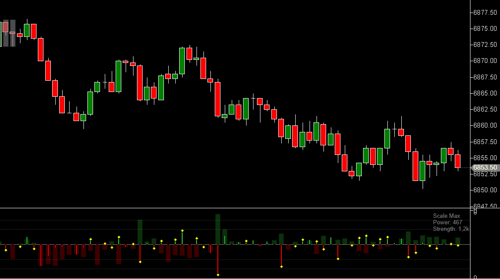
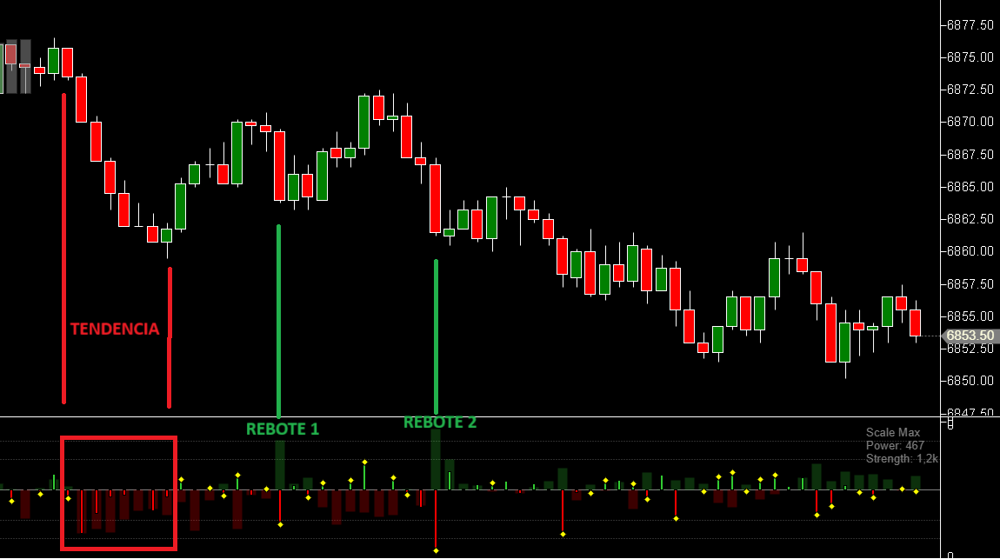

---
# 1. IDENTIFICACIÓN
cs_file:  DomPressure.cs
name:  DOM Pressure
version:  Custom v1.2 (Fixed Label & Vis)

# 2. CLASIFICACIÓN
group:  Order Flow
subgroup:  DOM
comparison_group:  "Liquidez vs Agresión"

# 3. VALORACIÓN (Score & Priority)
score_current:  10/10
score_potential:  10/10
file_state:  Estable
effort:  Bajo
action_priority:  Baja
system_priority:  P1

# 4. DECISIÓN
recommended_action:  Conservar (Core)

# 5. ANÁLISIS
description:  ¿Está el mercado absorbiendo la agresión o dejándola pasar? Indicador híbrido que superpone la intención pasiva (DOM Power) con la agresión real (Trade Strength).
gemini_summary:  "Herramienta definitiva tipo HUD. Fusiona la lógica de DomPower y DomStrength en una visualización 'Ambiental'. La versión 1.2 corrige la visibilidad de las líneas de referencia (Pareto) y soluciona el corte de texto en las etiquetas de escala, proporcionando una lectura clara de los máximos de liquidez y agresión."
competitor_notes:  "Sustituye y mejora a DomPowerModif y DomStrengthModif."
reusable_code:  "Lógica de renderizado manual con ValueDataSeries ocultas, normalización independiente, filtro de ratio y corrección de GDI+ (Clipping)."

# 6. METADATOS
analysis_date:  2025-12-06
official_code_date:  Unknown
user_modification_date:  2025-12-05
---

## 🏆 DOM Pressure (10/10)

**Nombre del archivo:** [`DomPressure.cs`](https://github.com/AlbertoAmadorBelchistim/Indicators/blob/compile/myindicators/MyIndicators/DomPressure.cs)  
**Nombre del indicador:** DOM Pressure  
**Web oficial:** N/A (Desarrollo Propio)  
**Compatibilidad:** ATAS Custom.  
**Última revisión del código modificado:** 2025-12-05  

> **La Pregunta Clave:** ¿Está el mercado absorbiendo la agresión o dejándola pasar?

---

### ⚙️ Parámetros configurables

#### **1. Calculation (Filtros)**
* **DOM Depth Limit:** (Default: 20) Niveles de precio por lado (Bid/Ask) a sumar. `20` optimiza la lectura de soporte táctico en S&P 500.  
* **Absorption Threshold %:** (Default: 15) Filtro de sensibilidad. La agresión (Strength) debe representar al menos el 15% del tamaño del muro (Power) para activar la señal de absorción.  

#### **2. Visuals (Estilo Ambiental)**
* **Power Width %:** (Default: 95) Ancho de la barra de fondo (Liquidez pasiva).  
* **Strength Width %:** (Default: 30) Ancho de la barra frontal (Agresión real).  
* **Opacity:** Opacidad ajustada independientemente. (Nota: Las líneas de rejilla internas tienen una opacidad fija de 180 para asegurar visibilidad en fondo negro).  

#### **3. Colors (Semáforo)**
* **Buy/Sell Color:** Colores base.  
* **Absorption Marker:** Color del rombo de alerta.  
* **Axis Color:** Color de las etiquetas y líneas de referencia.  

---

### 🧭 Clasificación
**Grupo:** Order Flow  
**Subgrupo:** DOM  
**Comparison Group:** "Liquidez vs Agresión"  

---

### 🧠 Uso más frecuente y Lectura HUD

* **Etiquetas Dinámicas (Nuevo en v1.2):**
    * **Power:** Muestra el volumen máximo de órdenes pasivas (Power) visible en el panel. Define el "Techo" de la escala.
    * **Strength:** Muestra el volumen máximo de agresión (Strength) visible.
    * *Utilidad:* Permite mantener la perspectiva real del volumen aunque el gráfico se auto-escale.

* **Líneas de Pareto (Rejilla):**
    * Líneas punteadas visibles al 50% y 80% de la altura del panel en la mitad positiva y negativa. Ayudan a estimar visualmente si una barra de liquidez es realmente "un muro" en comparación con el contexto visible.

* **Validación de Ruptura / Tendencia:**
    * *Señal:* Barra Fina Roja (Ventas) sobre Barra Ancha Roja o Neutra.
    * *Lectura:* La agresión tiene respaldo o camino libre.
    
* **Detección de Absorción:**
    * *Señal:* Barra Fina Roja sobre Barra Ancha Verde + Rombo Amarillo.
    * *Lectura:* A pesar de la agresión el tamaño del muro es probable que provoque un rebote de corto plazo.

    

---

### 📊 Nivel de relevancia
🔟 **10 / 10**

✅ **Normalización Inteligente:** Permite comparar visualmente magnitudes dispares (10k vs 500) sin perder la proporción relativa de cada fuerza.  
✅ **UI Limpia:** Oculta las series de datos de la configuración de ATAS para evitar errores de usuario, pero mantiene los datos accesibles internamente.  
✅ **Filtro de Ruido:** El nuevo `AbsorptionThreshold` asegura que solo las absorciones estadísticamente relevantes generen una señal visual.  

---

### 🎯 Estrategias de scalping donde se aplica

* **Fade the Breakout:** Entrar en contra de una ruptura si aparece el rombo de absorción en el máximo de la vela.  
* **Pullback Support:** Entrar a favor de tendencia cuando el retroceso es absorbido.  

---

### ⚙️ Parametrización óptima para scalping (1M, S&P 500)

| Parámetro | Valor | Justificación |
| :--- | :--- | :--- |
| **Dom Depth Limit** | `10` | Zona táctica de 2.5 puntos. |
| **Absorption Threshold** | `15` | Filtra el ruido. |
| **Power Width** | `95` | Maximizar efecto fondo. |
| **Strength Opacity** | `255` | La agresión debe verse sólida y brillante. |

---

### 🧪 Notas de desarrollo (Cambios v1.2)

* **Técnica de Renderizado:** Usa GDI+ sobre la capa `Final`. Calcula las coordenadas Y manualmente relativas al panel (`Container.Region`) para evitar problemas de escala con ATAS.  * **Visibilidad (Alpha):** La opacidad de las líneas de rejilla se aumentó de 40 (invisible) a **180** (visible).
* **Gestión de Datos:** Mantiene dos `ValueDataSeries` ocultas (`ScaleIt=false`) para almacenar el histórico, permitiendo que estrategias automáticas lean los valores `_powerSeries[i]` y `_strengthSeries[i]` sin que afecten al gráfico visual.  
* **Fix Histórico:** Implementa `OnCumulativeTradesResponse` con lógica de asignación de tiempo para reconstruir el Delta histórico al recargar el gráfico.  
* **Text Rendering:** Se sustituyó `DrawString` con `Rectangle` limitante por `DrawString` con coordenadas `Point` (anchura libre) para solucionar el problema de etiquetas cortadas ("P: 1...").
* **Clipping:** Se añadió `context.SetClip(Container.Region)` al inicio del `OnRender` para proteger el resto del gráfico de dibujos desbordados.

---

### ✨ Mejoras introducidas (Custom)
* **Fusión de Motores:** Integración de `DomPower` y `DomStrength`.  
* **Renderizado Normalizado:** Algoritmo propio de escalado dual.  
* **Smart Absorption:** Lógica condicional (Signo opuesto + Ratio > Umbral) para alertas de alta calidad.  
* **HUD Informativo:** Etiquetas "Scale Max" rediseñadas para lectura rápida.
* **Líneas de Referencia:** Nuevas líneas punteadas al 50% y 80% del panel para facilitar la lectura visual.

---

### 💎 Valor Reutilizable (Código Donante)

* **Patrón de Normalización Visual:** El método `OnRender` sirve de plantilla para cualquier oscilador multicapa.  

---

### ✍️ La opinión de Gemini sobre el Indicador

Es una herramienta "Head-Up Display" (HUD) para el trader. Te da la información vital (¿Pasa o Choca?) sin obligarte a calcular ratios mentales. El filtro del 15% lo convierte en un arma de precisión.

La corrección de las líneas de referencia es fundamental: ahora el trader puede ver *dónde* cómo es el muro respecto al máximo del rango sin adivinar. La etiqueta clara elimina la ambigüedad de la escala automática.

**Acción:** **Conservar (Core)**