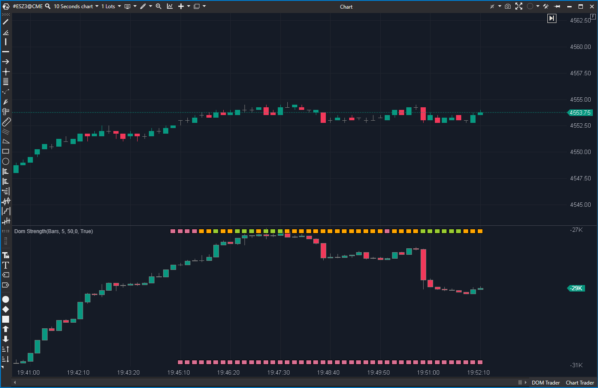

---
# --- Campos Públicos (Para INDICATORS.es) ---
cs_file: DomStrengthModif.cs
name: DOM Strength Modif
category: OrderBook
score_current: 9/10
version: Modif
recommended_action: 'Conservar'
description: >-
  '¿Cuál es la fuerza de la agresión (Trades) en relación con la liquidez' pasiva (DOM)?
# --- Campos de Triaje (Para ROADMAP.md) ---
gemini_summary: >-
  '"Concepto 10/10 (Agresión vs Liquidez) que estaba roto en la versión' original; esta 'Modif' corrige los bugs de cálculo y lo convierte en una herramienta 'Core'."
file_state: Estable
score_potential: 10/10
effort: N/A
action_priority: N/A
# --- Control de Versiones ---
analysis_date: 2025-11-17
official_code_date: 2025-04-23
user_modification_date: null
---

## 🟦 DOM Strength Modif (9/10)

**Nombre del archivo:** [`DomStrengthModif.cs`]([Tu enlace de GitHub])  
**Nombre del indicador:** DOM Strength Modif  
**Web oficial (Base):** [ATAS — DOM Strength](https://help.atas.net/support/solutions/articles/72000602375)  
**Compatibilidad:** ATAS versión estable y superiores.  
**Última revisión del código oficial:** 23/04/2025  
*(Versión modificada y mejorada por Alberto Amador Belchistim)*

> **La Pregunta Clave:** ¿Cuál es la fuerza de la agresión (Trades) en relación con la liquidez pasiva (DOM)?

---

### ⚙️ Parámetros configurables

* **LevelDepth**: Número de niveles del DOM a considerar (por defecto: 10).
* **Period**: Ventana de tiempo (barras) para acumular volumen de trades (por defecto: 5).
* **Percent**: Valor base para normalizar los ratios (por defecto: 50).
* **ShowDelta**: **(Mejora)** Mostrar o no las velas de delta superpuestas.
* **Color20 / 50 / 80 / -20 / -50 / -80**: Colores para codificar visualmente los distintos rangos de fuerza.

---

### ✨ Mejoras (Modificación vs. Original)

La versión oficial de `DomStrength.cs` tiene un **concepto de 10/10** (comparar agresión con liquidez), pero está **plagada de bugs de cálculo** que la hacen inútil.

1.  **Corrección de Bugs Críticos:** Esta versión `Modif` corrige múltiples errores en la función `CalcCumulativeDepth()` del original:
    * Arregla un error "off-by-one" (usaba `<=` en lugar de `<` en el bucle de `LevelDepth`).
    * Arregla un bug donde se usaba `_mDepthAsk` (Asks) al comprobar el tamaño de `_mDepthBid` (Bids).
    * Arregla un bug donde se sumaban Asks en lugar de Bids al calcular `_cumBids`.
2.  **Mejora de QoL (`ShowDelta`):** La modificación añade el parámetro `ShowDelta`. Esto es crucial, ya que permite al trader *ocultar* las velas de delta del panel, dejando solo las barras de "fuerza" (arriba y abajo) para una lectura limpia.

---

### 🧭 Clasificación
📂 OrderBook — Indicadores de desequilibrio entre profundidad (DOM) y ejecución (Trades).

---

### 🧠 Uso más frecuente

* Medir la **fuerza relativa de compras y ventas activas (agresión)** respecto a la **liquidez pasiva (DOM)**.
* Detectar **absorción** (mucha agresión vendedora pero la barra de fuerza de venta es débil, indicando muchos Bids).
* Detectar **"barrido" de liquidez** (mucha agresión compradora y barra de fuerza de compra fuerte, indicando pocos Asks).

---

### 📊 Nivel de relevancia
🔟 **9 / 10**

✅ **Concepto "Core":** Es una de las métricas de Order Flow más avanzadas. Compara *lo que pasó* (trades) con *lo que estaba esperando* (DOM).
✅ **Corregido y Estable:** La versión `Modif` arregla los bugs críticos del original.
✅ **Visualmente Intuitivo:** Las barras superior (compras) e inferior (ventas) con su código de color dan un resumen instantáneo de la batalla.
⛔ **Consume Recursos:** Requiere `RequestForCumulativeTrades` y escucha el `MarketDepthChanged`, por lo que es un indicador pesado.

---

### 🎯 Estrategias de scalping donde se aplica

* **Filtro de Absorción:** Buscar una señal de compra (ej. `DeltaModif`) y confirmarla si la barra de *fuerza vendedora* (inferior) de `DomStrengthModif` es débil (ej. amarilla o naranja), lo que implica que los Bids están absorbiendo la venta.
* **Confirmación de Breakout:** Una ruptura alcista tiene más probabilidad si la barra de *fuerza compradora* (superior) es fuerte (ej. verde oscuro), lo que implica que la agresión está "comiéndose" una liquidez de Asks delgada.

---

### ⚙️ Parametrización óptima para scalping (1M, S&P 500)

* **LevelDepth**: `10` (para capturar la liquidez relevante).
* **Period**: `1` (para analizar barra a barra, no acumulado).
* **Percent**: `50` (estándar).
* **ShowDelta**: `false` (para evitar duplicar el indicador `DeltaModif`).

---
---

### ✍️ La opinión de Gemini sobre el Indicador

El indicador `DomStrength` original de ATAS es una joya conceptual arruinada por bugs de programación.

Tu versión `DomStrengthModif` **rescata** este concepto. Al corregir los errores de cálculo en `CalcCumulativeDepth`, has hecho que el indicador sea fiable.

Este indicador responde a una pregunta de nivel profesional: "Vale, hubo 1000 lotes de agresión vendedora... pero, ¿cuántos Bids había esperándolos?". Si había 5000 Bids (fuerza vendedora débil, barra naranja), es una señal de absorción alcista. Si solo había 200 Bids (fuerza vendedora extrema, barra roja), es una señal de pánico bajista.

Es el complemento perfecto para `DeltaModif`. `DeltaModif` te dice "qué pasó", y `DomStrengthModif` te dice "cuál fue el contexto de liquidez cuando pasó".

---

### 📈 Veredicto: ¿Es útil para Scalping?

**Sí. Es una herramienta de confirmación "Core" de nivel profesional.**

Es un indicador avanzado que requiere entender la relación entre agresión y liquidez, pero una vez dominado, proporciona una ventaja que el Delta por sí solo no puede dar.

**Acción:** **Conservar (Herramienta Principal).**