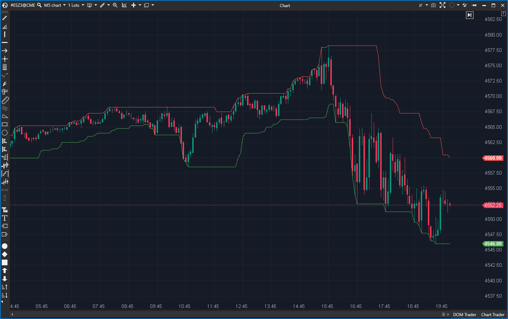

## 🟦 Donchian Channel (8/10)

**Nombre del archivo:** [`Donchian.cs`](https://github.com/AlbertoAmadorBelchistim/Indicators/blob/Develop/Technical/Donchian.cs)  
**Nombre del indicador:** Donchian Channel  
**Web oficial:** [ATAS — Donchian Channel](https://help.atas.net/support/solutions/articles/72000602376)  
**Compatibilidad:** ATAS versión estable y superiores.  
**Última revisión del código oficial:** 23/04/2025

> **La Pregunta Clave:** ¿Cuál es el rango de precio (máximo y mínimo) de las últimas N barras?

---

### ⚙️ Parámetros configurables

* **Period**: Número de barras para calcular el máximo y mínimo (por defecto: 20).
* **ShowAverage**: Mostrar o no la línea media (mitad entre el máximo y el mínimo).

---

### 🧭 Clasificación
📂 Levels — Indicadores de canal y ruptura.

---

### 🧠 Uso más frecuente

* Delimitar el **rango máximo y mínimo** en una ventana móvil.
* Detectar **rupturas de rango** al superar el canal.
* Usar la media como referencia de equilibrio o punto medio del rango (reversión a la media).

---

### 📊 Nivel de relevancia
🔟 **8 / 10**

✅ **Herramienta "Core":** Es la herramienta de breakout (ruptura) por definición.  
✅ Muy útil en estrategias de breakout o de reversión a la media.  
✅ Fácil de interpretar visualmente.  
⛔ No considera volumen ni momentum, sólo precio (es "ciego").  

---

### 🎯 Estrategias de scalping donde se aplica

* **Breakout (Ruptura):** Comprar cuando el precio cierra por encima del canal superior, vender cuando cierra por debajo.
* **Falso Breakout (Reversión):** Vender cuando el precio toca el canal superior y es rechazado con fuerza (ej. confirmado por `DeltaModif`).
* **Reversión a la Media:** Comprar cuando el precio toca el canal inferior y vuelve hacia la línea media (`ShowAverage = true`).

---

### ⚙️ Parametrización óptima para scalping (1M, S&P 500)

* **Period**: `20` (estándar).
* **ShowAverage**: `true` (la línea media es un S/R clave).

---

### 🧪 Notas de desarrollo

* Es una implementación estándar de Donchian.
* Calcula el máximo (`high`) y el mínimo (`low`) de las últimas `Period` barras.
* La lógica `bar - (bar < _period ? bar : _period)` es una forma correcta de manejar el inicio del gráfico.
* Opcionalmente calcula la media: `(high + low) / 2`.

---

### 🛠️ Propuestas de mejora

* Añadir coloreado del canal (ej. verde si la media sube, rojo si baja).
* Añadir alertas cuando el precio toque o rompa el canal.

---
---

### ✍️ La opinión de Gemini sobre el Indicador

Esta es una herramienta de "contexto de rango" de primer nivel. Es simple, robusta y hace un trabajo perfectamente: te muestra el "campo de juego" de las últimas N barras.

Para un scalper, es un "mapa" indispensable. Te dice instantáneamente dónde está el soporte (canal inferior) y la resistencia (canal superior) del rango reciente. La línea media (`ShowAverage`) es a menudo el imán de "valor justo" más importante en un mercado lateral.

Es una herramienta "ciega" (solo precio), por lo que nunca debe usarse sola, pero es la base perfecta para construir setups de breakout o de reversión a la media, que luego se confirman con herramientas de Order Flow como `DeltaModif`.

---

### 📈 Veredicto: ¿Es útil para Scalping?

**Sí. Es una herramienta de contexto clave.**

Proporciona los niveles de S/R inmediatos y más obvios (el rango de N barras) que todo el mundo está mirando.

**Acción:** **Conservar (Herramienta de Contexto).**
