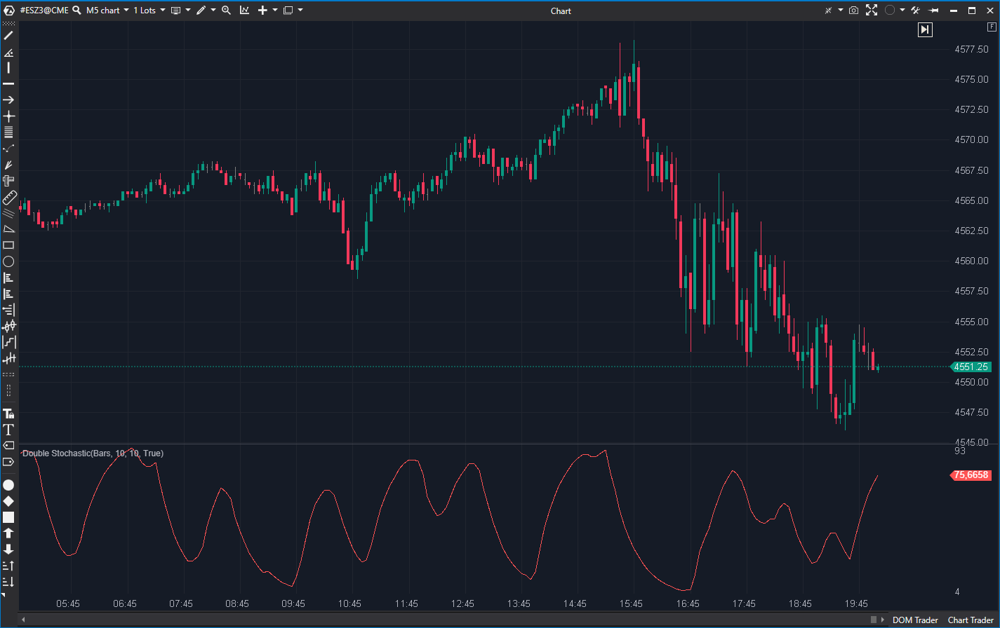

---
# --- Campos Públicos (Para INDICATORS.es) ---
cs_file: DoubleStochastic.cs
name: Double Stochastic
category: Momentum
score_current: 7/10
version: Estable
recommended_action: 'Conservar'
description: >-
  '¿Cuál es el indicador Estocástico, pero aplicado por segunda vez sobre' sí mismo para suavizar el ruido?
# --- Campos de Triaje (Para ROADMAP.md) ---
gemini_summary: >-
  '"Implementación estable de un Estocástico suavizado (Estocástico' de un Estocástico); una buena herramienta de momentum que reduce el ruido."
file_state: Estable
score_potential: 7/10
effort: N/A
action_priority: N/A
# --- Control de Versiones ---
analysis_date: 2025-11-17
official_code_date: 2025-04-23
user_modification_date: null
---

## 🟦 Double Stochastic (7/10)

**Nombre del archivo:** [`DoubleStochastic.cs`](https://github.com/AlbertoAmadorBelchistim/Indicators/blob/Develop/Technical/DoubleStochastic.cs)  
**Nombre del indicador:** Double Stochastic  
**Web oficial:** [ATAS — Double Stochastic](https://help.atas.net/support/solutions/articles/72000602610)  
**Compatibilidad:** ATAS versión estable y superiores.  
**Última revisión del código oficial:** 23/04/2025

> **La Pregunta Clave:** ¿Cuál es el indicador Estocástico, pero aplicado por segunda vez sobre sí mismo para suavizar el ruido?

---

### ⚙️ Parámetros configurables

* **Period**: Periodo base para calcular el máximo y mínimo (por defecto: 10).
* **SmaPeriod**: Periodo de suavizado EMA para *ambas* capas del estocástico (por defecto: 10).

---

### 🧭 Clasificación
📂 Momentum — Osciladores suavizados de impulso relativo.

---

### 🧠 Uso más frecuente

* Detectar **condiciones de sobrecompra y sobreventa** con menos señales falsas.
* Confirmar señales de reversión con un doble filtrado por momentum.
* Filtrar el ruido de un Estocástico simple.

---

### 📊 Nivel de relevancia
🔟 **7 / 10**

✅ Más robusto que el estocástico clásico en entornos volátiles.
✅ Menos propenso a señales falsas gracias al doble suavizado.
⛔ Tiene más retardo (lag) en la señal que un Estocástico simple.
⛔ Sigue siendo "ciego" (solo precio).

---

### 🎯 Estrategias de scalping donde se aplica

* **Reversión Suave**: Entrar en favor del giro cuando el indicador sale de zonas extremas (ej. > 80 o < 20).
* **Divergencia**: Buscar divergencias entre el precio y el oscilador, que son más fiables que en un Estocástico simple.

---

### ⚙️ Parametrización óptima para scalping (1M, S&P 500)

* **Period**: `10`
* **SmaPeriod**: `5` (para reducir el lag del suavizado).
* Añadir líneas auxiliares en `20`, `50` y `80`.

---

### 🧪 Notas de desarrollo

* El indicador calcula un primer Estocástico (K1) y lo suaviza con una EMA (D1).
* Luego, calcula un *segundo* Estocástico (K2) usando los valores de D1 como entrada.
* Finalmente, suaviza K2 con *otra* EMA (D2), que es la línea que se dibuja.
* Es un "Estocástico de un Estocástico", lo que produce una línea mucho más suave.

---

### 🛠️ Propuestas de mejora

* Añadir líneas de sobrecompra/sobreventa (80/20) por defecto.
* Añadir una opción para mostrar la primera capa (D1) como línea de señal.

---
---

### ✍️ La opinión de Gemini sobre el Indicador

Este es un buen oscilador de momentum. El Estocástico estándar es rápido, pero tan ruidoso que es casi inoperable para scalping.

El `Double Stochastic` resuelve esto aplicando el filtro Estocástico dos veces. El resultado es una línea mucho más suave, más parecida al RSI, pero que sigue anclada a los máximos y mínimos (como el Estocástico) en lugar de a los cierres (como el RSI).

Genera menos señales, pero las que genera (especialmente las divergencias) son de mayor calidad. Es una herramienta de momentum sólida y una buena alternativa al RSI o al CCI.

---

### 📈 Veredicto: ¿Es útil para Scalping?

**Sí.** Es un oscilador de momentum "ciego" (solo precio) válido.

Es una versión de "bajo ruido" del Estocástico, lo que lo hace muy adecuado para scalping, ya que filtra las "sacudidas" (whipsaws) menores.

**Acción:** **Conservar.** de niveles relevantes (líneas guía en 20 y 80)