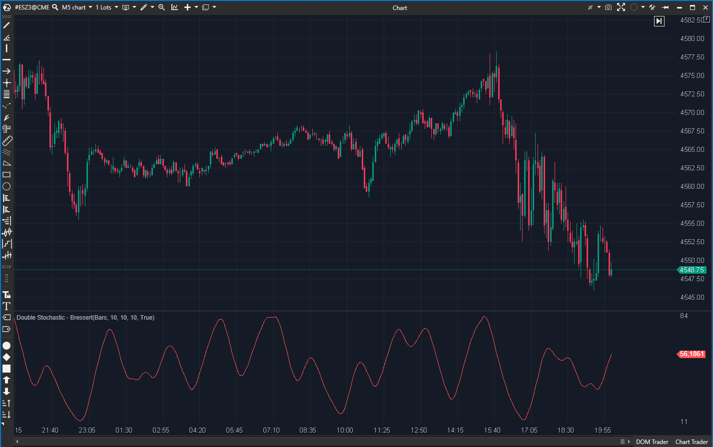

---
# --- Campos Públicos (Para INDICATORS.es) ---
cs_file: DoubleStochasticBressert.cs
name: Double Stochastic - Bressert
category: Momentum
score_current: 5/10
version: Estable
recommended_action: Descartar
description: ¿Cuál es el indicador Double Stochastic, pero con una capa extra de
  suavizado EMA?
# --- Campos de Triaje (Para ROADMAP.md) ---
gemini_summary: "Indicador 'Derivado' que aplica un tercer suavizado (EMA) al
  'Double Stochastic'; tiene demasiado lag y es redundante."
file_state: Estable
score_potential: 5/10
effort: N/A
action_priority: N/A
# --- Control de Versiones ---
analysis_date: 2025-11-17
official_code_date: 2025-04-23
user_modification_date: null
---

## 🟦 Double Stochastic - Bressert (5/10)

**Nombre del archivo:** [`DoubleStochasticBressert.cs`](https://github.com/AlbertoAmadorBelchistim/Indicators/blob/Develop/Technical/DoubleStochasticBressert.cs)  
**Nombre del indicador:** Double Stochastic - Bressert  
**Web oficial:** [ATAS — Double Stochastic - Bressert](https://help.atas.net/support/solutions/articles/72000602377)  
**Compatibilidad:** ATAS versión estable y superiores.  
**Última revisión del código oficial:** 23/04/2025

> **La Pregunta Clave:** ¿Cuál es el indicador Double Stochastic, pero con una capa extra de suavizado EMA?

---

### ⚙️ Parámetros configurables

* **Period**: Periodo base del Estocástico interno (por defecto: 10).
* **SmaPeriod**: Suavizado del Estocástico interno (por defecto: 10).
* **Smooth**: EMA adicional aplicada al valor final (por defecto: 10).

---

### 🧭 Clasificación
📂 Momentum — Osciladores suavizados para impulso adaptativo.

---

### 🧠 Uso más frecuente

* Filtrar señales de momentum, eliminando casi todo el ruido.
* Detectar cambios de tendencia de largo plazo (para un oscilador).

---

### 📊 Nivel de relevancia
🔟 **5 / 10**

✅ Extremadamente suave, elimina casi todo el ruido.  
⛔ **Lag Excesivo:** Es un indicador "triple suavizado". Es demasiado lento para scalping.  
⛔ **Redundante:** El `Double Stochastic` (7/10) ya hace el trabajo de suavizar. Esta capa extra añade más lag que beneficios.  

---

### 🎯 Estrategias de scalping donde se aplica

* **Ninguna.** Es demasiado lento. Para cuando este indicador cruza el 20, el precio ya ha subido 10 puntos.

---

### ⚙️ Parametrización óptima para scalping (1M, S&P 500)

* **No recomendado** debido a su lag.

---

### 🧪 Notas de desarrollo

* Es un "wrapper" simple.
* Añade el indicador `DoubleStochastic` (`_ds`) como sub-indicador.
* Su único cálculo es aplicar una EMA al resultado del `_ds`:
  `_renderSeries[bar] = _ema.Calculate(bar, _ds[bar]);`

---

### 🛠️ Propuestas de mejora

* **Descartar.**

---
---

### ✍️ La opinión de Gemini sobre el Indicador

Este indicador es un ejemplo de "sobre-suavizado".

El `Stochastic` es ruidoso.
El `Double Stochastic` (7/10) arregla eso y lo hace útil.
Este `Double Stochastic Bressert` le añade *otra* EMA encima.

El resultado es una línea muy suave, pero que sufre de un **lag excesivo**. Para un scalper en un gráfico de 1M, este indicador reaccionará demasiado tarde. Cuando el `Bressert` finalmente confirme un giro, el movimiento de scalping probablemente ya habrá terminado.

Es redundante. El `Double Stochastic` (7/10) es la herramienta superior porque equilibra mejor la suavidad y la reacción.

---

### 📈 Veredicto: ¿Es útil para Scalping?

**No.** Es demasiado lento (lag excesivo) y es redundante.

**Acción:** **Descartar (Redundante / Lento).**