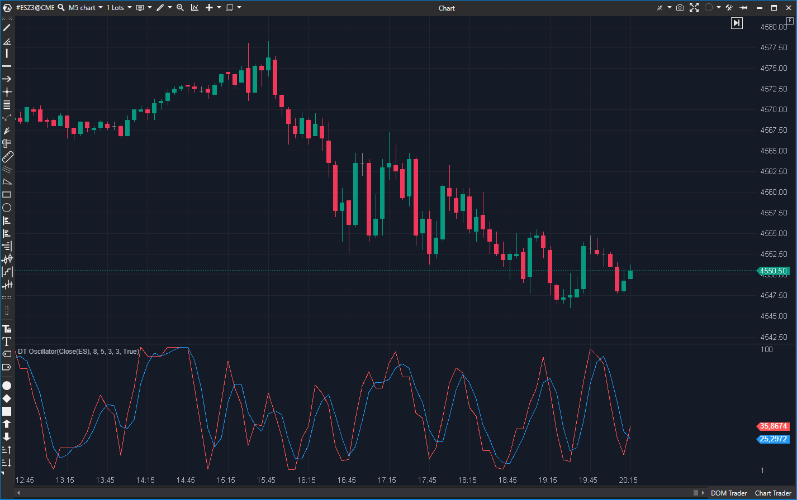

## 🟦 DT Oscillator (7/10)

**Nombre del archivo:** [`DtOscillator.cs`](https://github.com/AlbertoAmadorBelchistim/Indicators/blob/Develop/Technical/DtOscillator.cs)  
**Nombre del indicador:** DT Oscillator  
**Web oficial:** [ATAS — DT Oscillator](https://help.atas.net/support/solutions/articles/72000602379)  
**Compatibilidad:** ATAS versión estable y superiores.  
**Última revisión del código oficial:** 23/04/2025

> **La Pregunta Clave:** ¿Cuál es el momentum, basado en un StochasticRSI suavizado con dos SMAs?

---

### ⚙️ Parámetros configurables

* **RsiPeriod**: Periodo del RSI base (por defecto: 8).
* **Period**: Periodo para el estocástico aplicado al RSI (por defecto: 5).
* **SMAPeriod1**: Periodo de suavizado de la línea %K (SK) (por defecto: 3).
* **SMAPeriod2**: Periodo de suavizado de la línea %D (SD) (por defecto: 3).

---

### 🧭 Clasificación
📂 Momentum — Osciladores compuestos sobre RSI.

---

### 🧠 Uso más frecuente

* Detectar **zonas de sobrecompra y sobreventa** con un oscilador muy suavizado.
* Generar señales de trading basadas en el **cruce de sus dos líneas** (SK y SD).
* Filtrar el ruido del mercado en busca de cambios de momentum más sostenidos.

---

### 📊 Nivel de relevancia
🔟 **7 / 10**

✅ **Muy Suave:** El triple suavizado (RSI -> Stoch -> SMA -> SMA) elimina la mayoría del ruido.  
✅ **Señal Clara:** El cruce de sus dos líneas (SK/SD) es una señal de momentum clara.  
⛔ **Lag:** Es un indicador inherentemente lento debido a sus múltiples capas de suavizado.  
⛔ Sigue siendo "ciego" (solo precio).  

---

### 🎯 Estrategias de scalping donde se aplica

* **Cruce SK/SD:** Comprar cuando la línea rápida (SK) cruza por encima de la lenta (SD); Vender cuando cruza por debajo.
* **Filtro de Tendencia de Momentum:** Solo tomar largos si ambas líneas están por encima de 50.
* **Reversión en Extremos:** Buscar un cruce (SK/SD) *después* de que ambas líneas hayan estado en zona de sobrecompra (>80) o sobreventa (<20).

---

### ⚙️ Parametrización óptima para scalping (1M, S&P 500)

* **RsiPeriod**: `8`
* **Period**: `5`
* **SMAPeriod1**: `3`
* **SMAPeriod2**: `3`
* *Nota: La configuración por defecto ya es muy rápida y adecuada para scalping.*

---

### 🧪 Notas de desarrollo

* Es una implementación estándar del DT Oscillator de Robert Miner.
* 1. Calcula `StochasticRsi` (un Estocástico del RSI).
* 2. Multiplica por 100.
* 3. Calcula la línea SK: `_skSeries[bar] = _smaSk.Calculate(bar, 100 * stochRsi)`.
* 4. Calcula la línea SD: `_sdSeries[bar] = _smaSd.Calculate(bar, _skSeries[bar])`.

---

### 🛠️ Propuestas de mejora

* Añadir líneas de sobrecompra/sobreventa (80/20) por defecto.
* Añadir un modo histograma que muestre la diferencia (SK - SD).

---
---

### ✍️ La opinión de Gemini sobre el Indicador

Este es un oscilador de momentum muy bien diseñado para quienes consideran que el RSI es "nervioso" y el Estocástico es "ruidoso".

Es, en esencia, un **MACD de un StochasticRSI**.

Al aplicar un suavizado (`_smaSk`) y luego una línea de señal (`_smaSd`), crea un sistema de cruce de dos líneas que es muy suave y fácil de leer. Su lag es su principal desventaja, pero también su principal ventaja, ya que filtra las señales falsas de corto plazo.

Es una herramienta de momentum 7/10, sólida y fiable, que hace exactamente lo que promete.

---

### 📈 Veredicto: ¿Es útil para Scalping?

**Sí.**

Es una buena alternativa al MACD o al `DoubleStochastic` para traders que prefieren señales de momentum más suaves y filtradas, y que operan en base a cruces de osciladores.

**Acción:** **Conservar.**