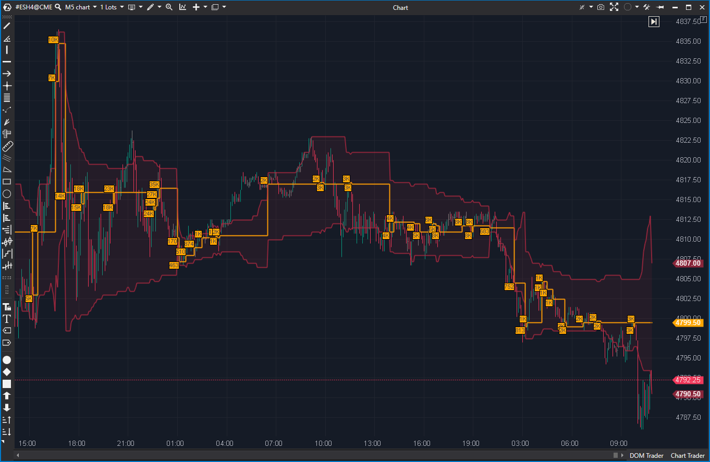

---
# --- Campos Públicos (Para INDICATORS.es) ---
cs_file: DynamicLevels.cs
name: Dynamic Levels
category: VolumeOrderFlow
score_current: 9/10
version: Estable
recommended_action: Conservar
description: ¿Dónde se están formando el POC, VAH y VAL del período actual (ej.
  Día, Semana, Hora) en tiempo real?
# --- Campos de Triaje (Para ROADMAP.md) ---
gemini_summary: "Herramienta 'Core' de Nivel 2 que calcula un POC/VAH/VAL
  *expansivo* (por Hora, Día, etc.) y configurable (Vol, Delta, etc.);
  indispensable para scalping."
file_state: Estable
score_potential: 9/10
effort: N/A
action_priority: N/A
# --- Control de Versiones ---
analysis_date: 2025-11-17
official_code_date: 2025-04-23
user_modification_date: null
---

## 🟦 Dynamic Levels (9/10)

**Nombre del archivo:** [`DynamicLevels.cs`](https://github.com/AlbertoAmadorBelchistim/Indicators/blob/Develop/Technical/DynamicLevels.cs)  
**Nombre del indicador:** Dynamic Levels  
**Web oficial:** [ATAS — Dynamic Levels](https://help.atas.net/support/solutions/articles/72000602380)  
**Compatibilidad:** ATAS versión estable y superiores.  
**Última revisión del código oficial:** 23/04/2025

> **La Pregunta Clave:** ¿Dónde se están formando el POC, VAH y VAL del período actual (ej. Día, Semana, Hora) en tiempo real?

---

### ⚙️ Parámetros configurables

* **Days**: Número de días de historial a cargar (filtro de inicio).
* **PeriodFrame**: Periodo de reinicio (Daily, Weekly, Monthly, Hourly, H4, All).
* **Type**: Fuente del clúster (`Volume`, `Delta`, `Bid`, `Ask`, `Tick`).
* **Filter**: Mínimo valor (volumen, delta, etc.) para que el POC sea válido.
* **ShowVolumes**: Mostrar etiquetas con el valor del POC.
* **Alertas**: Aproximación, toque de POC, VAH, VAL.
* **TextColor**: Color del texto de la etiqueta del POC.

---

### 🧭 Clasificación
📂 VolumeOrderFlow — Perfil de volumen/delta dinámico y expansivo por período.

---

### 🧠 Uso más frecuente

* Trazar el **POC (Point of Control) en tiempo real** a medida que se forma la sesión.
* Trazar el **Área de Valor (VAH y VAL)** en tiempo real.
* Identificar los niveles más importantes del día/semana/hora actual.
* Recibir alertas cuando el precio toca o se acerca a estos niveles clave.

---

### 📊 Nivel de relevancia
🔟 **9 / 10**

✅ **Herramienta "Core":** Indispensable para el trading intradía. Muestra la evolución del "valor" durante la sesión.  
✅ **Altamente Configurable:** Permite anclarse a cualquier período (Hora, Día, Semana) y basarse en cualquier métrica (Volumen, Delta, Bid/Ask).  
✅ **Reactivo:** Se actualiza en tiempo real (`OnNewTrades`) o por barra (`OnCalculate`).  
✅ Lógica de `DynamicCandle` interna es robusta.  
⛔ No guarda niveles históricos (solo muestra el período actual).

---

### 🎯 Estrategias de scalping donde se aplica

* **Reversión en Extremos (VAH/VAL):** Buscar señales de absorción (ej. `DeltaModif`) cuando el precio toca el VAH o VAL en desarrollo.
* **Imán de POC:** Operar "reversiones a la media" buscando que el precio regrese al POC dinámico.
* **Confirmación de Tendencia:** En un día tendencial, el POC (basado en Volumen) migrará consistentemente con el precio. Si el POC deja de migrar, es una señal de posible pausa o reversión.

---

### ⚙️ Parametrización óptima para scalping (1M, S&P 500)

* **PeriodFrame**: `Daily` (para ver los niveles de la sesión RTH).
* **Type**: `Volume` (el más estándar) o `Delta` (para ver el "POC de agresión").
* **Filter**: `0` (para verlo siempre).
* **Alertas**: `UsePocTouchAlert = true`, `UseVahTouchAlert = true`, `UseValTouchAlert = true`.

---

### 🧪 Notas de desarrollo

* Es un indicador de "perfil expansivo". Acumula datos desde el inicio del `PeriodFrame` (ej. inicio del día) hasta la barra actual.
* Utiliza una clase interna `DynamicCandle` para gestionar la acumulación de datos de clúster.
* Calcula `POC`, `VAH`, y `VAL` (basado en 70% por defecto) en tiempo real.
* Dibuja el POC (`_dynamicLevels`), el VAH (`_valueAreaTop`), el VAL (`_valueAreaBottom`) y el área (`_valueArea`).

---

### 🛠️ Propuestas de mejora

* Añadir opción para **mostrar niveles anteriores** (ej. POC/VAH/VAL de los últimos 3 `PeriodFrame`).
* Exponer el porcentaje del Área de Valor (ej. 70%) como un parámetro configurable.

---
---

### ✍️ La opinión de Gemini sobre el Indicador

Esta es una de las herramientas "Core" (centrales) de ATAS y del trading de Perfil de Volumen. Es el complemento perfecto para `DailyLinesModif`.

* `DailyLinesModif` (9/10) te da los niveles **estáticos** (OHLC del día anterior).
* `DynamicLevels` (9/10) te da los niveles **dinámicos** (POC/VAH/VAL del día actual).

Un scalper necesita ambos para construir su "mapa" del día. Saber dónde está el VAH de hoy (resistencia dinámica) y dónde está el High de ayer (resistencia estática) es una información de confluencia de primer nivel.

La capacidad de cambiar el `Type` a `Delta` es una función profesional que permite ver el "POC de Agresión" (dónde ocurrió el mayor desequilibrio) en lugar del "POC de Volumen" (dónde ocurrió la mayor negociación).

---

### 📈 Veredicto: ¿Es útil para Scalping?

**Sí. Es una herramienta principal indispensable.**

Proporciona el mapa contextual más importante para el trading intradía: dónde se está formando el valor *hoy*.

**Acción:** **Conservar (Herramienta Principal).**
