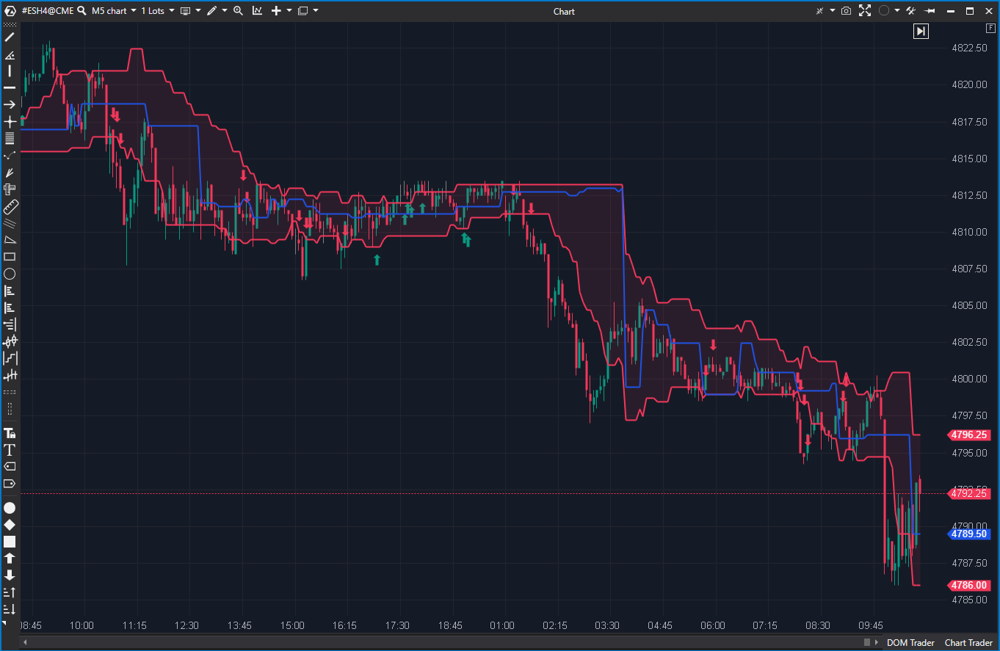

## 🟦 Dynamic Levels Channel (9/10)

**Nombre del archivo:** [`DynamicLevelsChannel.cs`](https://github.com/AlbertoAmadorBelchistim/Indicators/blob/Develop/Technical/DynamicLevelsChannel.cs)  
**Nombre del indicador:** Dynamic Levels Channel  
**Web oficial:** [ATAS — Dynamic Levels Channel](https://help.atas.net/support/solutions/articles/72000602381)  
**Compatibilidad:** ATAS versión estable y superiores.  
**Última revisión del código oficial:** 23/04/2025

> **La Pregunta Clave:** ¿Dónde se están formando el POC, VAH y VAL de las últimas N barras (un perfil móvil)?

---

### ⚙️ Parámetros configurables

* **CalcMode**: Fuente de cálculo para el POC (Volume, PosDelta, NegDelta, Delta).
* **Period**: Número de velas en la ventana móvil (por defecto: 40).
* **Days**: Días de historial a cargar (filtro de inicio).
* **AreaColor**: Color del canal de valor (entre VAL y VAH).
* **Alertas**: Aproximación, toque de POC, VAH, VAL.

---

### 🧭 Clasificación
📂 VolumeOrderFlow — Perfil de Volumen/Delta móvil (Rolling VPOC).

---

### 🧠 Uso más frecuente

* Visualizar el **POC, VAH y VAL dinámicos** dentro de un canal *móvil* (rolling).
* Trazar el "valor a corto plazo" que viaja con el precio.
* Identificar niveles de soporte/resistencia que se mueven con la acción del precio.

---

### 📊 Nivel de relevancia
🔟 **9 / 10**

✅ **Herramienta "Core":** Es un "Rolling POC/VA". Esencial para seguir la migración del valor.  
✅ Complemento perfecto para `DynamicLevels` (que es expansivo, no móvil).  
✅ Soporta múltiples modos de cálculo (Volume, Delta, etc.).  
⛔ No guarda niveles históricos (es puramente dinámico).

---

### 🎯 Estrategias de scalping donde se aplica

* **Tendencia (Migración del POC):** En una tendencia alcista, el canal (POC/VAH/VAL) migra hacia arriba. Se buscan largos en pullbacks al VAH o POC del canal móvil.
* **Reversión (POC Atrapado):** Si el precio se mueve bruscamente, pero el POC móvil se queda atrás, indica una posible reversión (trampa).
* **Rechazo en VAH/VAL móvil:** Buscar señales de absorción en los bordes del canal móvil.

---

### ⚙️ Parametrización óptima para scalping (1M, S&P 500)

* **Period**: `30` a `60` (representa los últimos 30-60 minutos de valor).
* **CalcMode**: `Volume` o `Delta`.
* **Alertas**: `UsePocTouchAlert = true`.

---

### 🧪 Notas de desarrollo

* A diferencia de `DynamicLevels` (que es *expansivo*), este indicador es *móvil*.
* Acumula los datos de perfil de las últimas `Period` barras (ej. `bar - Period`).
* Recalcula el POC/VAH/VAL de esta ventana de `Period` barras en *cada* barra nueva.
* Incluye una lógica de "señales" (flechas) basada en patrones de rechazo en los bordes del canal.

---

### 🛠️ Propuestas de mejora

* Añadir una opción para un suavizado (SMA/EMA) del POC/VAH/VAL, ya que pueden "saltar" mucho de una barra a otra.
* Exponer el porcentaje del Área de Valor (fijo en 70%) como un parámetro configurable.

---
---

### ✍️ La opinión de Gemini sobre el Indicador

Esta es la segunda herramienta "Core" de Perfil de Volumen.

* `DynamicLevels` (9/10) te da el "Valor del Día" (expansivo, lento).
* `DynamicLevelsChannel` (9/10) te da el "Valor de la Hora" (móvil, rápido).

Para un scalper, el "Rolling POC" (este indicador) es a menudo más importante que el POC del día, ya que te dice dónde está el "valor inmediato". Te permite ver si el valor está migrando con el precio (tendencia saludable) o si el precio está corriendo lejos del valor (extensión, posible reversión).

La capacidad de cambiar el `CalcMode` a `Delta` es una función profesional que te permite seguir el "Rolling Delta POC", una herramienta muy avanzada.

---

### 📈 Veredicto: ¿Es útil para Scalping?

**Sí. Es una herramienta principal indispensable.**

Proporciona el mapa contextual de "valor inmediato" (últimas N barras), que es crucial para el scalping de tendencia.

**Acción:** **Conservar (Herramienta Principal).**