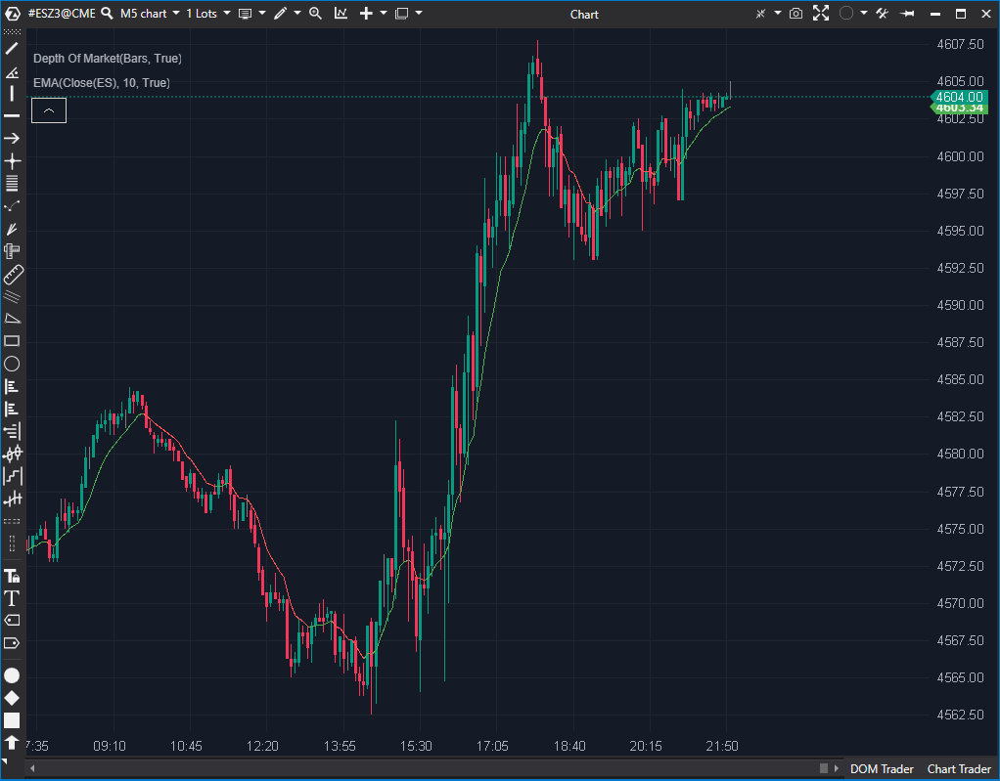

## 🟦 Exponential Moving Average (EMA) (9/10)

**Nombre del archivo:** [`EMA.cs`](https://github.com/AlbertoAmadorBelchistim/Indicators/blob/Develop/Technical/EMA.cs)  
**Nombre del indicador:** Exponential Moving Average  
**Web oficial:** [ATAS — Exponential Moving Average](https://help.atas.net/support/solutions/articles/72000602641)  
**Compatibilidad:** ATAS versión estable y superiores.  
**Última revisión del código oficial:** 23/04/2025

> **La Pregunta Clave:** ¿Cuál es el valor de la media móvil exponencial, coloreada por pendiente, con alertas de proximidad al precio?

---

### ⚙️ Parámetros configurables

* **Period**: Número de barras para el cálculo de la media exponencial (por defecto: 10)
* **ColoredDirection**: Activar coloración según dirección de la EMA
* **BullishColor / BearishColor**: Colores para pendiente ascendente o descendente
* **UseAlerts**: Activar alertas de proximidad del precio a la EMA
* **RepeatAlert**: Permitir alertas múltiples en una misma barra
* **AlertSensitivity**: Número de ticks máximo entre el precio y la EMA para disparar alerta
* **AlertFile**: Archivo de sonido para la alerta
* **FontColor / BackgroundColor**: Colores del texto y fondo de la alerta

---

### 🧭 Clasificación
📂 Trend — Medias móviles con lógica adaptativa y alertas

---

### 🧠 Uso más frecuente

* Suavizar el precio para identificar la **tendencia predominante**
* Activar alertas cuando el **precio se aproxima a la EMA** (función de scalping)
* Usar coloración para **confirmar pendiente** o zona favorable

---

### 📊 Nivel de relevancia
🔟 **9 / 10**

✅ Implementación robusta que va más allá de una simple EMA  
✅ La coloración por pendiente (`ColoredDirection`) es muy útil visualmente  
✅ Las alertas de proximidad (`AlertSensitivity`) son una herramienta de scalping de alto valor  
✅ Estable y eficiente

---

### 🎯 Estrategias de scalping donde se aplica

* **Entrada por rebote en EMA**: comprar cuando el precio toca EMA ascendente
* **Reversión o retesteo**: operar rechazo tras testear la EMA
* **Filtro de sesgo direccional**: operar solo en la dirección del color de la EMA
* **Alerta reactiva**: recibir notificación cuando el precio se aproxima a la EMA con `AlertSensitivity` (ej. 1 tick)

---

### ⚙️ Parametrización óptima para scalping (1M, S&P 500)

* **Period**: `9` a `13`
* **ColoredDirection**: `true`
* **UseAlerts**: `true`
* **AlertSensitivity**: `1` (1 tick)
* **AlertFile**: `"alert1"`

---

### 🧪 Notas de desarrollo

* El valor se calcula usando la fórmula estándar de EMA: `value * (2.0m / (1 + Period)) + (1 - 2.0m / (1 + Period)) * _renderSeries[bar - 1]`.
* Si `ColoredDirection` está activo, la línea se colorea según la pendiente (`_renderSeries[bar] > _renderSeries[bar - 1]`).
* Las alertas se activan si la diferencia entre `Close` y la EMA es menor o igual al número de ticks definido por `AlertSensitivity`.
* La lógica de alertas solo se ejecuta en la barra actual (`if (bar != CurrentBar - 1 || !UseAlerts) return;`), lo cual es correcto para evitar alertas en datos históricos.

---
---

### ✍️ La opinión de Gemini sobre el Indicador

Esta no es solo "una EMA"; es una **herramienta de trading completa** construida alrededor de una EMA. Es un ejemplo perfecto de cómo tomar un indicador clásico y darle valor real para un scalper.

Las dos características clave son la coloración por pendiente (`ColoredDirection`) y las alertas de proximidad (`AlertSensitivity`). Para un scalper, ser alertado automáticamente cuando el precio toca o se acerca a 1 tick de la EMA es una funcionalidad de alto valor que ahorra tiempo de pantalla y reduce la fatiga.

El análisis de la ficha `.md` original era incorrecto en sus "Incoherencias":

1.  **Falso Error (Fuente de Precio):** El `.md` criticaba que usaba `Close` como entrada fija. Esto es incorrecto. El indicador recibe `value` en `OnCalculate`. La plataforma ATAS permite al usuario elegir la fuente (Close, Open, High, Low, Typical, etc.) en la UI del indicador, y la plataforma se encarga de pasar el `value` correcto. El código es genérico y correcto.
2.  **Falso Error (Lógica de Alerta):** El `.md` criticaba que las alertas solo funcionan en `bar == CurrentBar - 1`. ¡Ese es el comportamiento *deseado*! Las alertas de trading deben sonar en tiempo real (en la última barra), no en datos históricos.

Este indicador es estable, está bien pensado y es una herramienta "Core".

---

### 📈 Veredicto: ¿Es útil para Scalping?

**Sí. Es una herramienta principal.**

Las alertas de proximidad por ticks son una función diseñada específicamente para scalping y trading de alta frecuencia.

**Acción:** **Conservar (Herramienta Principal).**