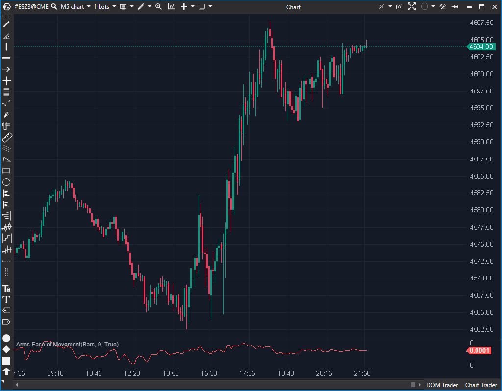

## 🟦 Arms Ease of Movement (EMV) (6.5/10)

**Nombre del archivo:** [`EMV.cs`](https://github.com/AlbertoAmadorBelchistim/Indicators/blob/Develop/Technical/EMV.cs)  
**Nombre del indicador:** Arms Ease of Movement  
**Web oficial:** [ATAS — Arms Ease of Movement](https://help.atas.net/support/solutions/articles/72000602315)  
**Compatibilidad:** ATAS versión estable y superiores.  
**Última revisión del código oficial:** 23/04/2025

> **La Pregunta Clave:** ¿Es el movimiento del precio (cambio en el punto medio) eficiente en relación con su volumen y rango?

---

### ⚙️ Parámetros configurables

* **Period**: Número de barras para suavizar el valor de EMV (por defecto: 9)
* **MaType**: Tipo de media móvil utilizada para el suavizado (`EMA`, `SMA`, `WMA`, `SMMA`, `LinearReg`)

---

### 🧭 Clasificación
📂 Volume — Indicadores que relacionan volumen con desplazamiento del precio

---

### 🧠 Uso más frecuente

* Medir la **facilidad con la que el precio se desplaza en relación al volumen**
* Detectar **fases de movimiento eficiente o ineficiente**
* Confirmar rupturas o fases de expansión con mayor claridad

---

### 📊 Nivel de relevancia
🔟 **6.5 / 10**

✅ Mide relación entre volumen y rango, no solo precio  
✅ Ofrece información de momentum con ajuste por fricción  
⛔ No es intuitivo sin conocer la fórmula  
⛔ Concepto clásico, a menudo menos útil que el análisis directo de Delta o CVD

---

### 🎯 Estrategias de scalping donde se aplica

* **Breakout eficiente**: si el EMV sube con vela expansiva y volumen bajo → movimiento limpio
* **Reversión por agotamiento**: caída del EMV indica falta de eficiencia en impulso
* **Confirmación contextual**: combinar con volumen o delta para validar fases de movimiento

---

### ⚙️ Parametrización óptima para scalping (1M, S&P 500)

* **Period**: `5` a `9`
* **MaType**: `EMA` o `WMA` para mayor reactividad
* Combinar con VWAP o CVD para contextos estructurales

---

### 🧪 Notas de desarrollo

* Calcula el MidPoint Move: `(candle.High + candle.Low) / 2m - (prevCandle.High + prevCandle.Low) / 2m`.
* Calcula el Box Ratio: `candle.Volume / (candle.High - candle.Low)`.
* El valor EMV es `midPoint / ratio`.
* **Maneja correctamente la división por cero**: si `candle.High - candle.Low == 0`, `ratio` se establece en 0, y `emv` también se establece en 0, evitando errores.
* El resultado se suaviza usando el tipo de media móvil seleccionado.
* El objeto `_movingIndicator` se recrea en `OnRecalculate()`, que es la forma estándar de ATAS de manejar cambios de parámetros.

---
---

### ✍️ La opinión de Gemini sobre el Indicador

Se trata de una implementación estándar y **estable** del indicador clásico "Arms Ease of Movement". El código calcula correctamente la relación entre el movimiento del punto medio y el "volumen por rango" y luego lo suaviza con la MA seleccionada.

El análisis de la ficha `.md` original (sección "Incoherencias") contenía errores:

1.  **Falso Error (División por Cero):** El `.md` sugería un problema si `High == Low`. El código (`EMV.cs`) maneja esto explícitamente: si el rango es cero, `ratio` es cero, y `emv` (el valor final) se establece en cero. Esto es un manejo de errores intencional y correcto, no un fallo.
2.  **Falso Error (Recreación de Objeto):** El `.md` criticaba que `OnRecalculate()` recrea el objeto MA. Esto *es necesario* y es la forma estándar de ATAS de manejar un cambio de parámetros (como `Period` o `MaType`).

El indicador funciona como se espera, es estable y no requiere ninguna acción. Su utilidad para scalping es subjetiva (es un concepto algo anticuado), pero el código es sólido.

---

### 📈 Veredicto: ¿Es útil para Scalping?

**Ocasionalmente.**

Puede dar una visión alternativa del "esfuerzo vs resultado" que el volumen por sí solo no muestra. No es una herramienta principal.

**Acción:** **Conservar (Estable).**