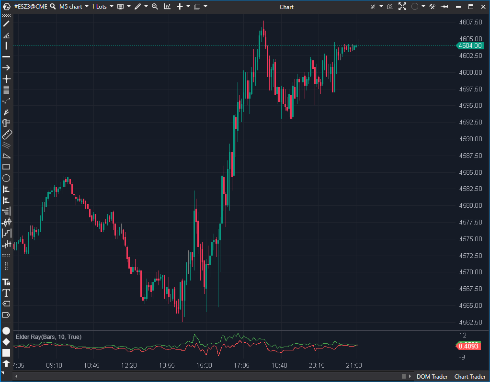

## 🟦 Elder Ray (6.5/10)

**Nombre del archivo:** [`ElderRay.cs`](https://github.com/AlbertoAmadorBelchistim/Indicators/blob/Develop/Technical/ElderRay.cs)  
**Nombre del indicador:** Elder Ray  
**Web oficial:** [ATAS — Elder Ray](https://help.atas.net/support/solutions/articles/72000602580)  
**Compatibilidad:** ATAS versión estable y superiores.  
**Última revisión del código oficial:** 23/04/2025

> **La Pregunta Clave:** ¿Cuál es la fuerza de los compradores (High - EMA) y vendedores (Low - EMA) en relación con el consenso (EMA)?

---

### ⚙️ Parámetros configurables

* **Period**: Periodo de la media exponencial (EMA) sobre la cual se calculan los valores de fuerza alcista y bajista (por defecto: 10)

---

### 🧭 Clasificación
📂 Momentum — Indicadores que evalúan presión alcista y bajista relativa al promedio

---

### 🧠 Uso más frecuente

* Evaluar la **presión de compra (bull power)** y la **presión de venta (bear power)**
* Determinar si los compradores o vendedores están dominando respecto al equilibrio medio (EMA)
* Confirmar señales de entrada/salida basadas en desbalance de poder

---

### 📊 Nivel de relevancia
🔟 **6.5 / 10**

✅ Intuitivo, fácil de visualizar e interpretar  
✅ Útil para detectar divergencias o cambios de dominancia  
⛔ Implementación actual limitada solo a EMA  
⛔ No permite visualizar la EMA de referencia en el gráfico principal

---

### 🎯 Estrategias de scalping donde se aplica

* **Entrada tras cruce de bear power a positivo**: señal de recuperación del control por parte de los compradores
* **Confirmación de impulso**: si bull power aumenta en expansión alcista
* **Divergencia bajista**: si el precio sube pero bear power es cada vez menos negativo

---

### ⚙️ Parametrización óptima para scalping (1M, S&P 500)

* **Period**: `10` a `13`
* Representar en panel separado como histograma dual (positivo y negativo)
* Línea base en 0 como referencia clave

---

### 🧪 Notas de desarrollo

* Usa una **EMA de cierre** como línea base de comparación.
* Calcula:
    * **Bull Power**: `candle.High - _ema[bar]`
    * **Bear Power**: `candle.Low - _ema[bar]`
* Ambas series (`_bullSeries`, `_bearSeries`) se dibujan en el mismo panel.
* La EMA se calcula internamente por objeto dedicado (`_ema`) con periodo ajustable.

---

### 🛠️ Propuestas de mejora

* **Añadir Selección de MA:** Reemplazar el `_ema` interno por una lógica que permita al usuario seleccionar el tipo de media móvil (EMA, SMA, WMA, etc.), similar a como lo hace el indicador `EMV.cs`.
* **Exponer la MA:** Añadir un parámetro booleano `Show Ma On Chart` (Mostrar MA en Gráfico). Si es `true`, el indicador debería dibujar también la media móvil de referencia en el panel de precios principal, para que el usuario no tenga que cargar dos indicadores (ElderRay y una EMA separada).
* Incorporar alertas visuales o sonoras al cruce por 0.

---
---

### ✍️ La opinión de Gemini sobre el Indicador

Este es un indicador clásico de momentum implementado correctamente. Su código es simple y estable. Mide la distancia desde el máximo (Bull Power) y el mínimo (Bear Power) hasta una EMA de consenso.

Sin embargo, la implementación es **demasiado rígida** para un entorno moderno. Un scalper puede querer usar una WMA o SMA en lugar de una EMA, o querer ver la EMA de referencia en el gráfico principal sin tener que cargar un segundo indicador (y arriesgarse a desincronizar los períodos).

Las mejoras propuestas son de bajo esfuerzo (el código para cambiar MA ya existe en otros indicadores) y aumentarían mucho la flexibilidad de la herramienta.

---

### 📈 Veredicto: ¿Es útil para Scalping?

**Moderadamente.**

Es una forma rápida de ver divergencias y la "respiración" del mercado alrededor de su media. Es un buen indicador de confirmación.

**Acción:** **Mejorar (Prioridad Baja).**
