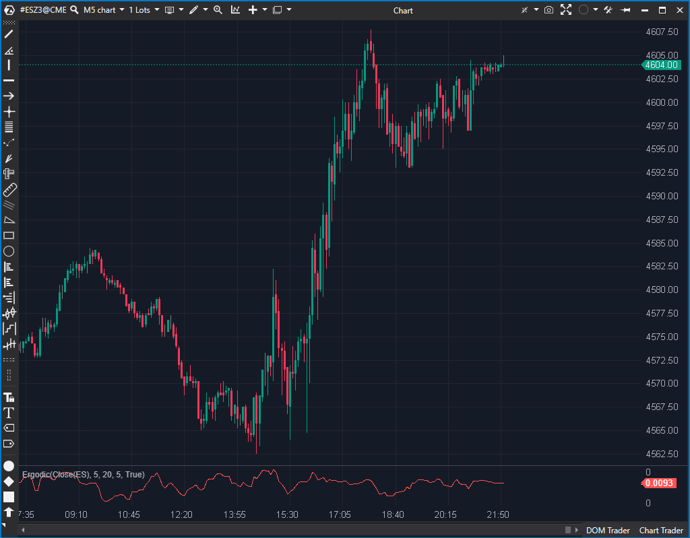

## 🟦 Ergodic Oscillator (4/10)

**Nombre del archivo:** [`Ergodic.cs`](https://github.com/AlbertoAmadorBelchistim/Indicators/blob/Develop/Technical/Ergodic.cs)  
**Nombre del indicador:** Ergodic  
**Web oficial:** [ATAS — Ergodic](https://help.atas.net/support/solutions/articles/72000602382)  
**Compatibilidad:** ATAS versión estable y superiores.  
**Última revisión del código oficial:** 23/04/2025

> **La Pregunta Clave:** ¿Cuál es la diferencia (histograma) entre el True Strength Index (TSI) y su línea de señal?

---

### ⚙️ Parámetros configurables

* **ShortPeriod**: Periodo de las EMAs rápidas (por defecto: 5)
* **LongPeriod**: Periodo de las EMAs lentas (por defecto: 20)
* **SignalPeriod**: Periodo del suavizado de la señal (por defecto: 5)

---

### 🧭 Clasificación
📂 Momentum — Osciladores basados en movimiento relativo suavizado

---

### 🧠 Uso más frecuente

* (Uso teórico) Detectar cambios de momentum (como un MACD, pero basado en el TSI)
* Usar la **diferencia entre el TSI (True Strength Index) y su señal** como activador táctico

---

### 📊 Nivel de relevancia
🔟 **4 / 10**

✅ El concepto (TSI) es bueno y suaviza el impulso  
⛔ **Incompleto:** Solo muestra el histograma (diferencia), no las líneas TSI y de señal  
⛔ Obliga al usuario a adivinar dónde ocurren los cruces de líneas  
⛔ Inútil para scalping en su estado actual

---

### 🎯 Estrategias de scalping donde se aplica

*(En su estado actual, no es recomendable para estrategias claras, ya que oculta la información principal)*

* **Cruce de línea base (0)** como disparador (si se asume que es un cruce de líneas)

---

### ⚙️ Parametrización óptima para scalping (1M, S&P 500)

* (No recomendable hasta que sea reparado)

---

### 🧪 Notas de desarrollo

* El indicador calcula correctamente el **TSI** (`tsi = _emaShort[bar] / _emaShortAbs[bar]`).
* Calcula una **línea de señal** (`_emaSignal.Calculate(bar, tsi)`).
* El problema: el indicador **solo renderiza la diferencia** (`_renderSeries[bar] = tsi - _emaSignal[bar]`).
* Las dos líneas principales (el TSI y la Señal) se calculan pero *no se dibujan*, haciéndolas invisibles para el usuario.

---

### 🛠️ Propuestas de mejora

* **Reparación (Bajo Esfuerzo):**
    1.  Añadir dos nuevas `ValueDataSeries`: `_tsiSeries` (el TSI) y `_signalSeries` (la EMA de señal).
    2.  Renderizar las 3 series: `_tsiSeries`, `_signalSeries` y el histograma (`_renderSeries` actual).
    3.  Añadir parámetros para controlar los colores y el tipo de visualización del histograma (línea, histograma, etc.).
    4.  Añadir protección contra división por cero en `var tsi = _emaShort[bar] / _emaShortAbs[bar];` (aunque es improbable, es una buena práctica).

---
---

### ✍️ La opinión de Gemini sobre el Indicador

Este indicador está conceptualmente **roto**.

El código (`Ergodic.cs`) calcula correctamente el **True Strength Index (TSI)** y luego calcula una **línea de señal** (EMA del TSI). Pero, incomprensiblemente, *oculta* estas dos líneas cruciales y solo renderiza su diferencia (el histograma).

Esto es el equivalente a un indicador MACD que solo muestra el histograma, pero no la línea MACD y la línea de Señal. El valor principal para un trader es ver el *cruce* de estas líneas, no solo su diferencia. En su estado actual, el indicador es inútil y confuso.

La reparación es trivial (solo hay que añadir las `DataSeries` para las líneas ya calculadas) y transformaría un indicador inútil en una herramienta de momentum válida (un 8/10 potencial).

---

### 📈 Veredicto: ¿Es útil para Scalping?

**No. En su estado actual, está incompleto y no debe usarse.**

Oculta la información más importante que calcula.

**Acción:** **Reparar (Prioridad Media).**
